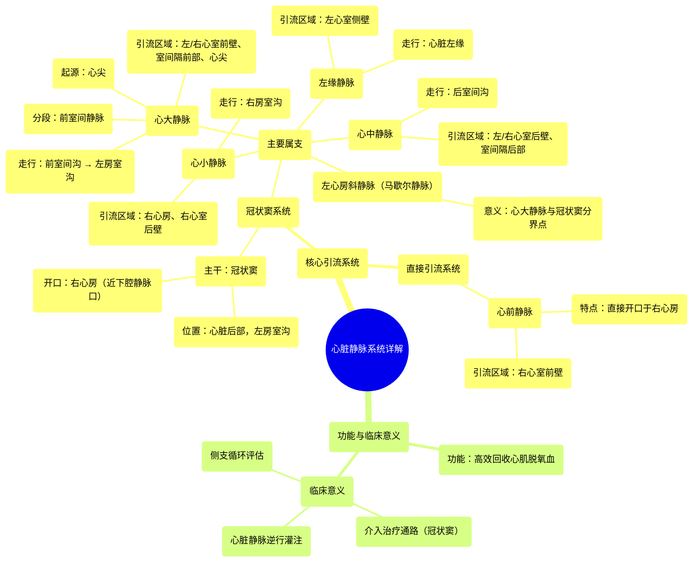

# 18 360 video - Cardiac Veins - Explained in Mixed Reality

  <video controls preload="metadata" playsinline>
    <source src="https://helly.s3.bitiful.net/心血管学科/%E4%B8%93%E8%BE%91%2001%EF%BC%9A%E5%BF%83%E8%84%8F%E8%A7%A3%E5%89%96%E5%AD%A6%E5%AE%9E%E6%99%AF%E8%AF%BE%20%28Heart%20Anatomy%20-%20Course%29/18%20360%20video%20-%20Cardiac%20Veins%20-%20Explained%20in%20Mixed%20Reality.mp4" type="video/mp4">
    
您的浏览器不支持播放，请升级。

  </video>

::: tip ⚡️ 核心考点 (30s速读)
*   **核心考点**：心脏静脉分为两大引流系统：以**冠状窦**为中心的**冠状窦系统**（引流大部分心肌血液）和直接汇入**右心房**的**心前静脉系统**。这种双系统设计确保了心脏血液回流的高效性。
*   **临床意义**：冠状窦是心脏介入治疗（如射频消融、起搏器电极植入）的重要解剖标志和通路。理解静脉走行对于诊断和治疗冠状动脉疾病、心肌缺血及某些心律失常至关重要。
:::

## 🧠 深度精讲

*   **概念1：心脏静脉的双系统引流**
    心脏静脉并非杂乱无章，而是高度组织化，形成两个主要引流系统，共同完成将心肌代谢后的脱氧血送回右心房的任务。
    1.  **冠状窦系统**：这是最主要的引流系统。**冠状窦**是位于心脏后侧左房室沟内的一条短而粗的静脉主干，横向走行，最终开口于右心房（靠近下腔静脉口）。心脏大部分区域的静脉血（主要来自左心及部分右心）最终都汇入冠状窦，再注入右心房。
    2.  **直接引流系统**：主要由**心前静脉**组成。这些静脉不经过冠状窦，而是直接开口于右心房前壁，主要引流右心室前壁的血液。这种“分流”设计减轻了冠状窦的引流压力，确保了右心室血液的高效回流。

*   **概念2：冠状窦系统的主要属支**
    冠状窦接收来自多条主要静脉的血液，它们像河流的支流一样汇入主干。
    1.  **心大静脉**：是冠状窦最大的属支。它起自心尖，沿前室间沟上行（此段称**前室间静脉**），与左冠状动脉前降支伴行。随后转向左，进入左房室沟，沿左冠状动脉旋支走行，最终延续为冠状窦。它引流左、右心室前壁、室间隔前部和心尖的血液。
    2.  **心中静脉**：起自心尖附近，沿心脏膈面的后室间沟上行，与后室间动脉（通常为右冠状动脉分支）伴行，直接注入冠状窦的末端。主要引流左、右心室后壁和室间隔后部的血液。
    3.  **心小静脉**：位于右房室沟内，与右冠状动脉伴行，常注入冠状窦右端或直接入右心房。引流右心房和右心室后壁的血液。
    4.  **左缘静脉**：沿心脏左缘（钝缘）上行，引流左心室侧壁的血液，通常汇入心大静脉或冠状窦起始部。
    5.  **左心室后静脉**：位于左心室膈面，引流左心室后壁，通常汇入冠状窦或心中静脉。
    6.  **左心房斜静脉（马歇尔斜静脉）**：一条细小的静脉，引流左心房后壁的血液，汇入冠状窦。它在解剖上是心大静脉延续为冠状窦的分界点。

*   **概念3：直接引流系统——心前静脉**
    这是一组变异较大的小静脉，通常有1-3支。它们起源于右心室前壁，跨过右冠状动脉及其分支，直接开口于右心房。它们与冠状窦系统之间存在潜在的吻合，是重要的侧支循环通路。

## 📚 双语术语表 (Terminology)
| 英文术语 | 中文翻译 | 定义/解释 |
| :--- | :--- | :--- |
| Cardiac Veins | 心脏静脉 | 引流心肌（心脏肌肉）脱氧血液回流入心脏腔室的静脉系统。 |
| Coronary Sinus | 冠状窦 | 位于心脏后部左房室沟内的短而宽的静脉通道，是心脏静脉血回流的主要汇集处，开口于右心房。 |
| Great Cardiac Vein | 心大静脉 | 冠状窦最大的属支，起自心尖，沿前室间沟上行，转向左房室沟，最终延续为冠状窦。 |
| Anterior Interventricular Vein | 前室间静脉 | 心大静脉位于前室间沟内的部分，与左冠状动脉前降支伴行。 |
| Middle Cardiac Vein | 心中静脉 | 位于心脏膈面后室间沟内的静脉，与后室间动脉伴行，注入冠状窦末端。 |
| Small Cardiac Vein | 心小静脉 | 位于右房室沟内，与右冠状动脉伴行，常注入冠状窦右端。 |
| Anterior Cardiac Veins | 心前静脉 | 一组直接开口于右心房前壁的静脉，引流右心室前壁血液，不经过冠状窦。 |
| Left Marginal Vein | 左缘静脉 | 沿心脏左缘（钝缘）走行的静脉，引流左心室侧壁血液。 |
| Oblique Vein of the Left Atrium (Vein of Marshall) | 左心房斜静脉（马歇尔斜静脉） | 一条引流左心房后壁的细小静脉，汇入冠状窦，是心大静脉与冠状窦的解剖学分界点。 |
| Right Marginal Vein | 右缘静脉 | 沿心脏右缘（锐缘）走行的静脉，引流右心室侧壁血液，常与心小静脉相连。 |
| Atrioventricular Groove (Coronary Sulcus) | 房室沟（冠状沟） | 环绕心脏，分隔心房和心室的表面沟槽，冠状动脉和冠状静脉的主要走行位置。 |

## 🗺️ 知识图谱

