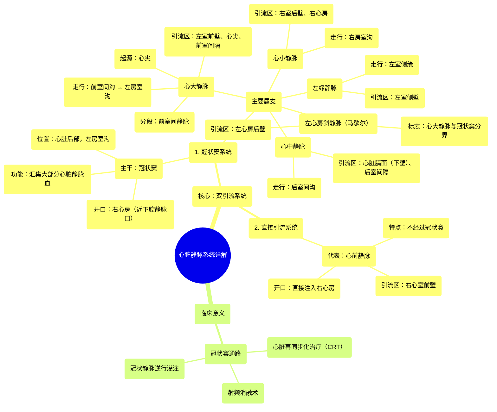

# 18 360 video - Cardiac Veins - Explained in Mixed Reality

  <video controls preload="metadata" playsinline>
    <source src="https://helly.s3.bitiful.net/心血管学科/%E4%B8%93%E8%BE%91%2001%EF%BC%9A%E5%BF%83%E8%84%8F%E8%A7%A3%E5%89%96%E5%AD%A6%E5%AE%9E%E6%99%AF%E8%AF%BE%20%28Heart%20Anatomy%20-%20Course%29/18%20360%20video%20-%20Cardiac%20Veins%20-%20Explained%20in%20Mixed%20Reality.mp4" type="video/mp4">
    
您的浏览器不支持播放，请升级。

  </video>

::: tip ⚡️ 核心考点 (30s速读)
*   **核心考点**：心脏静脉分为两大引流系统：以**冠状窦**为中心的**冠状窦系统**（引流大部分心肌血液）和直接汇入**右心房**的**心前静脉系统**。这种双系统设计确保了心脏血液回流的高效性。
*   **临床意义**：冠状窦是心脏介入治疗（如心脏再同步化治疗、射频消融）的重要通路。理解静脉走行对于放置电极导管、评估冠状静脉窦逆行灌注等操作至关重要。
:::

## 🧠 深度精讲

*   **概念1：心脏静脉的双系统引流**
    心脏的静脉回流并非单一通路，而是由两个主要系统构成，这体现了心脏循环的冗余性和高效性。
    1.  **冠状窦系统**：这是最主要的引流系统。**冠状窦**位于心脏后侧的左房室沟内，横向走行，最终开口于右心房。心大静脉、心中静脉、心小静脉、左缘静脉等主要静脉均汇入冠状窦，将左心室、右心室大部分及室间隔的脱氧血引流入右心房。
    2.  **直接引流系统**：以**心前静脉**为代表，它们不经过冠状窦，而是直接开口于右心房，主要引流右心室前壁的血液。这种设计可能有助于平衡不同区域的血流压力，确保右心室，尤其是前壁区域的高效引流。

*   **概念2：主要静脉的走行与引流区域**
    1.  **心大静脉**：起自心尖，沿前室间沟上行（此段称**前室间静脉**），与左冠状动脉前降支伴行。随后转入左房室沟，与左旋支动脉伴行，并逐渐增粗延续为**冠状窦**。它引流左心室前壁、心尖部、部分右心室前壁及前室间隔的血液。
    2.  **心中静脉**：位于心脏膈面，沿后室间沟上行，与后降支动脉伴行，引流左、右心室后壁及室间隔后部的血液，通常汇入冠状窦末端。
    3.  **心小静脉**：位于右房室沟内，与右冠状动脉伴行，引流右心室后壁及右心房部分血液，多数汇入冠状窦，有时直接入右心房。
    4.  **左缘静脉**：沿左心室侧缘（钝缘）上行，引流左心室侧壁血液，汇入心大静脉或冠状窦起始部。
    5.  **心前静脉**：位于右心室前壁，数量不定，直接跨过右房室沟注入右心房，是直接引流系统的代表。

*   **概念3：重要的解剖标志与变异**
    1.  **冠状窦口**：位于右心房，下腔静脉口与右房室口之间，其开口处常有**冠状窦瓣**（Thebesian瓣）覆盖。
    2.  **左心房斜静脉（马歇尔斜静脉）**：一条引流左心房后壁的小静脉，汇入心大静脉与冠状窦的交界处，是两者在解剖上的分界标志。它也是胚胎期左总主静脉的残留物。
    3.  **变异**：心脏静脉的走行、汇入点和数量存在较大的个体差异，例如心小静脉可能缺如，其引流区域由心中静脉或心前静脉代偿。

## 📚 双语术语表 (Terminology)
| 英文术语 | 中文翻译 | 定义/解释 |
| :--- | :--- | :--- |
| Cardiac Veins | 心脏静脉 | 引流心肌脱氧血液回流入心脏（主要是右心房）的静脉系统。 |
| Coronary Sinus | 冠状窦 | 位于心脏后部左房室沟内的短粗静脉窦，是心脏静脉回流的主要汇集通道，开口于右心房。 |
| Great Cardiac Vein | 心大静脉 | 起自心尖，沿前室间沟和左房室沟走行的主要静脉，引流左心室前壁等区域，延续为冠状窦。 |
| Anterior Interventricular Vein | 前室间静脉 | 心大静脉在前室间沟内的部分，与左冠状动脉前降支伴行。 |
| Middle Cardiac Vein | 心中静脉 | 位于后室间沟内，与后降支动脉伴行，引流心脏膈面（下壁）血液，汇入冠状窦。 |
| Small Cardiac Vein | 心小静脉 | 位于右房室沟内，与右冠状动脉伴行，引流右心室后壁和右心房。 |
| Anterior Cardiac Veins | 心前静脉 | 一组直接开口于右心房的静脉，引流右心室前壁，不经过冠状窦。 |
| Left Marginal Vein | 左缘静脉 | 沿左心室左缘（钝缘）上行的静脉，引流左心室侧壁。 |
| Oblique Vein of the Left Atrium (Marshall) | 左心房斜静脉（马歇尔斜静脉） | 引流左心房后壁的小静脉，汇入心大静脉与冠状窦交界处，是两者的解剖学分界点。 |
| Right Atrium | 右心房 | 心脏的四个腔室之一，接收来自体循环（经上下腔静脉）和心脏本身（经冠状窦）的脱氧血。 |

## 🗺️ 知识图谱

