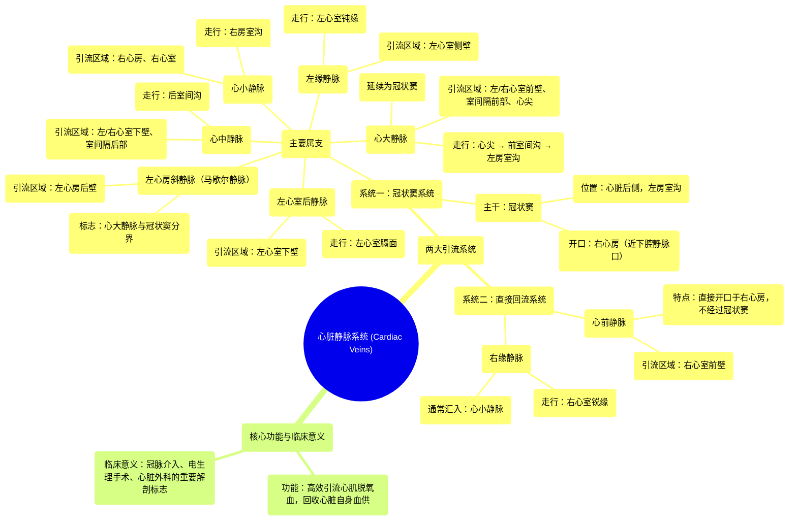

# 18 360 video - Cardiac Veins - Explained in Mixed Reality

  <video controls preload="metadata" playsinline>
    <source src="https://helly.bitiful.net/心血管学科/%E4%B8%93%E8%BE%91%2001%EF%BC%9A%E5%BF%83%E8%84%8F%E8%A7%A3%E5%89%96%E5%AD%A6%E5%AE%9E%E6%99%AF%E8%AF%BE%20%28Heart%20Anatomy%20-%20Course%29/18%20360%20video%20-%20Cardiac%20Veins%20-%20Explained%20in%20Mixed%20Reality.mp4" type="video/mp4">
    
您的浏览器不支持播放，请升级。

  </video>

::: tip ⚡️ 核心考点 (30s速读)
*   **核心考点**：心脏静脉分为两大引流系统：以**冠状窦**为中心的系统和**直接汇入右心房**的系统。这种双系统设计确保了心脏脱氧血液的高效回流。
*   **临床意义**：理解心脏静脉的走行和汇入点对于**冠状动脉介入治疗**（如冠状窦逆行灌注）、**心脏电生理手术**（如冠状窦电极放置）以及**心脏外科手术**中保护静脉结构至关重要。
:::

## 🧠 深度精讲

*   **概念1：心脏静脉的双系统引流**
    心脏静脉并非杂乱无章，而是高度组织化，主要分为两大引流路径。第一个也是主要的系统，以**冠状窦**为中心。冠状窦是位于心脏后侧左房室沟内的一条短而粗的静脉通道，最终开口于右心房。绝大多数心脏静脉，如心大静脉、心中静脉等，都作为其属支汇入其中。第二个系统则绕过冠状窦，由**心前静脉**等组成，它们直接开口于右心房。这种“双轨制”引流模式，为心脏的静脉回流提供了冗余保障，确保心肌代谢后的血液能够高效、可靠地返回循环。

*   **概念2：冠状窦及其主要属支**
    **冠状窦**是心脏静脉系统的“主干道”。它横向走行于左心房与左心室之间的房室沟内，最终汇入右心房，其开口靠近下腔静脉口。汇入冠状窦的主要静脉包括：
    1.  **心大静脉**：起自心尖，沿前室间沟上行，引流左、右心室前壁及室间隔前部的血液。在左房室沟内，它延续为冠状窦。
    2.  **心中静脉**：起自心尖，沿后室间沟上行，与后降支动脉伴行，主要引流左、右心室下壁及室间隔后部的血液，汇入冠状窦末端。
    3.  **心小静脉**：走行于右房室沟内，与右冠状动脉伴行，引流右心房和右心室部分血液，通常汇入冠状窦末端或心中静脉。
    4.  **左心室后静脉**：引流左心室膈面（下壁）的血液，汇入冠状窦或心中静脉。
    5.  **左缘静脉**：沿左心室侧缘（钝缘）上行，引流左心室侧壁血液，汇入心大静脉或冠状窦起始部。
    6.  **左心房斜静脉（Marshall静脉）**：一条细小的静脉，引流左心房后壁血液，汇入冠状窦起始部，常作为心大静脉与冠状窦的解剖学分界标志。

*   **概念3：直接汇入右心房的静脉**
    这部分静脉不经过冠状窦，直接回流至右心房，主要包括：
    1.  **心前静脉**：位于右心室前壁，为数条（通常3-4条）变异较大的小静脉，跨过右房室沟，直接开口于右心房。它们引流右心室前壁的血液。
    2.  **右缘静脉**：沿右心室锐缘上行，与右缘动脉伴行，通常汇入心小静脉，但有时也可直接汇入右心房。

## 📚 双语术语表 (Terminology)
| 英文术语 | 中文翻译 | 定义/解释 |
| :--- | :--- | :--- |
| Cardiac veins | 心脏静脉 | 引流心肌内脱氧血液回流入心腔的静脉系统。 |
| Coronary sinus | 冠状窦 | 位于心脏后部左房室沟内的短粗静脉通道，是心脏静脉回流的主要汇集处，开口于右心房。 |
| Great cardiac vein | 心大静脉 | 起自心尖，沿前室间沟上行，后转入左房室沟延续为冠状窦，引流心脏前壁血液的主要静脉。 |
| Anterior interventricular vein | 前室间静脉 | 心大静脉在前室间沟内走行部分。 |
| Middle cardiac vein | 心中静脉 | 沿后室间沟上行，引流心脏下壁（膈面）血液，汇入冠状窦末端。 |
| Small cardiac vein | 心小静脉 | 走行于右房室沟内，引流右心房和右心室部分血液，常汇入冠状窦末端。 |
| Left marginal vein | 左缘静脉 | 沿左心室钝缘走行，引流左心室侧壁血液，汇入心大静脉或冠状窦。 |
| Inferior vein of the left ventricle | 左心室后静脉 | 引流左心室膈面（下壁）的静脉。 |
| Oblique vein of the left atrium (Marshall) | 左心房斜静脉（马歇尔静脉） | 一条细小的静脉，引流左心房后壁，常标志心大静脉与冠状窦的界限。 |
| Anterior cardiac veins | 心前静脉 | 一组直接开口于右心房的静脉，引流右心室前壁血液，不经过冠状窦。 |
| Right marginal vein | 右缘静脉 | 沿右心室锐缘走行，引流右心室侧缘血液，通常汇入心小静脉。 |
| Right atrium | 右心房 | 心脏的右上方腔室，接收体循环静脉血和心脏静脉血（经冠状窦口）。 |
| Atrioventricular groove (coronary sulcus) | 房室沟（冠状沟） | 分隔心房和心室的表面环形沟，内有冠状动脉和冠状静脉的主干走行。 |

## 🗺️ 知识图谱

