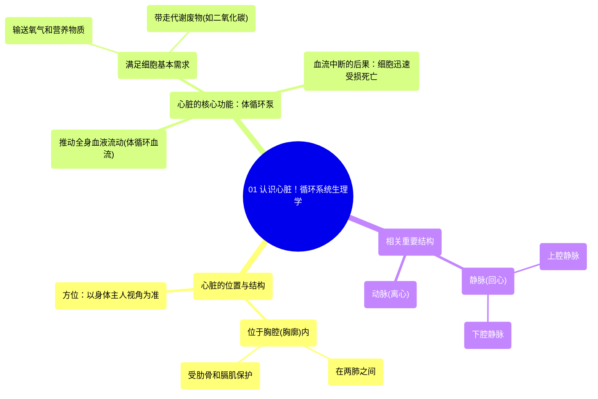

# 01 Meet the heart! Circulatory system physiology NCLEX-RN Khan Academy

  <video controls preload="metadata" playsinline>
    <source src="https://helly.s3.bitiful.net/心血管学科/%E4%B8%93%E8%BE%91%2002%EF%BC%9A%E5%BF%83%E8%A1%80%E7%AE%A1%E7%B3%BB%E7%BB%9F%E6%A6%82%E8%A7%88%20%28Cardiovascular%20System%29/01%20Meet%20the%20heart%21%20Circulatory%20system%20physiology%20NCLEX-RN%20Khan%20Academy.mp4" type="video/mp4">
    
您的浏览器不支持播放，请升级。

  </video>

::: tip ⚡️ 核心考点 (30s速读)
*   **核心考点**：心脏的核心功能是作为一个强大的泵，推动血液在全身持续流动，为所有细胞输送氧气和营养物质，并带走代谢废物（如二氧化碳），这是维持细胞生存和功能的基础。
*   **临床意义**：理解心脏的泵血功能是理解循环系统生理和病理（如心力衰竭、休克）的基石。任何导致血流灌注不足的情况，都会迅速危及细胞和器官功能。
:::

## 🧠 深度精讲

*   **心脏的位置与保护结构**：心脏位于胸腔（胸廓）内，具体位置在两肺之间，被肋骨和膈肌构成的保护性结构所包围。肋骨构成“墙壁”和“天花板”，膈肌构成“地板”，共同保护心脏和肺等重要器官。描述心脏的左右方位时，需以心脏拥有者的视角为准（即解剖学方位）。
*   **细胞的生存需求与血液流动的重要性**：以脚趾细胞为例，所有活细胞都需要持续的血液灌注。血流带来生存必需的**氧气**和**营养物质**，同时带走细胞产生的**代谢废物**（如二氧化碳）。如果没有血流，废物会积聚，营养物质会耗竭，细胞将在几分钟内功能受损并死亡。
*   **心脏的核心功能——体循环泵**：心脏的核心角色是一个强大的**泵**。它通过静脉（如上腔静脉、下腔静脉）接收来自全身的血液，再通过动脉将血液泵出，输送到全身各处。这种持续的泵血活动确保了**体循环血流**，即流向全身所有细胞的血液流动，是维持生命最基本的生理过程之一。

## 📚 双语术语表 (Terminology)
| 英文术语 | 中文翻译 | 定义/解释 |
| :--- | :--- | :--- |
| Heart | 心脏 | 位于胸腔内的肌性器官，主要功能是作为泵推动血液在循环系统中流动。 |
| Thorax / Ribcage | 胸腔 / 胸廓 | 由肋骨、胸骨、脊柱和膈肌围成的体腔，内藏心脏、肺等重要器官。 |
| Diaphragm | 膈肌 | 位于胸腔底部的一块穹顶状肌肉，是主要的呼吸肌，也参与分隔胸腔和腹腔。 |
| Cell | 细胞 | 生物体结构和功能的基本单位。 |
| Oxygen | 氧气 | 细胞进行有氧呼吸以产生能量所必需的气体。 |
| Nutrients | 营养物质 | 维持细胞生命活动所需的物质，如葡萄糖、氨基酸、脂肪酸等。 |
| Waste / Carbon Dioxide | 代谢废物 / 二氧化碳 | 细胞代谢产生的、需要被清除的物质。二氧化碳是细胞呼吸的主要气体废物。 |
| Blood Flow / Perfusion | 血流 / 灌注 | 血液在血管中流动的过程，特指流向组织或器官的血液供应。 |
| Pump | 泵 | 此处指心脏，因其能产生压力推动血液流动。 |
| Systemic Flow / Circulation | 体循环血流 / 体循环 | 血液从左心室泵出，经动脉流向全身组织（除肺外），再经静脉返回右心房的循环路径。 |
| Vein | 静脉 | 将血液从身体各部输送回心脏的血管。 |
| Artery | 动脉 | 将血液从心脏输送到身体各部的血管。 |
| Superior Vena Cava (SVC) | 上腔静脉 | 收集头部、颈部、上肢和胸部血液回流入右心房的大静脉。 |
| Inferior Vena Cava (IVC) | 下腔静脉 | 收集腹部、盆腔和下肢血液回流入右心房的大静脉。 |

## 🗺️ 知识图谱

