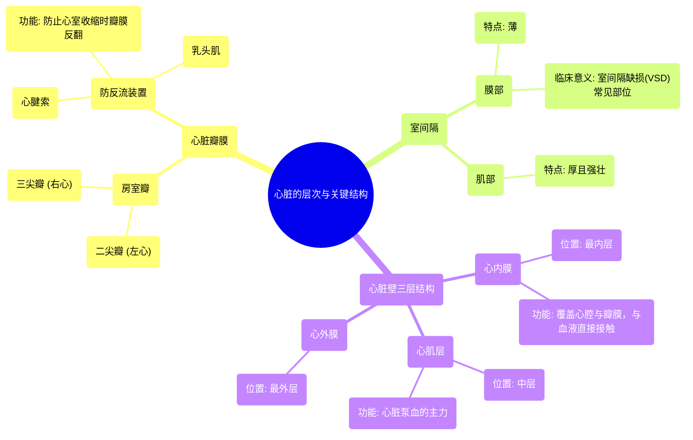

# 02 Layers of the heart Human anatomy and physiology Health & Medicine Khan Academy

  <video controls preload="metadata" playsinline>
    <source src="https://helly.s3.bitiful.net/心血管学科/%E4%B8%93%E8%BE%91%2002%EF%BC%9A%E5%BF%83%E8%A1%80%E7%AE%A1%E7%B3%BB%E7%BB%9F%E6%A6%82%E8%A7%88%20%28Cardiovascular%20System%29/02%20Layers%20of%20the%20heart%20Human%20anatomy%20and%20physiology%20Health%20%26%20Medicine%20Khan%20Academy.mp4" type="video/mp4">
    
您的浏览器不支持播放，请升级。

  </video>

::: tip ⚡️ 核心考点 (30s速读)
*   **核心考点**：心脏瓣膜（特别是房室瓣）的防反流机制，以及心脏壁的三层结构。
*   **临床意义**：心腱索断裂会导致瓣膜关闭不全，引起血液反流；室间隔膜部是先天性室间隔缺损的常见部位。
:::

## 🧠 深度精讲

*   **房室瓣的防反流机制**：二尖瓣和三尖瓣统称为房室瓣，它们位于心房和心室之间，开口朝下。为了防止心室强力收缩时血液反流回心房，瓣膜通过坚韧的纤维索——**心腱索**——连接到心室壁上的**乳头肌**上。这就像用绳子拉住门帘，防止它被风吹翻。如果心腱索断裂，瓣膜就会无法紧密闭合，导致血液向错误方向流动。
*   **室间隔的结构与临床意义**：分隔左右心室的壁称为室间隔。它分为两部分：较薄的**膜部**（上部）和较厚的**肌部**（下部）。膜部是先天性**室间隔缺损**最常见的发生部位。这种缺损会导致左心室的富氧血液流入右心室，增加右心和肺循环的负担。
*   **心脏壁的三层结构**：从内到外依次为：
    1.  **心内膜**：最内层，非常薄，覆盖所有心腔内部和瓣膜表面，与血管内膜相似，是血液直接接触的一层。
    2.  **心肌层**：中间层，由心肌细胞构成，是心脏进行收缩和舒张的主体部分，心室肌尤其肥厚有力。
    3.  **心外膜**：最外层，是覆盖在心脏表面的浆膜层（视频中虽未详述，但作为完整的三层结构之一，在此补充）。

## 📚 双语术语表 (Terminology)
| 英文术语 | 中文翻译 | 定义/解释 |
| :--- | :--- | :--- |
| Atrioventricular valves | 房室瓣 | 位于心房和心室之间的瓣膜，包括二尖瓣和三尖瓣。 |
| Tricuspid valve | 三尖瓣 | 位于右心房和右心室之间的房室瓣。 |
| Mitral valve | 二尖瓣 | 位于左心房和左心室之间的房室瓣。 |
| Chordae tendineae | 心腱索 | 连接房室瓣瓣叶与乳头肌的坚韧纤维索，防止心室收缩时瓣膜翻入心房。 |
| Papillary muscles | 乳头肌 | 心室壁上的锥形肌肉突起，通过心腱索牵拉房室瓣。 |
| Ventricular septum | 室间隔 | 分隔左心室和右心室的壁。 |
| Membranous septum | 膜部（室间隔） | 室间隔上部较薄的纤维性部分，是室间隔缺损的常见部位。 |
| Muscular septum | 肌部（室间隔） | 室间隔下部较厚的肌肉部分。 |
| Ventricular Septal Defect (VSD) | 室间隔缺损 | 一种先天性心脏病，指室间隔上存在异常孔洞，导致左右心室血液混合。 |
| Endocardium | 心内膜 | 心脏壁的最内层，覆盖心腔和瓣膜。 |
| Myocardium | 心肌层 | 心脏壁的中层，由心肌构成，负责心脏的泵血功能。 |
| Epicardium | 心外膜 | 心脏壁的最外层，即心包的脏层。 |

## 🗺️ 知识图谱

