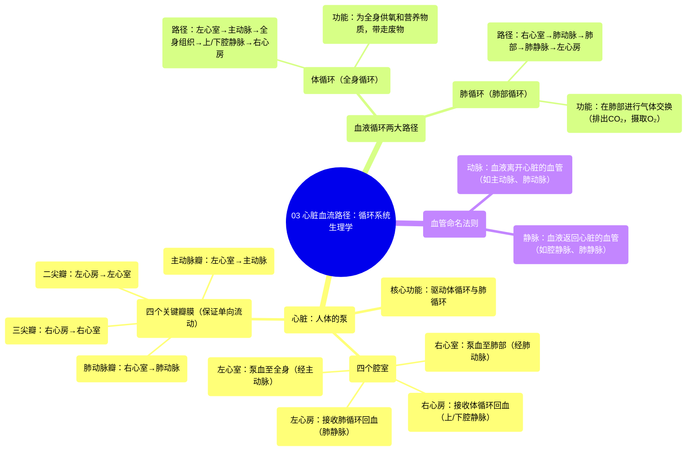

# 03 Flow through the heart Circulatory system physiology NCLEX-RN Khan Academy

  <video controls preload="metadata" playsinline>
    <source src="https://helly.s3.bitiful.net/心血管学科/%E4%B8%93%E8%BE%91%2002%EF%BC%9A%E5%BF%83%E8%A1%80%E7%AE%A1%E7%B3%BB%E7%BB%9F%E6%A6%82%E8%A7%88%20%28Cardiovascular%20System%29/03%20Flow%20through%20the%20heart%20Circulatory%20system%20physiology%20NCLEX-RN%20Khan%20Academy.mp4" type="video/mp4">
    
您的浏览器不支持播放，请升级。

  </video>

::: tip ⚡️ 核心考点 (30s速读)
*   **核心考点**：掌握体循环与肺循环的完整路径，理解心脏四个腔室（右心房、右心室、左心房、左心室）的功能顺序，以及瓣膜（三尖瓣、肺动脉瓣、二尖瓣、主动脉瓣）在维持血液单向流动中的关键作用。
*   **临床意义**：这是理解几乎所有心血管疾病（如心力衰竭、瓣膜病、先天性心脏病）病理生理学的基础。例如，瓣膜关闭不全会导致血液反流，影响泵血效率。
:::

## 🧠 深度精讲

*   **心脏的核心功能**：心脏本质上是一个终生工作的“泵”，其核心任务是将血液泵送至全身（体循环）和肺部（肺循环）。
*   **血液循环的两大路径**：
    1.  **体循环（全身循环）**：携带氧气和营养物质的血液从左心室泵出，经主动脉及其分支流向全身各组织。在组织中释放氧气并带走二氧化碳等废物后，血液通过上、下腔静脉返回右心房。此路径为身体供能。
    2.  **肺循环（肺部循环）**：从右心室泵出的去氧血，经肺动脉进入肺部。在肺部毛细血管中，血液释放二氧化碳，吸收新鲜氧气，变成富氧血。随后，富氧血经肺静脉返回左心房，准备进入下一轮体循环。
*   **心脏腔室与血流方向**：血液流经心脏遵循固定顺序：**体静脉 → 右心房 →（经三尖瓣）→ 右心室 →（经肺动脉瓣）→ 肺动脉 → 肺部 → 肺静脉 → 左心房 →（经二尖瓣）→ 左心室 →（经主动脉瓣）→ 主动脉 → 体动脉**。这个顺序确保了血液的有效氧合和分配。
*   **瓣膜的关键作用**：心脏的四个瓣膜（三尖瓣、肺动脉瓣、二尖瓣、主动脉瓣）如同“单向阀门”，只允许血液向前流动，防止其倒流，从而保证泵血效率。任何瓣膜的狭窄或关闭不全都会严重影响心脏功能。
*   **血管命名法则**：
    *   **动脉 (Artery)**：将血液**带离**心脏的血管（两者英文均以‘A’开头，便于记忆）。无论血液是富氧（如主动脉）还是去氧（如肺动脉），只要离开心脏，就是动脉。
    *   **静脉 (Vein)**：将血液**带回**心脏的血管。无论血液是去氧（如上、下腔静脉）还是富氧（如肺静脉），只要返回心脏，就是静脉。

## 📚 双语术语表 (Terminology)
| 英文术语 | 中文翻译 | 定义/解释 |
| :--- | :--- | :--- |
| Heart | 心脏 | 人体的肌性泵血器官，驱动血液循环。 |
| Atrium | 心房 | 心脏上部的腔室，接收回心血液。右心房接收体静脉血，左心房接收肺静脉血。 |
| Ventricle | 心室 | 心脏下部的腔室，肌肉发达，负责将血液泵出心脏。右心室泵血至肺部，左心室泵血至全身。 |
| Valve | 瓣膜 | 心脏内的单向阀门结构，确保血液单向流动。 |
| Tricuspid Valve | 三尖瓣 | 位于右心房和右心室之间的瓣膜，有三个瓣叶，防止血液从心室倒流回心房。 |
| Pulmonary Valve | 肺动脉瓣 | 位于右心室和肺动脉之间的瓣膜，防止血液从肺动脉倒流回右心室。 |
| Mitral Valve | 二尖瓣 | 位于左心房和左心室之间的瓣膜，有两个瓣叶，防止血液从左心室倒流回左心房。 |
| Aortic Valve | 主动脉瓣 | 位于左心室和主动脉之间的瓣膜，防止血液从主动脉倒流回左心室。 |
| Artery | 动脉 | 将血液带离心脏的血管。 |
| Vein | 静脉 | 将血液带回心脏的血管。 |
| Aorta | 主动脉 | 体循环的起始动脉，将富氧血从左心室输送至全身。 |
| Superior Vena Cava | 上腔静脉 | 收集头部、颈部、上肢和胸部血液，将其送回右心房的大静脉。 |
| Inferior Vena Cava | 下腔静脉 | 收集腹部、盆腔和下肢血液，将其送回右心房的大静脉。 |
| Pulmonary Artery | 肺动脉 | 将去氧血从右心室输送至肺部的动脉。 |
| Pulmonary Vein | 肺静脉 | 将富氧血从肺部输送回左心房的静脉。 |
| Systemic Circulation | 体循环 / 全身循环 | 血液从左心室流向全身再返回右心房的循环路径。 |
| Pulmonary Circulation | 肺循环 / 肺部循环 | 血液从右心室流向肺部再返回左心房的循环路径。 |

## 🗺️ 知识图谱

