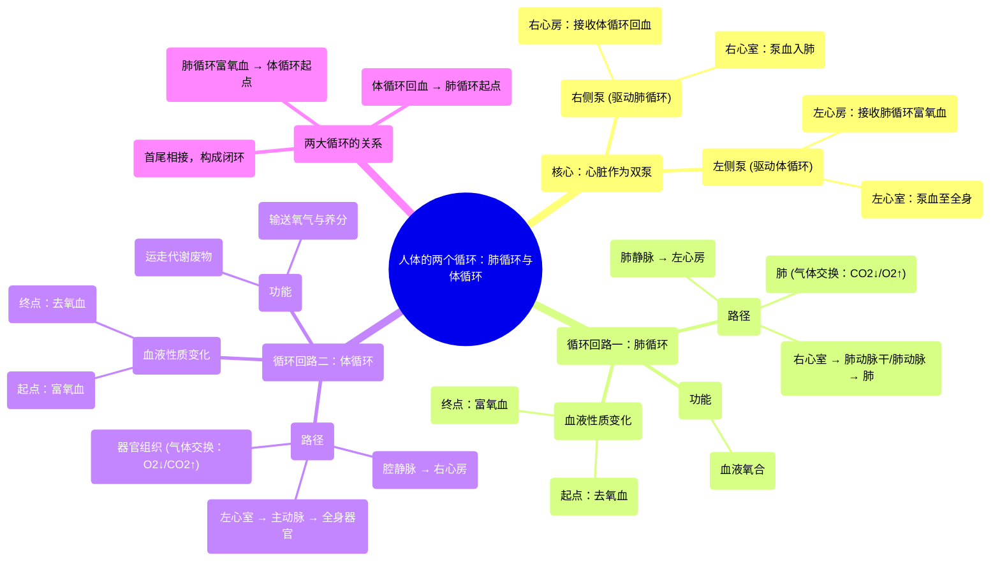

# 04 Two Circulations in the Body Circulatory system physiology NCLEX-RN Khan Academy

  <video controls preload="metadata" playsinline>
    <source src="https://helly.s3.bitiful.net/心血管学科/%E4%B8%93%E8%BE%91%2002%EF%BC%9A%E5%BF%83%E8%A1%80%E7%AE%A1%E7%B3%BB%E7%BB%9F%E6%A6%82%E8%A7%88%20%28Cardiovascular%20System%29/04%20Two%20Circulations%20in%20the%20Body%20Circulatory%20system%20physiology%20NCLEX-RN%20Khan%20Academy.mp4" type="video/mp4">
    
您的浏览器不支持播放，请升级。

  </video>

::: tip ⚡️ 核心考点 (30s速读)
*   **核心考点**：心脏是一个双泵系统，驱动着两个独立的血液循环回路：**肺循环**和**体循环**。理解血液如何在这两个回路中流动，以及血液含氧量的变化，是循环系统生理学的基石。
*   **临床意义**：区分这两个循环对于理解多种心血管疾病至关重要。例如，**左心衰竭**主要影响体循环，导致全身供血不足；而**右心衰竭**主要影响肺循环，导致肺部淤血和呼吸困难。
:::

## 🧠 深度精讲

根据视频内容，我们可以将心脏和循环系统理解为一个精密的“双泵管道系统”。

*   **心脏作为双泵**：心脏的四个腔室可以看作是两个协同工作的泵。
    *   **右侧泵（右心房+右心室）**：负责驱动**肺循环**。它接收来自全身的、氧气已被消耗的**去氧血**，并将其泵向肺部。
    *   **左侧泵（左心房+左心室）**：负责驱动**体循环**。它接收来自肺部的、富含氧气的**动脉血**，并将其泵向全身各个器官和组织。

*   **两大循环回路**：
    1.  **肺循环 (Pulmonary Circulation)**：
        *   **路径**：右心室 → **肺动脉瓣** → **肺动脉干** → **左、右肺动脉** → 肺部毛细血管网（进行气体交换：释放二氧化碳，摄取氧气）→ **肺静脉** → 左心房。
        *   **功能**：使血液在肺部“更新”，将去氧血转化为富氧血。
        *   **关键特点**：肺动脉中流动的是**去氧血**，肺静脉中流动的是**富氧血**。这是循环系统中唯一“动脉流静脉血，静脉流动脉血”的特例。

    2.  **体循环 (Systemic Circulation)**：
        *   **路径**：左心室 → **主动脉瓣** → **主动脉**及其各级分支 → 全身器官/组织的毛细血管网（释放氧气和营养物质，收集二氧化碳和代谢废物）→ 小静脉、静脉 → **上腔静脉** 和 **下腔静脉** → 右心房。
        *   **功能**：将氧气和营养物质输送到全身，并运走代谢废物。
        *   **关键特点**：这是循环系统的主体，压力高，路径长。主动脉及其分支中流动的是**富氧血**，腔静脉及其属支中流动的是**去氧血**。

*   **循环的衔接与意义**：这两个循环首尾相连，构成一个完整的“8”字形环路。**体循环的终点（右心房）是肺循环的起点**，**肺循环的终点（左心房）是体循环的起点**。这种设计确保了血液必须不间断地流经肺部进行氧合，才能被分配到全身，高效地维持生命活动。

## 📚 双语术语表 (Terminology)
| 英文术语 | 中文翻译 | 定义/解释 |
| :--- | :--- | :--- |
| Right Atrium | 右心房 | 心脏右上方的腔室，接收来自全身（通过腔静脉）的去氧血，并将其送入右心室。 |
| Right Ventricle | 右心室 | 心脏右下方的腔室，将去氧血泵入肺动脉，开始肺循环。 |
| Left Atrium | 左心房 | 心脏左上方的腔室，接收来自肺部（通过肺静脉）的富氧血，并将其送入左心室。 |
| Left Ventricle | 左心室 | 心脏左下方的腔室，心肌最厚，将富氧血泵入主动脉，开始体循环。 |
| Pulmonary Trunk | 肺动脉干 | 从右心室发出的大血管，随后分为左、右肺动脉。 |
| Pulmonary Arteries | 肺动脉 | 将去氧血从心脏输送到肺部的血管。 |
| Pulmonary Veins | 肺静脉 | 将经过氧合的富氧血从肺部输送回心脏（左心房）的血管。 |
| Aorta | 主动脉 | 人体最粗大的动脉血管，从左心室发出，将富氧血输送至全身。 |
| Superior Vena Cava | 上腔静脉 | 收集头部、颈部、上肢和胸部回流的去氧血，注入右心房。 |
| Inferior Vena Cava | 下腔静脉 | 收集腹部、盆腔和下肢回流的去氧血，注入右心房。 |
| Pulmonary Circulation | 肺循环 | 血液从右心室流向肺部再回到左心房的循环路径，主要功能是气体交换。 |
| Systemic Circulation | 体循环 | 血液从左心室流向全身再回到右心房的循环路径，负责为组织供氧和输送养分。 |
| Deoxygenated Blood | 去氧血 / 静脉血 | 氧气含量较低、二氧化碳含量较高的血液，通常呈暗红色。 |
| Oxygenated Blood | 富氧血 / 动脉血 | 氧气含量高、二氧化碳含量较低的血液，通常呈鲜红色。 |

## 🗺️ 知识图谱

