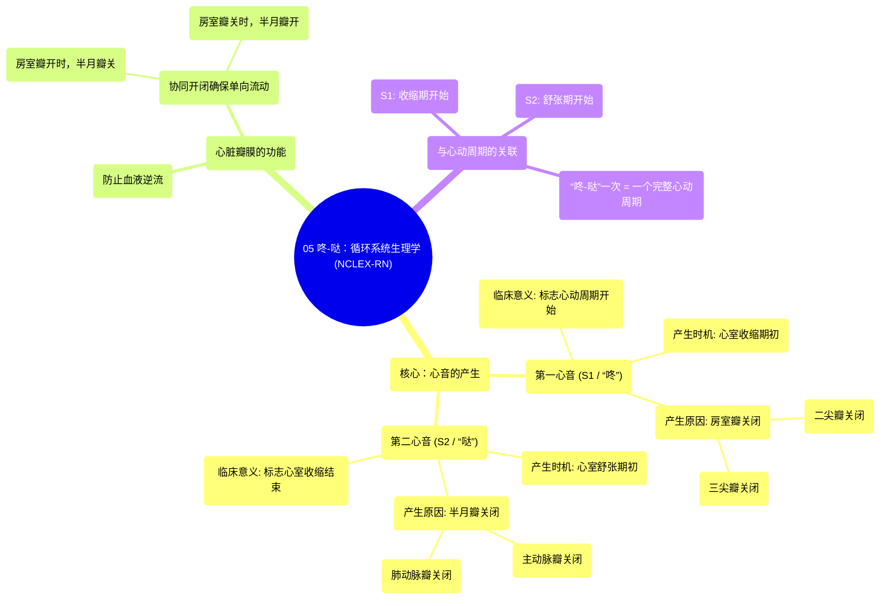

# 05 Lub Dub Circulatory system physiology NCLEX-RN Khan Academy

  <video controls preload="metadata" playsinline>
    <source src="https://helly.s3.bitiful.net/心血管学科/%E4%B8%93%E8%BE%91%2002%EF%BC%9A%E5%BF%83%E8%A1%80%E7%AE%A1%E7%B3%BB%E7%BB%9F%E6%A6%82%E8%A7%88%20%28Cardiovascular%20System%29/05%20Lub%20Dub%20Circulatory%20system%20physiology%20NCLEX-RN%20Khan%20Academy.mp4" type="video/mp4">
    
您的浏览器不支持播放，请升级。

  </video>

::: tip ⚡️ 核心考点 (30s速读)
*   **核心考点**：第一心音（S1）由房室瓣（二尖瓣、三尖瓣）关闭产生；第二心音（S2）由半月瓣（主动脉瓣、肺动脉瓣）关闭产生。它们标志着心动周期的关键节点。
*   **临床意义**：听诊心音（“咚-哒”）是评估心脏瓣膜功能的基础。心音异常（如增强、减弱、分裂或出现额外心音）是诊断瓣膜狭窄、关闭不全等心脏疾病的重要线索。
:::

## 🧠 深度精讲

*   **心音的产生机制**：心脏的“咚-哒”声并非心肌收缩的直接声音，而是**心脏瓣膜关闭时产生的振动音**。血液在心脏内单向流动，瓣膜通过适时开闭来防止血液逆流。当瓣膜因血流冲击而突然关闭时，就会产生我们听到的心音。
*   **第一心音 (S1 / “咚”)**：
    *   **产生时机**：心室收缩期开始时。
    *   **产生原因**：心室压力迅速升高，超过心房压力，导致**房室瓣（二尖瓣和三尖瓣）骤然关闭**。
    *   **特点**：音调较低钝，持续时间较长。标志着一个心动周期的开始。
*   **第二心音 (S2 / “哒”)**：
    *   **产生时机**：心室舒张期开始时。
    *   **产生原因**：心室舒张，压力迅速下降，低于主动脉和肺动脉压力，导致**半月瓣（主动脉瓣和肺动脉瓣）骤然关闭**。
    *   **特点**：音调较高脆，持续时间较短。标志着心室收缩期结束。
*   **瓣膜的协同工作**：瓣膜的开闭是成对且交替进行的。当房室瓣打开让血液流入心室时，半月瓣是关闭的，防止动脉血回流。当心室收缩、血液射入动脉时，半月瓣打开，而房室瓣则关闭以防止血液倒流回心房。这种精密的配合确保了血液的单向高效流动。

## 📚 双语术语表 (Terminology)
| 英文术语 | 中文翻译 | 定义/解释 |
| :--- | :--- | :--- |
| Lub-dub | 咚-哒 | 对正常第一和第二心音的口语化描述。 |
| First heart sound (S1) | 第一心音 | 由二尖瓣和三尖瓣关闭产生的声音，标志心室收缩开始。 |
| Second heart sound (S2) | 第二心音 | 由主动脉瓣和肺动脉瓣关闭产生的声音，标志心室舒张开始。 |
| Atrioventricular valves (AV valves) | 房室瓣 | 位于心房与心室之间的瓣膜，包括二尖瓣和三尖瓣。 |
| Tricuspid valve | 三尖瓣 | 右心房与右心室之间的房室瓣。 |
| Mitral valve | 二尖瓣 | 左心房与左心室之间的房室瓣。 |
| Semilunar valves | 半月瓣 | 位于心室与动脉之间的瓣膜，包括主动脉瓣和肺动脉瓣。 |
| Aortic valve | 主动脉瓣 | 左心室与主动脉之间的半月瓣。 |
| Pulmonary valve | 肺动脉瓣 | 右心室与肺动脉之间的半月瓣。 |
| Systole | 收缩期 | 心脏（通常指心室）收缩，将血液泵出的时期。 |
| Diastole | 舒张期 | 心脏（通常指心室）舒张，充盈血液的时期。 |

## 🗺️ 知识图谱

