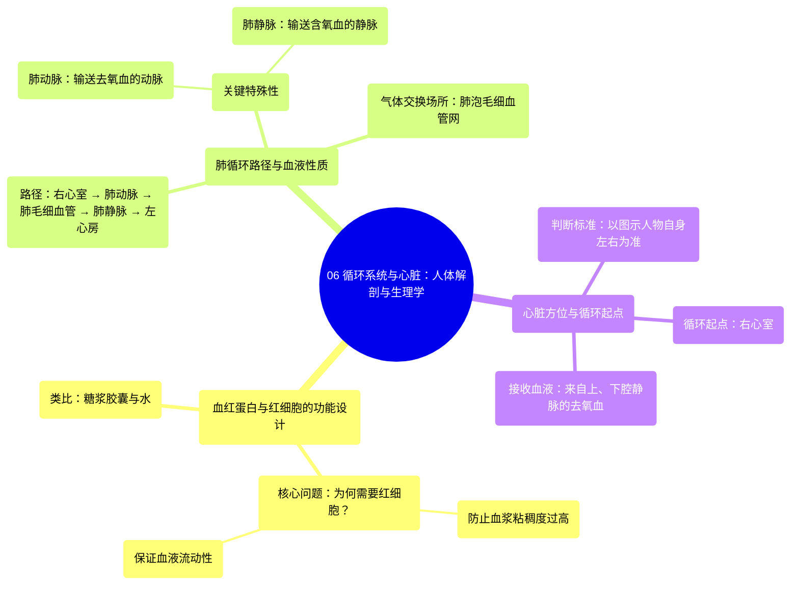

# 06 Circulatory system and the heart Human anatomy and physiology Health & Medicine Khan Academy

  <video controls preload="metadata" playsinline>
    <source src="https://helly.s3.bitiful.net/心血管学科/%E4%B8%93%E8%BE%91%2002%EF%BC%9A%E5%BF%83%E8%A1%80%E7%AE%A1%E7%B3%BB%E7%BB%9F%E6%A6%82%E8%A7%88%20%28Cardiovascular%20System%29/06%20Circulatory%20system%20and%20the%20heart%20Human%20anatomy%20and%20physiology%20Health%20%26%20Medicine%20Khan%20Academy.mp4" type="video/mp4">
    
您的浏览器不支持播放，请升级。

  </video>

::: tip ⚡️ 核心考点 (30s速读)
*   **核心考点**：血红蛋白被封装在红细胞内，而非自由漂浮于血浆中，是为了降低血液粘稠度，保证血液高效流动。
*   **临床意义**：理解肺动脉（输送去氧血）和肺静脉（输送含氧血）的功能特殊性，是掌握肺循环（小循环）与体循环（大循环）区别的关键。
:::

## 🧠 深度精讲

*   **血红蛋白的“容器”设计**：视频提出了一个关键问题：为什么血红蛋白必须存在于红细胞内？直观上，让血红蛋白直接溶解在血浆中似乎更高效，无需跨膜运输。但答案与血液的物理特性有关。如果血红蛋白自由漂浮，会使血浆变得异常粘稠（像糖浆一样），严重阻碍血液流动。将血红蛋白封装在红细胞这个“小珠子”里，就像把糖浆装进胶囊再放入水中，能保持血浆（水）的低粘性，从而确保血液在血管中顺畅流动。
*   **肺循环的路径与血液性质**：视频通过人体循环系统图，清晰勾勒了肺循环的路径：**右心室** → **肺动脉**（蓝色，去氧血）→ **肺毛细血管**（在肺泡处进行气体交换）→ **肺静脉**（红色，含氧血）→ **左心房**。这里需要特别注意**肺动脉和肺静脉的“名不副实”**：肺动脉是唯一输送去氧血的动脉；肺静脉是唯一输送含氧血的静脉。这打破了“动脉都含氧，静脉都去氧”的简单认知，其判断标准是血流方向（离心为动脉，回心为静脉）。
*   **心脏的方位与循环起点**：视频特别强调了在解剖图中判断左右的心窍门：应以图示人物自身的左右为准，而非观察者的左右。图中人物面对观察者，因此其右侧对应画面的左侧。循环的起点是**右心室**，它接收来自全身的**去氧血**（通过上、下腔静脉），并将其泵入肺动脉，开始肺循环。

## 📚 双语术语表 (Terminology)
| 英文术语 | 中文翻译 | 定义/解释 |
| :--- | :--- | :--- |
| Hemoglobin | 血红蛋白 | 红细胞内的一种蛋白质，负责结合与运输氧气。 |
| Red blood cells (RBCs) | 红细胞 | 血液中富含血红蛋白的细胞，主要功能是运输氧气。 |
| Plasma | 血浆 | 血液的液体成分，运载血细胞、营养物质和代谢废物。 |
| Viscous | 粘稠的 | 描述流体流动阻力的物理特性，粘稠度越高，流动越困难。 |
| Alveoli | 肺泡 | 肺部微小的气囊，是气体交换（氧气入血，二氧化碳出血）的主要场所。 |
| Pulmonary artery | 肺动脉 | 将血液从心脏右心室输送至肺部的血管，其内为去氧血。 |
| Pulmonary vein | 肺静脉 | 将血液从肺部输送回心脏左心房的血管，其内为含氧血。 |
| Deoxygenated blood | 去氧血 | 氧气含量较低的血液，通常呈暗红色，在体循环的静脉和肺循环的动脉中。 |
| Oxygenated blood | 含氧血/动脉血 | 氧气含量高的血液，通常呈鲜红色，在体循环的动脉和肺循环的静脉中。 |
| Right ventricle | 右心室 | 心脏的四个腔室之一，接收来自右心房的去氧血，并将其泵入肺动脉。 |
| Inferior vena cava | 下腔静脉 | 将身体下半部分的去氧血输送回心脏右心房的大静脉。 |

## 🗺️ 知识图谱

