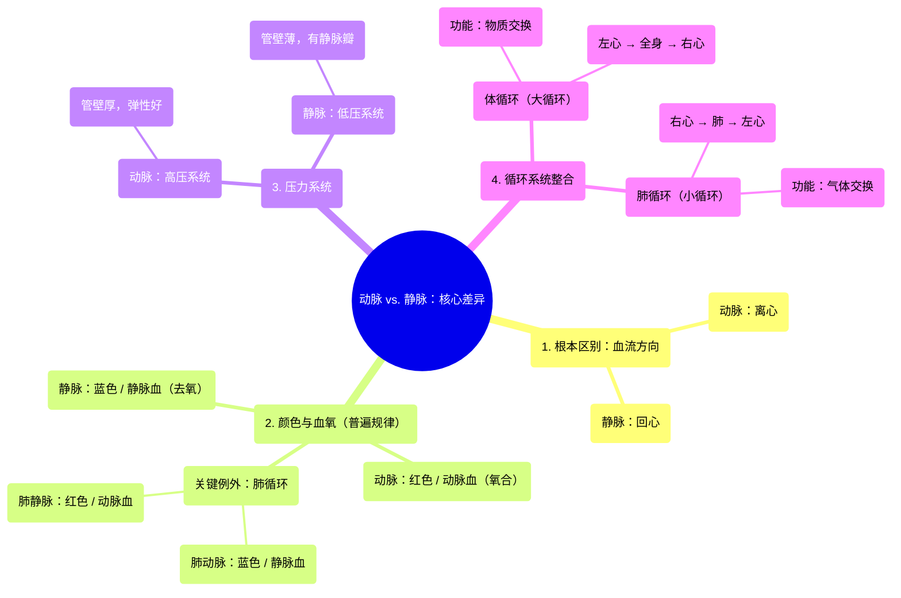

# 07 Arteries vs. veins-what's the difference Circulatory system physiology NCLEX-RN Khan Academy

  <video controls preload="metadata" playsinline>
    <source src="https://helly.s3.bitiful.net/心血管学科/%E4%B8%93%E8%BE%91%2002%EF%BC%9A%E5%BF%83%E8%A1%80%E7%AE%A1%E7%B3%BB%E7%BB%9F%E6%A6%82%E8%A7%88%20%28Cardiovascular%20System%29/07%20Arteries%20vs.%20veins-what%27s%20the%20difference%20Circulatory%20system%20physiology%20NCLEX-RN%20Khan%20Academy.mp4" type="video/mp4">
    
您的浏览器不支持播放，请升级。

  </video>

::: tip ⚡️ 核心考点 (30s速读)
*   **核心考点**：动脉与静脉的核心区别在于**血流方向**：动脉将血液带离心脏，静脉将血液带回心脏。颜色（红/蓝）和压力（高/低）是重要的辅助判断特征，但存在例外（如肺循环）。
*   **临床意义**：理解动脉高压、静脉低压的特性，是解释高血压、静脉曲张等疾病的基础。区分体循环与肺循环的血管功能，对理解心肺疾病（如肺动脉高压）至关重要。
:::

## 🧠 深度精讲

*   **概念1：动脉与静脉的根本区别——血流方向**
    这是区分动脉和静脉最根本、最可靠的标准。无论血管内流动的是含氧血还是去氧血，**动脉始终是将血液从心脏输送出去的血管，而静脉始终是将血液输送回心脏的血管**。这个定义适用于全身所有血管，包括体循环和肺循环。

*   **概念2：颜色与血氧含量的普遍规律及重要例外**
    *   **普遍规律**：在**体循环**中，动脉通常携带富含氧气的**动脉血**，呈鲜红色；静脉通常携带氧气被组织利用后的**去氧血**，呈暗红色（在体表观察下呈现蓝色）。
    *   **重要例外**：在**肺循环**中，情况正好相反。**肺动脉**将心脏（右心室）泵出的去氧血送往肺部进行气体交换，因此内部流动的是去氧血；**肺静脉**则将肺部完成氧合后的动脉血输送回心脏（左心房）。这是“动脉流动脉血，静脉流静脉血”这一简单规律的关键例外。

*   **概念3：压力系统的差异**
    *   **动脉系统**：属于**高压系统**。血液从心脏（左心室）泵出时压力很高，以适应将血液推向全身各处的需要。动脉管壁较厚、弹性好，以承受这种高压和维持血流。
    *   **静脉系统**：属于**低压系统**。血液流经毛细血管网后，压力已大幅下降。静脉管壁较薄，腔内通常有**静脉瓣**以防止血液倒流，并依靠肌肉收缩等外力帮助血液回流至心脏。

*   **概念4：体循环与肺循环的整合**
    心血管系统由这两个循环串联而成，形成一个完整的“8”字形环路：
    1.  **体循环**：左心室 → 主动脉及各级动脉 → 全身组织毛细血管（物质交换） → 各级静脉 → 上、下腔静脉 → 右心房。功能：向全身输送氧气和养分，带走代谢废物。
    2.  **肺循环**：右心室 → 肺动脉 → 肺部毛细血管（气体交换：释放CO₂，摄取O₂） → 肺静脉 → 左心房。功能：在肺部进行气体交换，使血液重新氧合。

## 📚 双语术语表 (Terminology)
| 英文术语 | 中文翻译 | 定义/解释 |
| :--- | :--- | :--- |
| Artery | 动脉 | 将血液从心脏输送出去的血管。 |
| Vein | 静脉 | 将血液输送回心脏的血管。 |
| Aorta | 主动脉 | 体循环的起始动脉，直接发自左心室，是全身最粗大的动脉。 |
| Capillary | 毛细血管 | 连接微小动脉和微小静脉的极细血管网，是血液与组织细胞进行物质和气体交换的场所。 |
| Systemic Circulation | 体循环 / 大循环 | 血液从左心室流经全身（除肺外）再返回右心房的过程。 |
| Pulmonary Circulation | 肺循环 / 小循环 | 血液从右心室流经肺部再返回左心房的过程。 |
| Pulmonary Artery | 肺动脉 | 将右心室的去氧血输送至肺部的动脉。 |
| Pulmonary Vein | 肺静脉 | 将肺部氧合后的动脉血输送回左心房的静脉。 |
| Oxygenated Blood | 动脉血 / 含氧血 | 富含氧气的血液，通常呈鲜红色。 |
| Deoxygenated Blood | 静脉血 / 去氧血 | 氧气含量较低的血液，通常呈暗红色（体表观呈蓝色）。 |
| High-pressure System | 高压系统 | 描述动脉系统内血液压力较高的特性。 |
| Low-pressure System | 低压系统 | 描述静脉系统内血液压力较低的特性。 |

## 🗺️ 知识图谱

