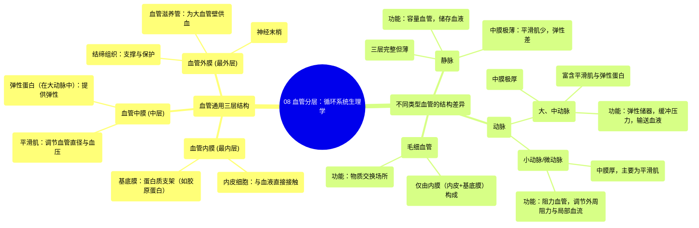

# 08 Layers of a blood vessel Circulatory system physiology NCLEX-RN Khan Academy

  <video controls preload="metadata" playsinline>
    <source src="https://helly.s3.bitiful.net/心血管学科/%E4%B8%93%E8%BE%91%2002%EF%BC%9A%E5%BF%83%E8%A1%80%E7%AE%A1%E7%B3%BB%E7%BB%9F%E6%A6%82%E8%A7%88%20%28Cardiovascular%20System%29/08%20Layers%20of%20a%20blood%20vessel%20Circulatory%20system%20physiology%20NCLEX-RN%20Khan%20Academy.mp4" type="video/mp4">
    
您的浏览器不支持播放，请升级。

  </video>

::: tip ⚡️ 核心考点 (30s速读)
*   **核心考点**：所有血管（除毛细血管外）都具有三层基本结构：血管内膜、血管中膜和血管外膜。这三层的厚度和成分在不同类型血管（动脉、静脉、毛细血管）中存在显著差异，决定了其功能。
*   **临床意义**：理解血管结构是掌握血压调节、动脉粥样硬化、静脉曲张等心血管疾病病理生理的基础。例如，动脉中膜富含平滑肌和弹性蛋白，使其能承受高压并调节血流；而静脉中膜薄，主要依靠外膜和瓣膜防止血液倒流。
:::

## 🧠 深度精讲

视频详细讲解了血管的微观结构，并将其归纳为一个通用模型，然后应用于不同类型的血管。

1.  **血管的通用三层结构**
    *   **血管内膜**：最内层，直接与血液接触。由单层**内皮细胞**及其下方的**基底膜**（主要由胶原蛋白等蛋白质构成）组成。功能是提供光滑的内表面，减少血流阻力，并参与物质交换和血管舒缩调节。
    *   **血管中膜**：中间层，主要由**平滑肌细胞**构成。这是血管最活跃的一层，平滑肌的收缩和舒张直接改变血管直径，从而调节血压和局部血流量。在某些血管（如大动脉）中，此层还含有大量**弹性蛋白**，赋予血管弹性。
    *   **血管外膜**：最外层，主要由结缔组织（如胶原蛋白）构成。功能是支撑和保护血管。在大型血管中，此层内可能含有为血管壁本身供血的小血管，称为**血管滋养管**，以及神经末梢。

2.  **不同类型血管的结构特点**
    *   **静脉**：三层结构完整，但**血管中膜层非常薄**，平滑肌含量少。因此静脉壁较薄，弹性差，主要作为容量血管储存血液。
    *   **动脉**：根据大小分为两类：
        *   **大、中动脉**：**血管中膜极厚**，不仅含有丰富的平滑肌，还含有大量的**弹性蛋白**。这使得它们具有极强的弹性和收缩力，能缓冲心脏泵血产生的压力波动（弹性储器作用），并将血液推向全身。
        *   **小动脉/微动脉**：**血管中膜依然很厚**，但主要由平滑肌构成，弹性蛋白较少。它们是调节外周阻力和局部血流量的主要部位，被称为“阻力血管”。
    *   **毛细血管**：仅由单层**内皮细胞**和**基底膜**构成（即仅保留血管内膜层），无平滑肌层。这种极薄的结构非常适合进行血液与组织液之间的气体和物质交换。

## 📚 双语术语表 (Terminology)
| 英文术语 | 中文翻译 | 定义/解释 |
| :--- | :--- | :--- |
| **Lumen** | **管腔** | 血管中空的部分，血液流经的通道。 |
| **Endothelial Cells** | **内皮细胞** | 衬覆在血管内膜最内层的单层扁平细胞，直接与血液接触。 |
| **Basement Membrane** | **基底膜** | 位于内皮细胞下方的一层薄膜，主要由蛋白质（如胶原蛋白）构成，起支持和固定作用。 |
| **Tunica Intima** | **血管内膜** | 血管壁的最内层，由内皮细胞和基底膜共同构成。 |
| **Tunica Media** | **血管中膜** | 血管壁的中间层，主要由平滑肌细胞和弹性纤维组成，负责血管的舒缩。 |
| **Tunica Externa (Adventitia)** | **血管外膜 (外膜)** | 血管壁的最外层，由结缔组织构成，内含血管滋养管和神经。 |
| **Smooth Muscle** | **平滑肌** | 构成血管中膜的非随意肌，其收缩和舒张调节血管直径。 |
| **Elastin** | **弹性蛋白** | 一种具有弹性的蛋白质，大量存在于大动脉的中膜，使血管具有弹性。 |
| **Collagen** | **胶原蛋白** | 一种结构蛋白质，存在于基底膜和血管外膜，提供抗张强度。 |
| **Vasovasorum** | **血管滋养管** | 分布于大型血管外膜中的微小血管，为血管壁本身供应营养和氧气。 |
| **Vein** | **静脉** | 将血液从身体各部输送回心脏的血管，管壁较薄，中膜平滑肌少。 |
| **Artery** | **动脉** | 将血液从心脏输送到身体各部的血管，管壁厚，中膜富含平滑肌和弹性蛋白。 |
| **Arteriole** | **微动脉** | 小动脉的分支，是调节外周阻力和局部血流的主要血管。 |

## 🗺️ 知识图谱

