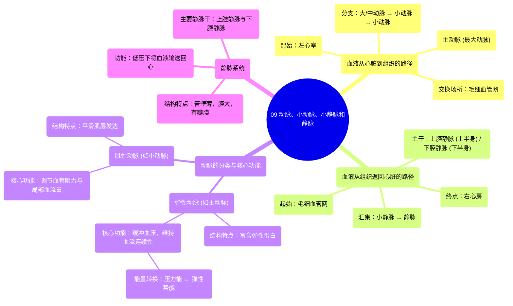

# 09 Arteries, arterioles, venules, and veins Health & Medicine Khan Academy

  <video controls preload="metadata" playsinline>
    <source src="https://helly.s3.bitiful.net/心血管学科/%E4%B8%93%E8%BE%91%2002%EF%BC%9A%E5%BF%83%E8%A1%80%E7%AE%A1%E7%B3%BB%E7%BB%9F%E6%A6%82%E8%A7%88%20%28Cardiovascular%20System%29/09%20Arteries%2C%20arterioles%2C%20venules%2C%20and%20veins%20Health%20%26%20Medicine%20Khan%20Academy.mp4" type="video/mp4">
    
您的浏览器不支持播放，请升级。

  </video>

::: tip ⚡️ 核心考点 (30s速读)
*   **核心考点**：血液从心脏到组织再返回的路径，以及不同血管（动脉、小动脉、小静脉、静脉）在结构和功能上的关键区别。
*   **临床意义**：理解血管的弹性（缓冲血压）和肌性（调节血流）功能，是理解高血压、动脉粥样硬化等心血管疾病病理生理的基础。
:::

## 🧠 深度精讲

*   **血液从心脏到脚趾的路径**：血液从左心室泵出，进入**主动脉**（最大的动脉）。主动脉向下延伸并分支，进入腿部。动脉逐级分支，管径逐渐变小：从**大动脉**到**中动脉**，再到**小动脉**，最后到达最细的**小动脉**。血液通过小动脉进入**毛细血管网**（视频中描绘为极细的分支），与脚趾细胞进行物质交换（输送氧气、葡萄糖，带走二氧化碳等废物）。交换后的血液首先汇入**小静脉**，然后小静脉汇合成**静脉**，最终通过**下腔静脉**（收集下半身血液）和**上腔静脉**（收集上半身血液）返回心脏右心房。

*   **动脉的分类与功能**：
    *   **弹性动脉**：包括主动脉及其主要分支（大、中动脉）。管壁富含**弹性蛋白**，使其具有高度弹性。当心脏收缩泵出高压血液时，这些动脉扩张，将心脏搏动产生的**压力能**储存为**弹性势能**；心脏舒张时，动脉壁弹性回缩，将储存的势能转化为推动血液前进的压力，从而**缓冲并稳定血压**，保证血流的连续性。
    *   **肌性动脉**：包括小动脉及其前一级分支。管壁**平滑肌**层发达。通过平滑肌的收缩与舒张，可以显著改变血管的直径，从而**精细调节流向特定器官或组织的血流量和阻力**，是调控血压和局部灌注的关键部位。

*   **静脉系统**：静脉管壁较薄，弹性较小，但管腔通常比同级动脉大。它们将血液从全身组织输送回心脏。**上腔静脉**和**下腔静脉**是身体最大的静脉，分别收集上半身和下半身的血液。静脉系统压力较低，其回流依赖于骨骼肌的挤压、静脉瓣膜（防止血液倒流）以及胸腔的负压吸引等机制。

## 📚 双语术语表 (Terminology)
| 英文术语 | 中文翻译 | 定义/解释 |
| :--- | :--- | :--- |
| Aorta | 主动脉 | 体循环的起始动脉，也是人体最粗大的动脉血管，从左心室发出。 |
| Artery | 动脉 | 将血液从心脏输送到身体各部位的血管，管壁厚，弹性好，承受压力高。 |
| Arteriole | 小动脉 | 最小的动脉分支，连接小动脉与毛细血管，其平滑肌收缩是调节外周阻力和局部血流的主要机制。 |
| Capillary | 毛细血管 | 连接小动脉和小静脉的极细微血管网，管壁仅由单层内皮细胞构成，是血液与组织液进行物质交换的场所。 |
| Venule | 小静脉 | 最小的静脉分支，收集来自毛细血管网的血液，并汇入更大的静脉。 |
| Vein | 静脉 | 将血液从身体各部位输送回心脏的血管，管壁较动脉薄，弹性小，管腔较大，内有瓣膜防止血液倒流。 |
| Inferior Vena Cava | 下腔静脉 | 人体最大的静脉之一，收集膈肌以下下半身的血液，并将其输送回右心房。 |
| Superior Vena Cava | 上腔静脉 | 人体最大的静脉之一，收集头颈部、上肢和胸部的血液，并将其输送回右心房。 |
| Elastic Artery | 弹性动脉 | 如主动脉，管壁富含弹性蛋白，主要功能是通过扩张和回缩来缓冲心脏搏动产生的血压波动。 |
| Muscular Artery | 肌性动脉 | 如分布到各器官的动脉，管壁平滑肌层发达，主要功能是通过收缩和舒张来调节分配到身体各部位的血流量。 |
| Elastin | 弹性蛋白 | 一种具有高度弹性的蛋白质，是弹性动脉壁的重要组成成分。 |
| Smooth Muscle | 平滑肌 | 构成内脏器官（如血管、消化道）壁的肌肉，其收缩不受意识支配，在血管中用于调节管径。 |

## 🗺️ 知识图谱

