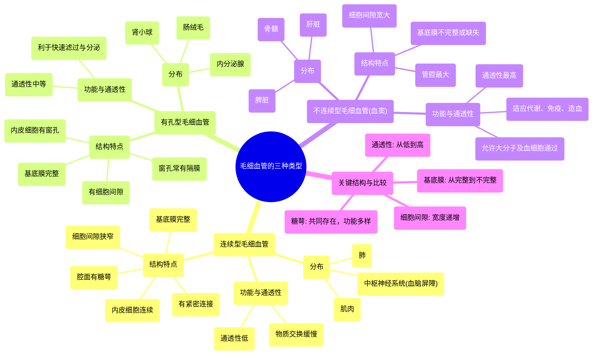

# 10 Three types of capillaries Circulatory system physiology NCLEX-RN Khan Academy

  <video controls preload="metadata" playsinline>
    <source src="https://helly.s3.bitiful.net/心血管学科/%E4%B8%93%E8%BE%91%2002%EF%BC%9A%E5%BF%83%E8%A1%80%E7%AE%A1%E7%B3%BB%E7%BB%9F%E6%A6%82%E8%A7%88%20%28Cardiovascular%20System%29/10%20Three%20types%20of%20capillaries%20Circulatory%20system%20physiology%20NCLEX-RN%20Khan%20Academy.mp4" type="video/mp4">
    
您的浏览器不支持播放，请升级。

  </video>

::: tip ⚡️ 核心考点 (30s速读)
*   **核心考点**：毛细血管是微循环的核心，根据其结构通透性分为连续型、有孔型和不连续型（血窦）三种。理解其结构差异是掌握物质交换机制的基础。
*   **临床意义**：不同器官的毛细血管类型与其功能密切相关。例如，血脑屏障由连续型毛细血管构成，通透性极低；而肝脏的血窦通透性极高，利于物质代谢。
:::

## 🧠 深度精讲

*   **概念1：毛细血管的结构与功能**
    毛细血管是连接微动脉和微静脉的极细血管，管壁仅由一层内皮细胞和基底膜构成，是血液与组织液进行物质交换的主要场所。其通透性决定了哪些物质可以进出血管。

*   **概念2：三种毛细血管类型的结构对比**
    1.  **连续型毛细血管**：
        *   **结构**：内皮细胞连续排列，细胞间通过**紧密连接**相连，但存在狭小的**细胞间隙**。内皮细胞外有完整的**基底膜**支撑。内皮细胞腔面覆盖一层富含糖蛋白的**糖萼**。
        *   **分布**：最常见，分布于肌肉、肺、中枢神经系统（构成血脑屏障）等。
        *   **通透性**：较低。水、小分子溶质（如离子、葡萄糖）主要通过细胞间隙或跨细胞方式缓慢通过。大分子物质难以通过。

    2.  **有孔型毛细血管**：
        *   **结构**：内皮细胞连续，但细胞上有许多贯穿细胞的“窗口”，即**窗孔**。窗孔上常覆盖一层由糖萼构成的**窗孔隔膜**。同样具有完整的基底膜和细胞间隙。
        *   **分布**：见于需要快速滤过或分泌的器官，如肾小球（滤过血液）、内分泌腺（分泌激素）、肠绒毛（吸收营养）。
        *   **通透性**：较高。窗孔极大地增加了水和中小分子溶质的通透速度，但大分子蛋白质通常仍被隔膜阻挡。

    3.  **不连续型毛细血管（血窦）**：
        *   **结构**：管腔**最大**。内皮细胞间有**宽大的细胞间隙**，连接不紧密。**基底膜不连续**甚至缺失。这使得血液成分几乎可以直接与组织细胞接触。
        *   **分布**：肝脏、脾脏、骨髓等。
        *   **通透性**：**最高**，非常“渗漏”。允许大分子蛋白质（如血浆蛋白）甚至血细胞（在脾脏和骨髓）自由通过，以适应这些器官的代谢、免疫和造血功能。

*   **概念3：关键结构与物质交换**
    *   **细胞间隙**：所有类型毛细血管共有的通道，是水和小分子溶质扩散的主要路径。在不连续型中变得非常宽大。
    *   **基底膜**：由蛋白质构成的网状支架，起支持和部分滤过作用。在不连续型中不完整。
    *   **糖萼**：内皮细胞腔面的“粘液层”，由糖蛋白构成。能感知血流剪切力，并参与调节血管通透性和炎症反应。在有孔型中可形成窗孔隔膜。

## 📚 双语术语表 (Terminology)
| 英文术语 | 中文翻译 | 定义/解释 |
| :--- | :--- | :--- |
| Capillary | 毛细血管 | 连接微动脉与微静脉的极细血管，是物质交换的主要场所。 |
| Continuous Capillary | 连续型毛细血管 | 内皮细胞连续排列，通透性最低的毛细血管类型。 |
| Fenestrated Capillary | 有孔型毛细血管 | 内皮细胞上有窗孔的毛细血管，通透性中等。 |
| Discontinuous Capillary / Sinusoid | 不连续型毛细血管 / 血窦 | 内皮细胞间隙宽大、基底膜不完整的毛细血管，通透性最高。 |
| Endothelial Cell | 内皮细胞 | 构成血管内壁的单层扁平细胞。 |
| Intercellular Cleft | 细胞间隙 | 相邻内皮细胞之间的狭窄缝隙，是物质交换的通道之一。 |
| Tight Junction | 紧密连接 | 内皮细胞间的一种紧密连接方式，能限制物质通过。 |
| Basement Membrane | 基底膜 | 内皮细胞下的一层蛋白质网状结构，起支持和滤过作用。 |
| Glycocalyx | 糖萼 | 覆盖在内皮细胞腔面的糖蛋白层，参与多种血管功能调节。 |
| Fenestration / Pore | 窗孔 / 孔 | 有孔型毛细血管内皮细胞上的贯通性小孔。 |
| Diaphragm | 窗孔隔膜 | 覆盖在窗孔上的一层极薄的膜，常由糖萼构成。 |

## 🗺️ 知识图谱

