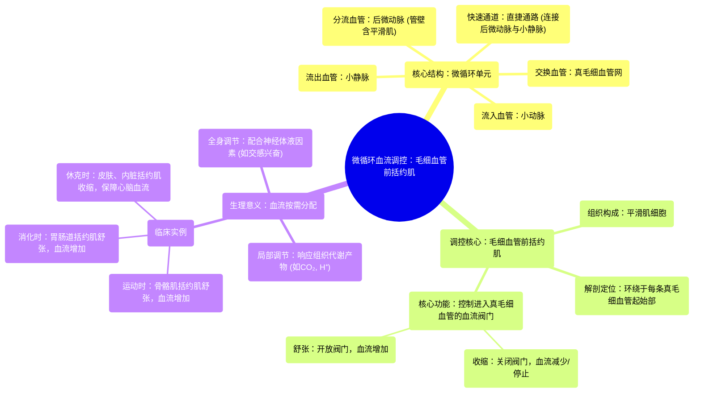

# 11 Pre-capillary sphincters Circulatory system physiology NCLEX-RN Khan Academy

  <video controls preload="metadata" playsinline>
    <source src="https://helly.s3.bitiful.net/心血管学科/%E4%B8%93%E8%BE%91%2002%EF%BC%9A%E5%BF%83%E8%A1%80%E7%AE%A1%E7%B3%BB%E7%BB%9F%E6%A6%82%E8%A7%88%20%28Cardiovascular%20System%29/11%20Pre-capillary%20sphincters%20Circulatory%20system%20physiology%20NCLEX-RN%20Khan%20Academy.mp4" type="video/mp4">
    
您的浏览器不支持播放，请升级。

  </video>

::: tip ⚡️ 核心考点 (30s速读)
*   **核心考点**：毛细血管前括约肌是位于真毛细血管起始端的平滑肌环，通过收缩或舒张，精细调控血液在特定组织毛细血管床中的分布。
*   **临床意义**：此机制是机体进行血流再分配的基础。例如，运动时，骨骼肌的毛细血管前括约肌舒张以增加血流；消化时，胃肠道的括约肌舒张。休克时，全身性收缩可优先保证心、脑血供。
:::

## 🧠 深度精讲

*   **概念1：微循环的血管通路**
    血液从小动脉流出后，并非直接进入真毛细血管。它首先进入**后微动脉**，这是一段管壁仍含有平滑肌的血管。随后，血液面临两个去向：一是通过**真毛细血管网**与组织细胞进行物质交换；二是直接通过**直捷通路**（后微动脉的延续，但无平滑肌）快速回流到小静脉。直捷通路在静息时开放较多，是血液的“快速通道”。

*   **概念2：毛细血管前括约肌的结构与功能**
    **毛细血管前括约肌**是环绕在每条真毛细血管起始部的平滑肌细胞。它们像一个个“小阀门”。当括约肌**收缩**时，其管腔关闭，阻止血液流入该条真毛细血管；当括约肌**舒张**时，阀门打开，血液得以流入并进行物质交换。这种调节是局部性的、精细的。

*   **概念3：血流的动态分配机制**
    身体通过调节不同区域毛细血管前括约肌的舒缩状态，实现血流的“按需分配”。当某个组织活动增强（如运动的肌肉），局部代谢产物（如CO₂、H⁺）堆积，会直接导致该区域的毛细血管前括约肌**舒张**，使更多血液流入以满足其增加的氧和营养需求。反之，在静息或需要保存血液供应给更重要器官（如大脑、心脏）时，其他区域的括约肌则**收缩**，减少不必要的血流。这使得有限的血液资源能被最高效地利用。

## 📚 双语术语表 (Terminology)
| 英文术语 | 中文翻译 | 定义/解释 |
| :--- | :--- | :--- |
| Arteriole | 小动脉/微动脉 | 将血液从动脉输送至毛细血管的细小血管，其管壁平滑肌是调节外周阻力和局部血流的主要部位。 |
| Metarteriole | 后微动脉 | 位于小动脉和真毛细血管之间的过渡性血管，其管壁仍含有不连续的平滑肌。 |
| True Capillary | 真毛细血管 | 血管壁仅由单层内皮细胞和基膜构成，是血液与组织液进行气体和物质交换的主要场所。 |
| Thoroughfare Channel | 直捷通路 | 后微动脉的直接延续，连接后微动脉和小静脉，管壁无平滑肌。静息时部分血流经此快速回流。 |
| Precapillary Sphincter | 毛细血管前括约肌 | 环绕在真毛细血管起始部的平滑肌环，通过收缩或舒张来精确控制进入真毛细血管网的血流量。 |
| Venule | 小静脉/微静脉 | 收集来自毛细血管的血液并汇入较大静脉的血管，是微循环的流出道。 |

## 🗺️ 知识图谱

