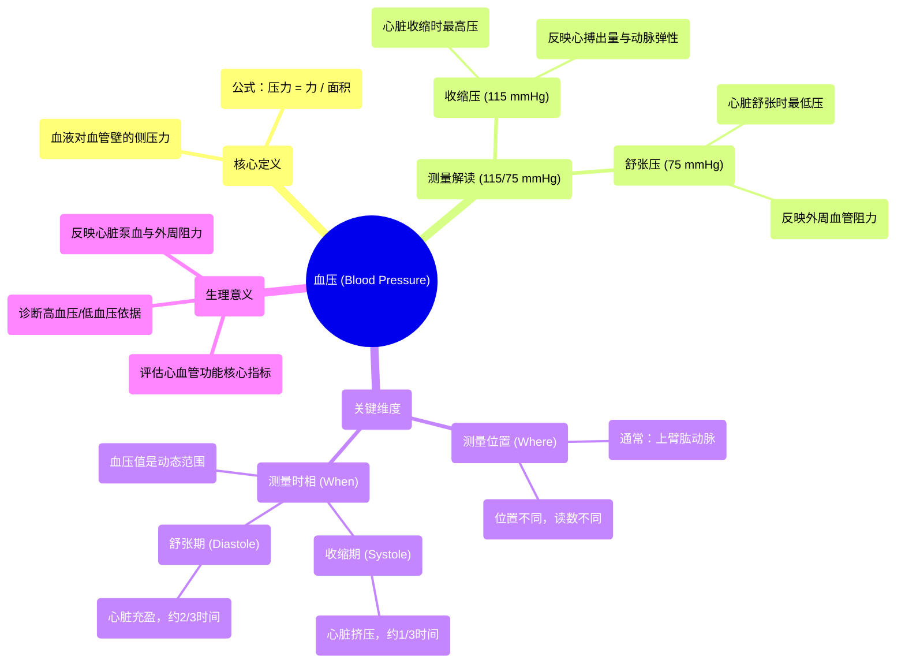

# 12 What is blood pressure Circulatory system physiology NCLEX-RN Khan Academy

  <video controls preload="metadata" playsinline>
    <source src="https://helly.s3.bitiful.net/心血管学科/%E4%B8%93%E8%BE%91%2002%EF%BC%9A%E5%BF%83%E8%A1%80%E7%AE%A1%E7%B3%BB%E7%BB%9F%E6%A6%82%E8%A7%88%20%28Cardiovascular%20System%29/12%20What%20is%20blood%20pressure%20Circulatory%20system%20physiology%20NCLEX-RN%20Khan%20Academy.mp4" type="video/mp4">
    
您的浏览器不支持播放，请升级。

  </video>

::: tip ⚡️ 核心考点 (30s速读)
*   **核心考点**：血压是血液对血管壁的侧压力，通常以收缩压/舒张压（如115/75 mmHg）表示。理解其测量位置（通常为上臂肱动脉）和测量时相（心动周期中的收缩期与舒张期）至关重要。
*   **临床意义**：血压是评估心血管系统功能的核心指标。收缩压反映心脏收缩时动脉内的最高压力，舒张压反映心脏舒张时动脉内的最低压力。其数值和波动范围是诊断高血压、低血压及评估心功能的重要依据。
:::

## 🧠 深度精讲

*   **概念1：血压的本质**
    血压本质上是血液在血管内流动时，对单位面积血管壁产生的侧向压力。可以想象血液流经一根“血管”管子，其内的血液成分（血细胞、血浆等）会向外推挤管壁。根据物理学原理，压力 = 力 / 受力面积，因此血压就是血液施加在血管壁上的力。

*   **概念2：血压读数的“位置”**
    血压读数具有位置特异性。视频中指出，临床上90%以上的血压测量是在**上臂的肱动脉**处进行的。在循环系统的不同位置（如主动脉、下肢动脉），由于血流动力学变化，测得的血压值会有所不同。因此，提及血压值时，默认指的是在标准位置（肱动脉）的测量结果。

*   **概念3：血压读数的“时间”**
    血压并非一个固定值，而是在心动周期中动态变化的。这引出了两个关键时相：
    1.  **收缩压**：心脏收缩（心室射血）时，血液冲击动脉壁，动脉内压力达到**最高值**（如115 mmHg）。此阶段约占心动周期的三分之一。
    2.  **舒张压**：心脏舒张（心室充盈）时，动脉血管弹性回缩，推动血液继续向前流动，此时动脉内压力降至**最低值**（如75 mmHg）。此阶段约占心动周期的三分之二。
    因此，血压读数（如115/75 mmHg）实际上代表了一个压力**范围**，真实血压值在任何时刻都处于这两个数值之间。

*   **概念4：收缩压与舒张压的生理意义**
    *   **收缩压**：主要反映**心脏每搏输出量**和**大动脉的弹性**。心脏收缩力越强、射血量越多，收缩压越高。
    *   **舒张压**：主要反映**外周血管的阻力**和**大动脉的弹性回缩功能**。外周血管收缩、阻力增大时，舒张压会升高。
    理解这两个数值，有助于分析心血管系统的不同环节是否存在问题。

## 📚 双语术语表 (Terminology)
| 英文术语 | 中文翻译 | 定义/解释 |
| :--- | :--- | :--- |
| Blood Pressure | 血压 | 血液在血管内流动时作用于单位面积血管壁的侧压力。 |
| Systolic Blood Pressure | 收缩压 | 心脏收缩时，血液对动脉壁产生的最高压力。 |
| Diastolic Blood Pressure | 舒张压 | 心脏舒张时，血液对动脉壁产生的最低压力。 |
| Systole | 收缩期 | 心动周期中心室收缩、将血液泵入动脉的阶段。 |
| Diastole | 舒张期 | 心动周期中心室舒张、充盈血液的阶段。 |
| Brachial Artery | 肱动脉 | 位于上臂的动脉，是测量血压的标准位置。 |
| Millimeters of Mercury (mmHg) | 毫米汞柱 | 血压的常用计量单位。 |
| Circulatory System | 循环系统 | 由心脏、血管和血液组成的封闭管道系统，负责运输物质。 |

## 🗺️ 知识图谱

