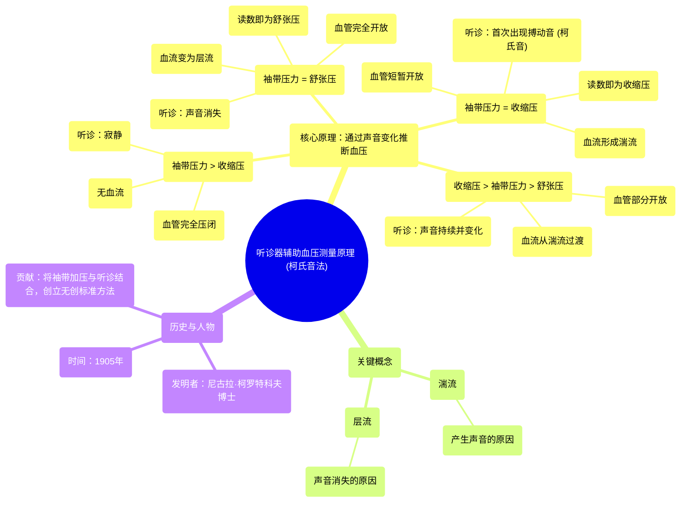

# 13 Learn how a stethoscope can help determine blood pressure NCLEX-RN Khan Academy

  <video controls preload="metadata" playsinline>
    <source src="https://helly.s3.bitiful.net/心血管学科/%E4%B8%93%E8%BE%91%2002%EF%BC%9A%E5%BF%83%E8%A1%80%E7%AE%A1%E7%B3%BB%E7%BB%9F%E6%A6%82%E8%A7%88%20%28Cardiovascular%20System%29/13%20Learn%20how%20a%20stethoscope%20can%20help%20determine%20blood%20pressure%20NCLEX-RN%20Khan%20Academy.mp4" type="video/mp4">
    
您的浏览器不支持播放，请升级。

  </video>

::: tip ⚡️ 核心考点 (30s速读)
*   **核心考点**：柯氏音法是利用听诊器，通过辨别血管内血流声音的变化（从无声到出现搏动音，再到声音消失）来间接测量血压的原理。
*   **临床意义**：该方法由尼古拉·柯罗特科夫博士于1905年发明，是现代无创血压测量的基础。通过识别收缩压（第一次出现声音）和舒张压（声音消失）对应的袖带压力，即可获得血压值。
:::

## 🧠 深度精讲

*   **概念1：柯氏音法的基本原理**
    柯氏音法的核心在于理解袖带压力、血管状态与血流声音三者之间的关系。当袖带压力高于收缩压时，血管被完全压闭，无血流通过，听诊器下为“寂静”。当袖带压力降至与收缩压相等时，血管在心脏收缩期被短暂冲开，形成一股湍急的血流，撞击血管壁产生可被听诊器捕捉的搏动音（即“柯氏音”首次出现），此时袖带压力读数即为**收缩压**。随着袖带压力继续降低，血管开放时间延长，血流逐渐变得平顺（层流），声音由强变弱。当袖带压力降至与舒张压相等时，血管在整个心动周期中均保持开放，血流恢复为平稳的层流，声音消失，此时袖带压力读数即为**舒张压**。

*   **概念2：湍流与层流**
    这是理解柯氏音来源的关键流体力学概念。
    *   **湍流**：当血流高速通过狭窄或部分开放的血管时，流线紊乱，血液分子相互碰撞并撞击血管壁，产生振动和声音。在柯氏音法中，袖带压力略低于收缩压时出现的搏动音正是湍流所致。
    *   **层流**：当血流平稳地通过完全开放的血管时，血液分层流动，中心流速最快，靠近管壁的流速慢，各层之间平滑移动，不产生额外振动和可听声音。在柯氏音法中，声音消失时的血流状态即为层流。

*   **概念3：历史背景与人物**
    该方法由俄罗斯军医**尼古拉·谢尔盖耶维奇·柯罗特科夫**于1905年提出。在听诊器已普及但无创血压测量仍很原始的年代，他通过细致的观察和推理，将袖带加压与听诊相结合，创造性地利用血流声音的变化来标定血压值。这一简单而巧妙的方法彻底改变了血压测量方式，并沿用至今。

## 📚 双语术语表 (Terminology)
| 英文术语 | 中文翻译 | 定义/解释 |
| :--- | :--- | :--- |
| Korotkov sounds / Korotkoff sounds | 柯氏音 | 在血压测量过程中，随着袖带放气，用听诊器在肱动脉处听到的一系列声音变化。 |
| Systolic blood pressure | 收缩压 | 心脏收缩时，血液对动脉壁产生的最高压力。柯氏音法中对应于**第一次出现搏动音**时的袖带压力。 |
| Diastolic blood pressure | 舒张压 | 心脏舒张时，血液对动脉壁产生的最低压力。柯氏音法中对应于**声音消失**时的袖带压力。 |
| Stethoscope | 听诊器 | 用于听取身体内部声音（如心音、呼吸音、血管音）的医疗仪器。 |
| Blood pressure cuff / Sphygmomanometer | 血压袖带 / 血压计 | 用于环绕上臂，通过充气加压和放气来测量血压的装置。 |
| Turbulent flow | 湍流 | 流体的一种流动状态，流体质点运动轨迹混乱，互相混合并产生涡旋和噪音。 |
| Laminar flow | 层流 | 流体的一种流动状态，流体质点分层运动，互不混合，流动平稳安静。 |
| Nikolai Sergeyevich Korotkov | 尼古拉·谢尔盖耶维奇·柯罗特科夫 | 俄罗斯外科医生，于1905年发明了听诊法无创血压测量技术。 |

## 🗺️ 知识图谱

