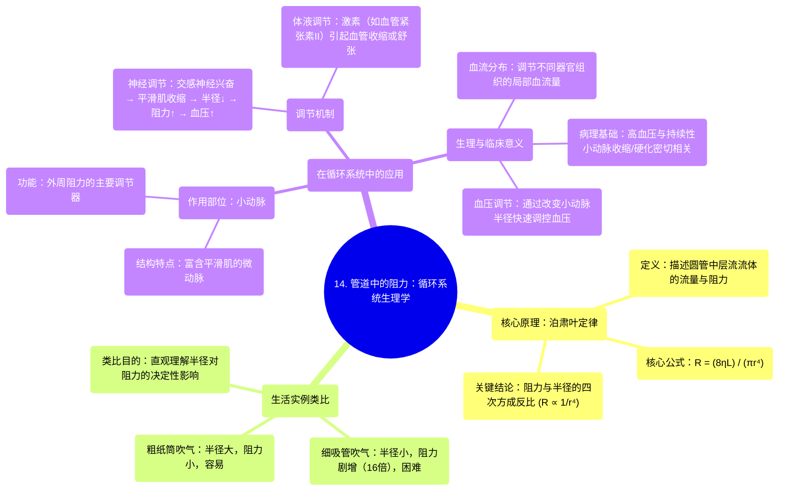

# 14 Resistance in a tube Circulatory system physiology NCLEX-RN Khan Academy

  <video controls preload="metadata" playsinline>
    <source src="https://helly.s3.bitiful.net/心血管学科/%E4%B8%93%E8%BE%91%2002%EF%BC%9A%E5%BF%83%E8%A1%80%E7%AE%A1%E7%B3%BB%E7%BB%9F%E6%A6%82%E8%A7%88%20%28Cardiovascular%20System%29/14%20Resistance%20in%20a%20tube%20Circulatory%20system%20physiology%20NCLEX-RN%20Khan%20Academy.mp4" type="video/mp4">
    
您的浏览器不支持播放，请升级。

  </video>

::: tip ⚡️ 核心考点 (30s速读)
*   **核心考点**：理解泊肃叶定律（Poiseuille‘s Law）及其核心结论：**血管阻力与半径的四次方成反比**。半径的微小变化会引起阻力的巨大改变。
*   **临床意义**：这是理解血压调节、高血压病理生理学以及血管活性药物（如血管扩张剂、收缩剂）作用机制的基础。小动脉是调节外周阻力的主要部位。
:::

## 🧠 深度精讲

*   **泊肃叶定律 (Poiseuille‘s Law)**：由法国医生让-路易-马里·泊肃叶（Jean-Louis-Marie Poiseuille）在19世纪40年代提出。该定律描述了**层流**状态下，流体通过刚性圆管时，其**流量 (Flow, Q)**、**压力差 (ΔP)** 与 **阻力 (Resistance, R)** 之间的关系。其核心公式为：
    *   **流量公式**：`Q = (π * ΔP * r⁴) / (8 * η * L)`
    *   **阻力公式**：`R = (8 * η * L) / (π * r⁴)`
    *   **公式解读**：
        *   **Q**：流量，单位时间内流过的液体体积。
        *   **ΔP**：管道两端的压力差，是流体流动的驱动力。
        *   **r**：管道半径。**这是公式中影响最大的变量**，因为它是四次方关系。
        *   **η**：流体的粘度（粘滞度），反映流体的内摩擦阻力。
        *   **L**：管道长度。
        *   **R**：血流阻力。

*   **核心结论：半径的微小变化，阻力的巨大改变**
    *   从阻力公式 `R ∝ 1 / r⁴` 可以看出，阻力与半径的四次方成反比。
    *   **举例**：视频中对比了半径2厘米的纸筒（R）和半径1厘米的吸管（r’）。当半径减半（r’ = R/2）时，代入公式计算，新阻力 `R’ ∝ 1 / (R/2)⁴ = 16 / R⁴`。这意味着**阻力变为原来的16倍**。这就是为什么用细吸管吹气远比用粗纸筒困难得多。

*   **在循环系统中的应用：小动脉是关键**
    *   在人体循环系统中，血液（视为一种粘性流体）在血管（视为弹性管道）中流动。
    *   **小动脉 (Arterioles)** 是连接动脉和毛细血管的血管，其管壁富含**平滑肌 (Smooth Muscle)**。
    *   小动脉是体循环中**外周阻力 (Peripheral Resistance)** 的主要来源。通过神经和体液调节（如交感神经兴奋、肾上腺素、血管紧张素II等），小动脉平滑肌可以收缩或舒张，从而**快速、显著地改变其管腔半径**。
    *   根据泊肃叶定律，半径的微小变化就能引起阻力的剧烈变化，进而高效地调节**血压 (Blood Pressure)** 和**局部组织血流量**。

## 📚 双语术语表 (Terminology)

| 英文术语 | 中文翻译 | 定义/解释 |
| :--- | :--- | :--- |
| **Resistance** | **阻力** | 阻碍流体（如血液）流动的因素。在循环生理学中，主要指外周血管阻力。 |
| **Poiseuille‘s Law** | **泊肃叶定律** | 描述层流状态下，流体通过圆管时流量、压力差与管道几何尺寸、流体粘度之间关系的物理定律。 |
| **Radius (r)** | **半径** | 血管或管道的横截面半径。是影响血管阻力最重要的因素（四次方反比关系）。 |
| **Viscosity (η)** | **粘度 / 粘滞度** | 流体内部摩擦力的量度，表示流体流动的难易程度。血液粘度主要受血细胞比容和血浆蛋白影响。 |
| **Arteriole** | **小动脉** | 微小的动脉分支，管壁富含平滑肌，是调节外周阻力和血压的主要部位。 |
| **Laminar Flow** | **层流** | 流体粒子分层流动，各层之间互不混合的流动状态。泊肃叶定律适用于层流条件。 |
| **Peripheral Resistance** | **外周阻力** | 血液流向外周血管（主要是小动脉和毛细血管）时所遇到的阻力。是决定动脉血压的主要因素之一。 |
| **Smooth Muscle** | **平滑肌** | 构成内脏器官和血管壁的肌肉组织，不受意识支配。血管平滑肌的舒缩直接改变血管半径。 |

## 🗺️ 知识图谱

