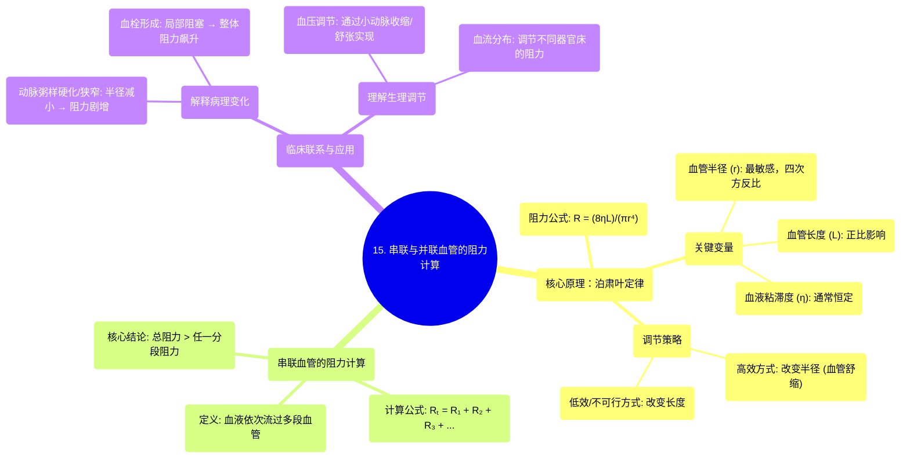

# 15 Adding up resistance in series and in parallel NCLEX-RN Khan Academy

  <video controls preload="metadata" playsinline>
    <source src="https://helly.s3.bitiful.net/心血管学科/%E4%B8%93%E8%BE%91%2002%EF%BC%9A%E5%BF%83%E8%A1%80%E7%AE%A1%E7%B3%BB%E7%BB%9F%E6%A6%82%E8%A7%88%20%28Cardiovascular%20System%29/15%20Adding%20up%20resistance%20in%20series%20and%20in%20parallel%20NCLEX-RN%20Khan%20Academy.mp4" type="video/mp4">
    
您的浏览器不支持播放，请升级。

  </video>

::: tip ⚡️ 核心考点 (30s速读)
*   **核心考点**：血管阻力由泊肃叶定律决定，其中血管半径是影响阻力的最关键因素（与半径的四次方成反比）。在串联血管中，总阻力等于各段阻力之和。
*   **临床意义**：理解此原理有助于解释为何动脉粥样硬化（管腔变窄）或血栓（局部阻塞）会显著增加血流阻力，从而影响血压和器官灌注。串联阻力相加解释了为何血管中任何一段的病变都会增加整体循环负荷。
:::

## 🧠 深度精讲

*   **概念1：泊肃叶定律与血管阻力**
    血管阻力（R）的计算公式源自泊肃叶定律：`R = (8ηL) / (πr⁴)`。其中，η为血液粘滞度，L为血管长度，r为血管半径。在血液粘滞度相对恒定的前提下，影响阻力的主要变量是**长度（L）**和**半径（r）**。但两者影响程度天差地别：阻力与长度成正比（长度加倍，阻力加倍），但与半径的四次方成反比（半径减半，阻力增至16倍）。因此，**通过改变血管半径（如血管收缩/舒张）来调节阻力，远比改变长度更为高效和可行**。这是机体微调血压和血流分布的主要生理机制。

*   **概念2：串联血管的总阻力计算**
    当血液必须依次流经多段血管（串联）时，总阻力（Rₜ）等于各分段阻力（R₁, R₂, R₃...）的简单相加：`Rₜ = R₁ + R₂ + R₃ + ...`。这意味着**总阻力总是大于其中任何一个分段的阻力**。这一原理在临床上的直接应用是：**血管中任何局部的狭窄（如血栓、斑块）都会直接增加整条血管路径的总阻力**，进而影响上游血压和下游血流。

*   **概念3：临床实例分析——血栓的影响**
    假设一段正常血管由三段串联组成，每段阻力为2，总阻力为6。若中间段因血栓形成导致管腔半径减半，根据泊肃叶定律，该段阻力将激增至原来的16倍（即2 → 32）。此时，总阻力变为 `2 + 32 + 2 = 36`。这个简单的计算清晰地展示了**局部微小的结构改变（半径减半）如何通过“四次方”效应，导致整体血流阻力发生灾难性（6倍）的增加**，这解释了为什么即使小的动脉斑块或血栓也可能引发严重的临床后果，如高血压或组织缺血。

## 📚 双语术语表 (Terminology)
| 英文术语 | 中文翻译 | 定义/解释 |
| :--- | :--- | :--- |
| Resistance | 阻力 | 在血流动力学中，指阻碍血液在血管中流动的力，主要来源于血管壁的摩擦。 |
| Poiseuille‘s Law | 泊肃叶定律 | 描述不可压缩流体在刚性圆管中作层流运动时，流量与管径、压差等参数关系的物理定律。其衍生公式用于计算血管阻力。 |
| Viscosity (η) | 粘滞度 | 流体内部摩擦力的量度。血液粘滞度主要受血细胞比容和血浆成分影响。 |
| Vessel Radius (r) | 血管半径 | 血管腔的半径。是决定血管阻力的最敏感因素，与阻力成四次方反比关系。 |
| Vessel Length (L) | 血管长度 | 血管的长度。与血管阻力成正比关系。 |
| Series Resistance | 串联阻力 | 指多个阻力元件依次连接，血流必须逐一通过的情况。总阻力为各阻力之和。 |
| Total Resistance (Rₜ) | 总阻力 | 在整个血流路径上所有阻力分量的综合效应。 |
| Blood Clot / Thrombus | 血栓 | 在血管内形成的由血液成分组成的凝块，可阻塞血管，显著增加局部阻力。 |

## 🗺️ 知识图谱

