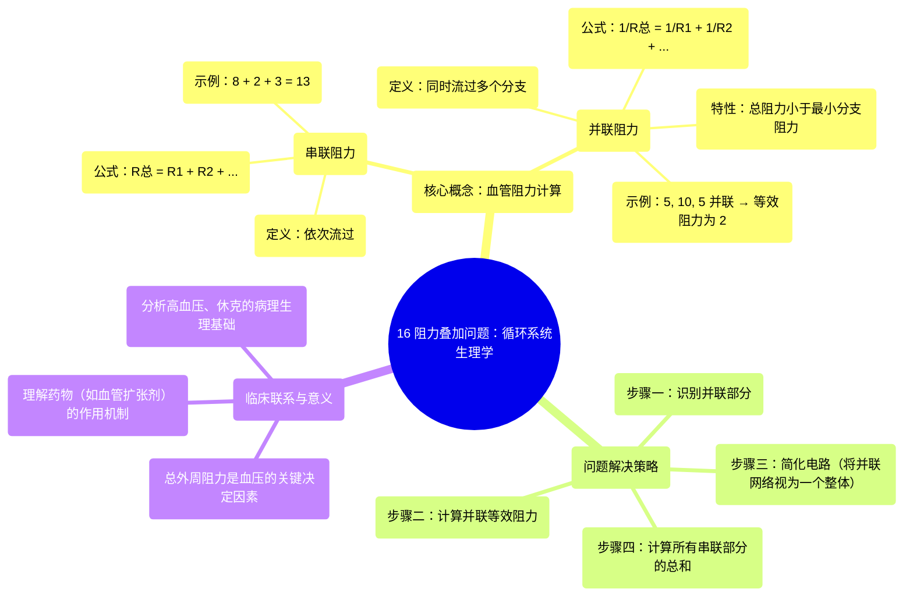

# 16 Adding up resistance problem Circulatory system physiology NCLEX-RN Khan Academy

  <video controls preload="metadata" playsinline>
    <source src="https://helly.s3.bitiful.net/心血管学科/%E4%B8%93%E8%BE%91%2002%EF%BC%9A%E5%BF%83%E8%A1%80%E7%AE%A1%E7%B3%BB%E7%BB%9F%E6%A6%82%E8%A7%88%20%28Cardiovascular%20System%29/16%20Adding%20up%20resistance%20problem%20Circulatory%20system%20physiology%20NCLEX-RN%20Khan%20Academy.mp4" type="video/mp4">
    
您的浏览器不支持播放，请升级。

  </video>

::: tip ⚡️ 核心考点 (30s速读)
*   **核心考点**：掌握串联与并联血管阻力的计算方法。串联总阻力等于各部分阻力之和；并联总阻力的倒数等于各支路阻力倒数之和。
*   **临床意义**：理解血管阻力如何影响血压和血流分布，是分析高血压、休克等循环系统疾病病理生理的基础。
:::

## 🧠 深度精讲

*   **概念1：血管阻力的串联与并联**
    在循环系统中，血管可以像电路一样以串联或并联方式连接。**串联**是指血液依次流经不同的血管段，其总阻力（R_total）等于各段阻力之和（R_total = R1 + R2 + R3 + ...）。视频中，入口血管（阻力8）、并联网络等效阻力（2）和出口血管（阻力3）就是串联关系，因此相加得到13。
    **并联**是指血流同时流经多条不同的血管分支。并联血管的总阻力小于其中任何一条分支的阻力。其计算公式为：1/R_total = 1/R1 + 1/R2 + 1/R3 + ...。视频中，三条阻力分别为5、10、5的血管是并联关系，通过计算得出其等效阻力为2。

*   **概念2：计算步骤与逻辑**
    面对复杂的血管网络，计算总阻力的关键步骤是 **“先并联，后串联”**。
    1.  **识别并联部分**：首先找出系统中所有并联的血管分支（如视频中的黄色方框部分）。
    2.  **计算并联等效阻力**：使用并联公式，计算出该并联网络的单一等效阻力。
    3.  **简化电路**：将并联网络视为一个具有等效阻力的“血管段”。
    4.  **计算串联总阻力**：将所有串联的血管段（包括简化后的等效阻力段）的阻力直接相加，即得到整个系统的总阻力。

*   **概念3：从模型到人体**
    视频中的简化模型（总阻力=13）是为了阐明计算原理。**人体的总外周阻力**是一个极其复杂的综合数值，由全身数以千计的动脉、小动脉和毛细血管网以串联和并联的复杂方式组合而成。这个总阻力是维持动脉血压和调节器官血流灌注的关键决定因素。临床上的血管扩张剂或收缩剂，正是通过改变这个总阻力来治疗高血压或休克。

## 📚 双语术语表 (Terminology)
| 英文术语 | 中文翻译 | 定义/解释 |
| :--- | :--- | :--- |
| Resistance | 阻力 | 在循环生理学中，指血液在血管中流动所遇到的阻碍，主要来自小动脉和微动脉。 |
| Series | 串联 | 指血液依次流经不同血管段的连接方式，总阻力为各段阻力之和。 |
| Parallel | 并联 | 指血流同时流经多条分支血管的连接方式，总阻力小于任一支路阻力。 |
| Total Peripheral Resistance (TPR) | 总外周阻力 | 体循环中所有血管阻力的总和，是决定动脉血压的主要因素之一。 |
| RT | 总阻力 | 在特定血管通路或整个系统中，血液流动所受到的总阻碍。 |

## 🗺️ 知识图谱

