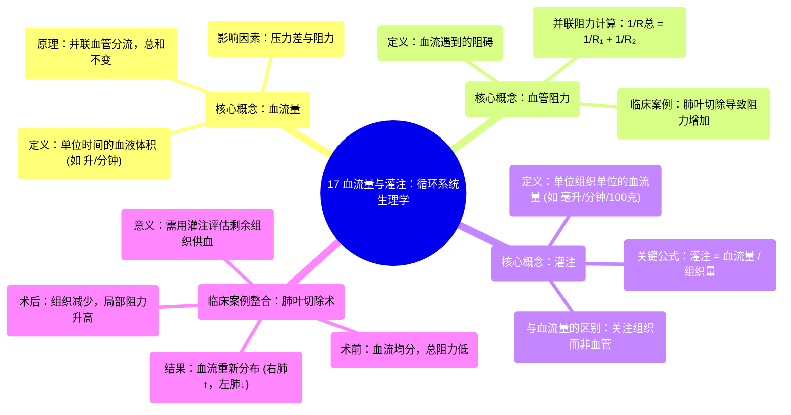

# 17 Flow and perfusion Circulatory system physiology NCLEX-RN Khan Academy

  <video controls preload="metadata" playsinline>
    <source src="https://helly.s3.bitiful.net/心血管学科/%E4%B8%93%E8%BE%91%2002%EF%BC%9A%E5%BF%83%E8%A1%80%E7%AE%A1%E7%B3%BB%E7%BB%9F%E6%A6%82%E8%A7%88%20%28Cardiovascular%20System%29/17%20Flow%20and%20perfusion%20Circulatory%20system%20physiology%20NCLEX-RN%20Khan%20Academy.mp4" type="video/mp4">
    
您的浏览器不支持播放，请升级。

  </video>

::: tip ⚡️ 核心考点 (30s速读)
*   **核心考点**：理解**血流量**与**灌注**的区别与联系。血流量是单位时间内流经血管的总血量（如升/分钟），而灌注是单位时间内流经**单位组织**的血量（如毫升/分钟/100克组织）。组织减少（如肺叶切除）会改变局部血流分布和灌注值。
*   **临床意义**：在肺部手术、血管阻塞等病理情况下，血流会从高阻力区域重新分配到低阻力区域，导致局部组织灌注不足，影响氧气和营养物质的输送。
:::

## 🧠 深度精讲

*   **概念1：血流量**
    *   **定义**：指单位时间内流经心血管系统某一特定截面的血液体积。视频中以“升/分钟”为单位，例如心脏每分钟泵出5升血液。
    *   **核心原理**：在串联管路中，各处的血流量相等（如肺动脉主干与左右肺动脉分支的总和）；在并联管路中，总血流量等于各分支血流量之和。
    *   **影响因素**：主要受**压力差**（驱动血液流动的动力）和**血管阻力**的调节。根据流体力学原理，血流量与压力差成正比，与阻力成反比。

*   **概念2：血管阻力**
    *   **定义**：血液在血管内流动时所遇到的阻力。
    *   **并联血管的阻力计算**：当血管并联时（如肺动脉分叉进入左右肺），总阻力会**降低**。计算公式为：1/R总 = 1/R₁ + 1/R₂ + ...。视频中假设左右肺血管阻力均为R，则术前总阻力为R/2。
    *   **临床联系**：视频案例中，切除左肺下叶相当于移除了一个并联的血管床，导致左肺总阻力从R/2**增加**到R（阻力翻倍）。这使得血液更倾向于流向阻力更低的右肺。

*   **概念3：灌注**
    *   **定义**：指单位时间内流经**单位质量或体积组织**的血液量。它是衡量组织血液供应充足与否的更精确指标。
    *   **公式**：灌注 = 血流量 / 组织量。常用单位如“毫升/分钟/100克组织”。
    *   **与血流量的关键区别**：
        *   **血流量**：关注的是血管。例如，流向左肺的总体血流量是2.5升/分钟。
        *   **灌注**：关注的是组织。如果左肺组织量减少（如下叶切除），即使血流量不变，剩余组织的灌注也可能发生变化。视频中，术后左肺血流量降至2升/分钟，若组织量也减半，则需计算新的灌注值来准确评估其血液供应状况。

*   **案例推演：肺叶切除术后的血流动力学变化**
    1.  **术前状态**：心脏输出5升/分钟，均分至左右肺（各2.5升/分钟）。左右肺血管阻力均为R，并联后总阻力为R/2。
    2.  **术后变化**：左肺下叶切除。
        *   **阻力变化**：左肺可利用的血管床减少，其血管阻力从R/2升至R。
        *   **血流重新分布**：由于左肺阻力升高，血液会进行重新分配。视频假设新的分布为：右肺3升/分钟，左肺2升/分钟（总和仍为5升/分钟）。
        *   **灌注的思考**：要评估左肺剩余上叶是否获得足够血液，必须计算其**灌注**（血流量/剩余组织量），而不仅仅是看流经左肺动脉的**总血流量**。

## 📚 双语术语表 (Terminology)
| 英文术语 | 中文翻译 | 定义/解释 |
| :--- | :--- | :--- |
| Flow | 血流量 | 单位时间内流经血管某一截面的血液体积。 |
| Perfusion | 灌注 | 单位时间内流经单位组织（质量或体积）的血液量，是评估组织血液供应的指标。 |
| Resistance | 阻力 | 血液在血管中流动时遇到的阻碍。与血管长度、血液粘稠度成正比，与血管半径的四次方成反比。 |
| Pulmonary Artery | 肺动脉 | 将心脏右心室的去氧血输送至肺部进行气体交换的动脉。 |
| Deoxygenated Blood | 去氧血 / 静脉血 | 含氧量低、二氧化碳含量高的血液，通常呈暗红色。 |
| Cardiac Output | 心输出量 | 一侧心室每分钟射出的血液总量，等于心率乘以每搏输出量。视频中示例为5升/分钟。 |

## 🗺️ 知识图谱

