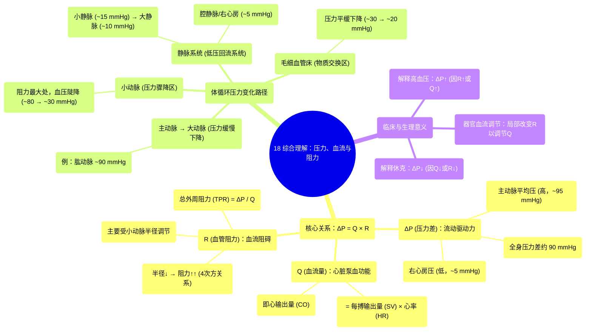

# 18 Putting it all together Pressure, flow, and resistance NCLEX-RN Khan Academy

  <video controls preload="metadata" playsinline>
    <source src="https://helly.s3.bitiful.net/心血管学科/%E4%B8%93%E8%BE%91%2002%EF%BC%9A%E5%BF%83%E8%A1%80%E7%AE%A1%E7%B3%BB%E7%BB%9F%E6%A6%82%E8%A7%88%20%28Cardiovascular%20System%29/18%20Putting%20it%20all%20together%20Pressure%2C%20flow%2C%20and%20resistance%20NCLEX-RN%20Khan%20Academy.mp4" type="video/mp4">
    
您的浏览器不支持播放，请升级。

  </video>

::: tip ⚡️ 核心考点 (30s速读)
*   **核心考点**：理解血压、血流与血管阻力三者之间的动态关系（ΔP = Q × R），以及压力在体循环中的变化趋势。
*   **临床意义**：掌握此关系是理解高血压、休克、心力衰竭等病理生理的基础，也是评估心血管功能的关键。
:::

## 🧠 深度精讲

*   **核心方程：ΔP = Q × R**
    *   **ΔP (压力差)**：驱动血液流动的根本动力。它不是某一点的绝对压力，而是血管系统**起点与终点之间的压力差值**。在体循环中，这大致是**主动脉平均压 (约95 mmHg) 减去右心房压 (约5 mmHg)**，差值约为90 mmHg。
    *   **Q (血流量)**：单位时间内流经血管的血液体积。它等于**每搏输出量 (SV) × 心率 (HR)**。这代表了心脏的泵血功能。
    *   **R (血管阻力)**：血液在血管中流动所遇到的阻力。**阻力主要受小动脉（微动脉）半径的影响**，半径的微小变化会引起阻力的巨大变化（与半径的4次方成反比）。

*   **体循环压力变化趋势**
    *   血液离开左心室进入**主动脉**时压力最高（平均压约95 mmHg）。
    *   血液流经**动脉系统**时，压力缓慢下降（例如，在手臂的肱动脉处约为90 mmHg）。
    *   当血液进入**小动脉 (微动脉)** 时，由于血管总横截面积骤减，**阻力急剧增加，导致血压出现最陡峭的下降**（从约80 mmHg骤降至约30 mmHg）。小动脉是调节外周阻力和器官血流量的主要部位。
    *   在**毛细血管**中，压力进一步平缓下降（从约30 mmHg降至约20 mmHg），这有利于物质交换。
    *   血液进入**静脉系统**后，压力已很低（小静脉约15 mmHg，大静脉约10 mmHg），最终回流至**腔静脉**和**右心房**时压力最低（约5 mmHg）。
    *   **关键点**：心脏（泵）产生的压力差（ΔP）用于克服全身血管的总阻力（R），从而维持一定的血流量（Q）。

*   **总外周阻力 (TPR)**
    *   指整个体循环系统的血管阻力总和。根据公式 **R = ΔP / Q**，我们可以进行概念性计算。
    *   已知：ΔP ≈ 90 mmHg，Q（心输出量）对于一个静息成人约为 5 L/min。
    *   因此，**TPR ≈ 90 mmHg / 5 L/min = 18 mmHg·min/L**。这是一个理论上的整体阻力单位，帮助理解心脏需要克服多大的阻力才能泵出血液。

## 📚 双语术语表 (Terminology)
| 英文术语 | 中文翻译 | 定义/解释 |
| :--- | :--- | :--- |
| Pressure (ΔP) | 压力 (压力差) | 驱动血液流动的力，通常指血管两端的压力差值。 |
| Flow (Q) | 血流量 | 单位时间内流经某一点的血液体积，等于心输出量 (CO = SV × HR)。 |
| Resistance (R) | 血管阻力 | 血液在血管内流动所遇到的阻碍，主要受血管半径影响。 |
| Aorta | 主动脉 | 体循环的起始动脉，是体内最粗大的动脉。 |
| Brachial Artery | 肱动脉 | 位于上臂的主要动脉，常用来测量血压。 |
| Arteriole | 小动脉 / 微动脉 | 连接小动脉和毛细血管的微小血管，是调节外周阻力和血压的关键部位。 |
| Capillary Bed | 毛细血管床 | 由大量毛细血管组成的网络，是血液与组织液进行物质交换的场所。 |
| Venule | 小静脉 | 收集毛细血管血液的微小静脉。 |
| Vena Cava | 腔静脉 | 将全身血液输送回心脏的大静脉，分为上腔静脉和下腔静脉。 |
| Systolic Pressure | 收缩压 | 心脏收缩时动脉内的最高压力。 |
| Diastolic Pressure | 舒张压 | 心脏舒张时动脉内的最低压力。 |
| Mean Arterial Pressure (MAP) | 平均动脉压 | 一个心动周期中动脉血压的平均值，≈ 舒张压 + 1/3脉压。 |
| Total Peripheral Resistance (TPR) | 总外周阻力 | 体循环所有血管阻力的总和。 |
| Stroke Volume (SV) | 每搏输出量 | 一次心跳由一侧心室射出的血液量。 |
| Heart Rate (HR) | 心率 | 每分钟心跳的次数。 |
| Cardiac Output (CO) | 心输出量 | 每分钟由一侧心室射出的血液总量，CO = SV × HR。 |

## 🗺️ 知识图谱

