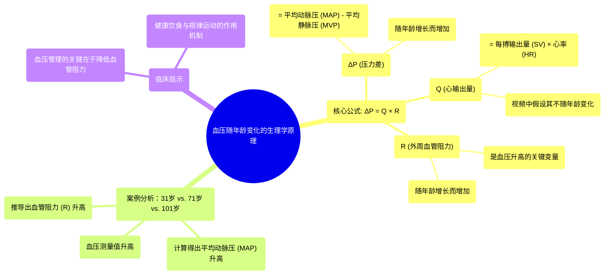

# 19 Blood pressure changes over time Circulatory system physiology NCLEX-RN Khan Academy

  <video controls preload="metadata" playsinline>
    <source src="https://helly.s3.bitiful.net/心血管学科/%E4%B8%93%E8%BE%91%2002%EF%BC%9A%E5%BF%83%E8%A1%80%E7%AE%A1%E7%B3%BB%E7%BB%9F%E6%A6%82%E8%A7%88%20%28Cardiovascular%20System%29/19%20Blood%20pressure%20changes%20over%20time%20Circulatory%20system%20physiology%20NCLEX-RN%20Khan%20Academy.mp4" type="video/mp4">
    
您的浏览器不支持播放，请升级。

  </video>

::: tip ⚡️ 核心考点 (30s速读)
*   **核心考点**：血压随年龄增长而升高，其根本原因在于**外周血管阻力 (R)** 的增加，而非心输出量 (Q) 的变化。
*   **临床意义**：理解血压公式 ΔP = Q × R 是分析高血压病理生理的基础。控制血压的关键在于通过健康生活方式（如饮食、运动）来降低血管阻力。
:::

## 🧠 深度精讲

本视频通过一个生动的例子，解释了血压随年龄变化的生理学原理。核心在于应用血流动力学基本公式：**ΔP = Q × R**。

*   **公式解析**：
    *   **ΔP (压力差)**：指平均动脉压 (MAP) 与平均静脉压 (MVP) 之间的差值，是推动血液在循环系统中流动的动力。
    *   **Q (心输出量)**：指心脏每分钟泵出的血液总量，等于每搏输出量 (SV) 乘以心率 (HR)。
    *   **R (外周血管阻力)**：指血液流经全身小动脉和微动脉时所遇到的阻力。

*   **案例分析**：
    视频假设一个人在31岁、71岁和101岁时的血压测量值分别为120/80 mmHg、150/90 mmHg和180/105 mmHg。
    1.  **计算平均动脉压 (MAP)**：使用公式 **MAP ≈ (1/3 × 收缩压) + (2/3 × 舒张压)**。这是因为心脏在舒张期的时间更长。计算得出三个年龄段的MAP分别为95、110和130 mmHg。
    2.  **计算压力差 (ΔP)**：假设平均静脉压 (MVP) 恒定在5 mmHg，则 ΔP = MAP - MVP。得出三个年龄段的ΔP分别为90、105和125 mmHg。
    3.  **假设心输出量 (Q) 不变**：视频假设随着年龄增长，每搏输出量和心率保持不变，因此心输出量恒定为5 L/min。
    4.  **推导血管阻力 (R)**：根据公式 **R = ΔP / Q**，可以计算出三个年龄段的血管阻力分别为18、21和25（单位：PRU，外周阻力单位）。

*   **核心结论**：
    在上述假设（心输出量和静脉压不变）下，血压（ΔP）随年龄升高**完全归因于外周血管阻力 (R) 的增加**。这解释了为什么医生建议通过健康饮食和锻炼来降低血压——因为这些干预措施的主要目标就是**降低血管阻力**（例如，通过减轻体重、改善血管内皮功能、减少血管壁僵硬等）。

## 📚 双语术语表 (Terminology)
| 英文术语 | 中文翻译 | 定义/解释 |
| :--- | :--- | :--- |
| Blood Pressure (BP) | 血压 | 血液对血管壁产生的侧压力，通常以收缩压/舒张压表示。 |
| Systolic Pressure | 收缩压 | 心脏收缩射血时，动脉内的最高压力。 |
| Diastolic Pressure | 舒张压 | 心脏舒张充盈时，动脉内的最低压力。 |
| Mean Arterial Pressure (MAP) | 平均动脉压 | 一个心动周期中动脉血压的平均值，是器官灌注的决定性因素。 |
| Mean Venous Pressure (MVP) | 平均静脉压 | 大静脉或右心房内的平均压力。 |
| ΔP (Delta P) | 压力差/灌注压 | 平均动脉压与平均静脉压之差，是血液循环的直接驱动力。 |
| Cardiac Output (Q or CO) | 心输出量 | 一侧心室每分钟泵出的血液总量，Q = 每搏输出量 × 心率。 |
| Stroke Volume (SV) | 每搏输出量 | 一次心搏中，一侧心室射出的血液量。 |
| Heart Rate (HR) | 心率 | 每分钟心脏搏动的次数。 |
| Peripheral Resistance (R) | 外周血管阻力 | 血液流经全身小动脉和毛细血管前阻力血管时所遇到的总阻力。 |
| Resistance Vessels | 阻力血管 | 主要指小动脉和微动脉，通过收缩或舒张调节外周阻力。 |

## 🗺️ 知识图谱

