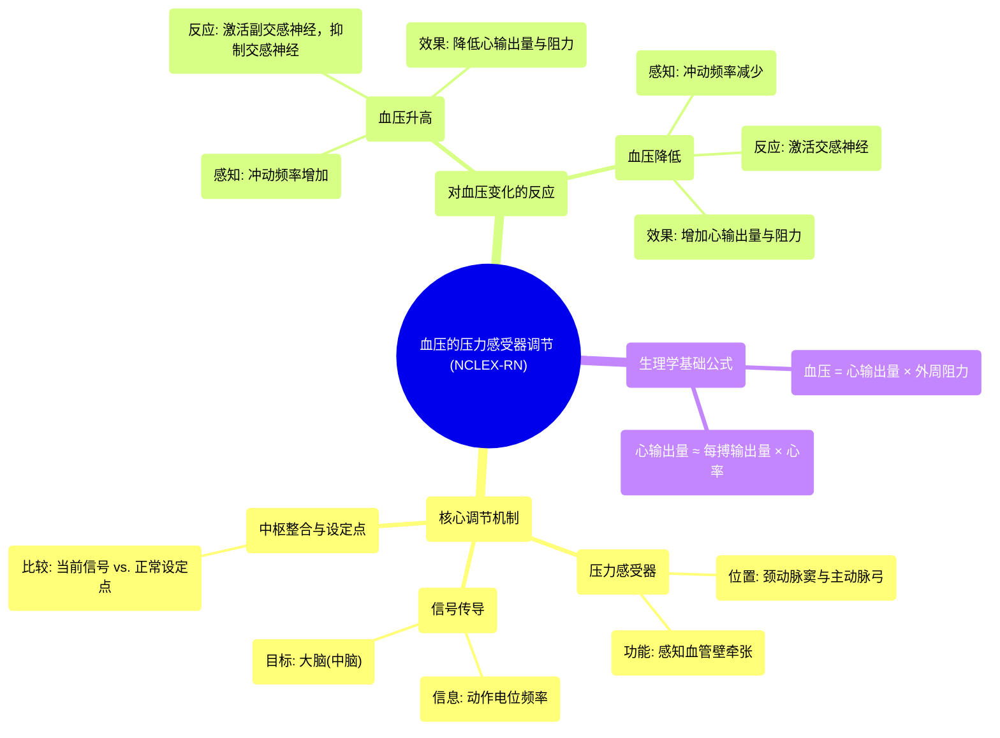

# 20 Regulation of blood pressure with baroreceptors NCLEX-RN Khan Academy

  <video controls preload="metadata" playsinline>
    <source src="https://helly.s3.bitiful.net/心血管学科/%E4%B8%93%E8%BE%91%2002%EF%BC%9A%E5%BF%83%E8%A1%80%E7%AE%A1%E7%B3%BB%E7%BB%9F%E6%A6%82%E8%A7%88%20%28Cardiovascular%20System%29/20%20Regulation%20of%20blood%20pressure%20with%20baroreceptors%20NCLEX-RN%20Khan%20Academy.mp4" type="video/mp4">
    
您的浏览器不支持播放，请升级。

  </video>

::: tip ⚡️ 核心考点 (30s速读)
*   **核心考点**：颈动脉窦和主动脉弓的压力感受器通过感知血管壁的牵张程度来监测血压变化，并将信号传至大脑。大脑通过调节自主神经系统（交感神经和副交感神经）来改变心率、心肌收缩力和血管阻力，从而维持血压稳定。
*   **临床意义**：理解压力感受器反射是掌握高血压、休克等心血管疾病病理生理机制的基础，也是理解某些药物（如降压药）作用原理的关键。
:::

## 🧠 深度精讲

*   **压力感受器反射的解剖基础**：视频重点介绍了三个关键的血压监测点：**左侧颈动脉窦**、**右侧颈动脉窦**和**主动脉弓**。这些部位的血管壁内嵌有特殊的神经末梢，称为**压力感受器**。它们不直接感受“压力”，而是感受血管壁因血压变化而产生的“牵张”程度。
*   **信号传导与设定点**：压力感受器将牵张信号转化为神经冲动（动作电位），通过神经传送到大脑（特别是中脑区域）。大脑根据一段时间内接收到的冲动频率，建立起个体正常的血压“设定点”。例如，血压为115/75 mmHg时，可能对应每分钟10次冲动，这被大脑视为“正常”。
*   **血压变化的识别**：
    *   **血压升高**（如140/90 mmHg）：血管壁过度牵张，压力感受器发放冲动的频率显著增加（如每分钟30次）。大脑识别到此频率高于设定点，判定为“高血压状态”。
    *   **血压降低**（如大出血后）：血管壁牵张减弱，冲动发放频率减少（如每分钟7次）。大脑识别到此频率低于设定点，判定为“低血压状态”。
*   **大脑的调节反应（自主神经系统）**：识别到血压异常后，大脑通过**自主神经系统**的两个分支作出精确调整：
    *   **对抗高血压**：激活**副交感神经系统**（主要释放乙酰胆碱），降低心率和心肌收缩力；同时抑制**交感神经系统**，引起血管舒张，降低外周阻力。根据公式 **血压 = 心输出量 × 外周阻力**，心输出量（≈每搏输出量×心率）和阻力下降，从而使血压回落。
    *   **对抗低血压**：激活**交感神经系统**（主要释放去甲肾上腺素），增加心率和心肌收缩力（增加心输出量），并引起大多数血管收缩（增加外周阻力），从而使血压回升。

## 📚 双语术语表 (Terminology)
| 英文术语 | 中文翻译 | 定义/解释 |
| :--- | :--- | :--- |
| Homeostasis | 稳态 | 机体维持内部环境（如血压、体温）相对平衡的状态。 |
| Carotid Sinus | 颈动脉窦 | 位于颈总动脉末端和颈内动脉起始处的膨大部分，是重要的压力感受器所在部位。 |
| Aortic Arch | 主动脉弓 | 升主动脉与降主动脉之间的弓形部分，其血管壁内同样含有压力感受器。 |
| Baroreceptor | 压力感受器 | 存在于颈动脉窦和主动脉弓等处的特殊神经末梢，能感知血管壁的牵张，进而监测血压变化。 |
| Action Potential | 动作电位 | 神经细胞或肌肉细胞产生的短暂电信号，是神经冲动传导的基本形式。 |
| Set Point | 设定点 | 机体调节系统（如血压调节）所要维持的参考值或正常范围。 |
| Autonomic Nervous System | 自主神经系统 | 支配内脏、血管和腺体的神经系统，不受意识控制，包括交感神经和副交感神经。 |
| Sympathetic Nervous System | 交感神经系统 | 自主神经系统的一部分，通常在应激、紧张或需要动员能量时活跃，可使心率加快、血管收缩等。 |
| Parasympathetic Nervous System | 副交感神经系统 | 自主神经系统的一部分，通常在安静、休息时活跃，可使心率减慢、血管舒张等。 |
| Stroke Volume | 每搏输出量 | 一次心搏中，一侧心室射出的血液量。 |
| Heart Rate | 心率 | 每分钟心脏搏动的次数。 |
| Peripheral Resistance | 外周阻力 | 血液在血管系统中流动所遇到的阻力，主要来自小动脉和微动脉。 |

## 🗺️ 知识图谱

