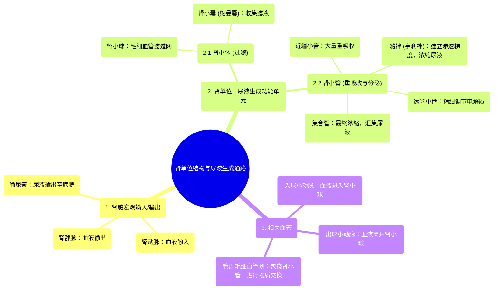

# 21 Parts of a nephron Circulatory system physiology NCLEX-RN Khan Academy

  <video controls preload="metadata" playsinline>
    <source src="https://helly.s3.bitiful.net/心血管学科/%E4%B8%93%E8%BE%91%2002%EF%BC%9A%E5%BF%83%E8%A1%80%E7%AE%A1%E7%B3%BB%E7%BB%9F%E6%A6%82%E8%A7%88%20%28Cardiovascular%20System%29/21%20Parts%20of%20a%20nephron%20Circulatory%20system%20physiology%20NCLEX-RN%20Khan%20Academy.mp4" type="video/mp4">
    
您的浏览器不支持播放，请升级。

  </video>

::: tip ⚡️ 核心考点 (30s速读)
*   **核心考点**：肾单位是肾脏生成尿液的基本功能单位，其结构包括肾小体（肾小球+肾小囊）和肾小管（近端小管、髓袢、远端小管、集合管）。血液通过肾动脉进入，在肾小球滤过，滤液经肾小管重吸收和分泌后形成尿液，经输尿管排出。
*   **临床意义**：理解肾单位的结构与功能是理解肾脏疾病（如肾小球肾炎、肾衰竭）、药物排泄以及体液和电解质平衡调节的基础。
:::

## 🧠 深度精讲

*   **肾脏的宏观结构**：肾脏位于身体左右两侧，形似蚕豆。其主要功能是生成尿液。有三条主要管道进出肾脏：**肾动脉**（输入血液）、**肾静脉**（输出血液）和**输尿管**（输出尿液至膀胱）。
*   **肾单位的微观结构**：肾单位是肾脏的功能单元，负责过滤血液并形成尿液。其结构依次为：
    1.  **肾小体**：由**肾小球**（一团毛细血管网）和包裹它的**肾小囊**（鲍曼囊）组成。血液在此进行初步滤过，形成原尿。
    2.  **近端小管**：紧邻肾小囊，管壁细胞具有大量微绒毛以增加重吸收面积，负责重吸收大部分水分、葡萄糖、氨基酸和离子。
    3.  **髓袢**：呈“U”形深入肾髓质，分为降支和升支，在建立和维持肾脏髓质的高渗梯度中起关键作用，从而浓缩尿液。
    4.  **远端小管**：远离肾小体，继续对水和电解质（如钠、钾）进行精细调节，其功能受激素（如醛固酮）调控。
    5.  **集合管**：汇集多个肾单位的滤液，是尿液浓缩的最后场所，其通透性受抗利尿激素调节，最终将形成的终尿排入肾盂，进而流入输尿管。
*   **血管通路**：肾动脉分支形成**入球小动脉**进入肾小体，形成肾小球毛细血管网，然后汇合成**出球小动脉**离开。出球小动脉再次分支形成毛细血管网，包绕在肾小管周围，为其重吸收和分泌功能提供物质交换的场所，最后汇入肾静脉。

## 📚 双语术语表 (Terminology)
| 英文术语 | 中文翻译 | 定义/解释 |
| :--- | :--- | :--- |
| Kidney | 肾脏 | 位于腹腔后壁的成对器官，主要功能是过滤血液、形成尿液、维持内环境稳定。 |
| Renal Artery | 肾动脉 | 将血液从主动脉输送至肾脏的动脉。 |
| Renal Vein | 肾静脉 | 将经过肾脏过滤后的血液输送回下腔静脉的静脉。 |
| Ureter | 输尿管 | 将肾脏产生的尿液输送至膀胱的肌性管道。 |
| Bladder | 膀胱 | 储存尿液的囊状器官。 |
| Nephron | 肾单位 | 肾脏结构和功能的基本单位，负责尿液的生成。 |
| Afferent Arteriole | 入球小动脉 | 将血液带入肾小球的微小动脉。 |
| Efferent Arteriole | 出球小动脉 | 将血液带离肾小球的微小动脉。 |
| Glomerulus | 肾小球 | 肾小体内的一团毛细血管网，是血液滤过的场所。 |
| Bowman‘s Capsule | 肾小囊（鲍曼囊） | 包裹肾小球的双层杯状囊，内层紧贴毛细血管，外层与肾小管相连，共同构成肾小体。 |
| Proximal Convoluted Tubule (PCT) | 近端小管 | 肾小管的第一段，紧接肾小囊，主要负责重吸收。 |
| Loop of Henle | 髓袢（亨利袢） | 肾小管的“U”形部分，深入肾髓质，对尿液浓缩至关重要。 |
| Distal Convoluted Tubule (DCT) | 远端小管 | 髓袢之后的肾小管部分，继续进行水和电解质的调节。 |
| Collecting Duct | 集合管 | 汇集多个肾单位滤液的管道，是尿液形成的最后阶段。 |

## 🗺️ 知识图谱

