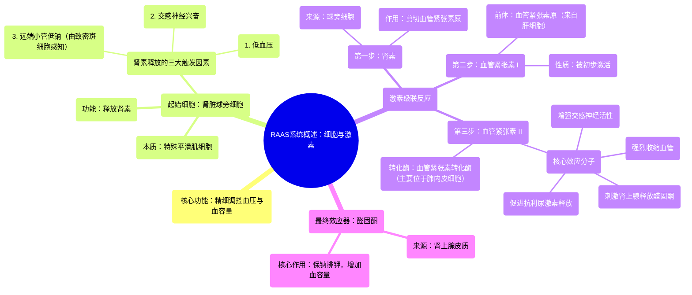

# 22 General overview of the RAAS system Cells and hormones NCLEX-RN Khan Academy

  <video controls preload="metadata" playsinline>
    <source src="https://helly.s3.bitiful.net/心血管学科/%E4%B8%93%E8%BE%91%2002%EF%BC%9A%E5%BF%83%E8%A1%80%E7%AE%A1%E7%B3%BB%E7%BB%9F%E6%A6%82%E8%A7%88%20%28Cardiovascular%20System%29/22%20General%20overview%20of%20the%20RAAS%20system%20Cells%20and%20hormones%20NCLEX-RN%20Khan%20Academy.mp4" type="video/mp4">
    
您的浏览器不支持播放，请升级。

  </video>

::: tip ⚡️ 核心考点 (30s速读)
*   **核心考点**：肾素-血管紧张素-醛固酮系统是身体调控血压的核心内分泌系统，其激活始于肾脏对低血压、交感神经兴奋或远端小管低钠的感知。
*   **临床意义**：RAAS过度激活是高血压、心力衰竭等心血管疾病的关键病理机制，相关药物（如ACEI、ARB）是临床一线治疗基石。
:::

## 🧠 深度精讲

*   **RAAS系统概览**：RAAS系统是一个精密的激素级联反应系统，旨在**升高血压**。其过程涉及多种细胞释放特定的激素信使，形成一个从感知到执行的控制环路。
*   **启动细胞：球旁细胞**：该系统始于肾脏内的**球旁细胞**。这些细胞本质上是位于肾小球入球小动脉上的**特殊平滑肌细胞**。它们是系统的“传感器”和“启动器”。
*   **肾素释放的三大触发因素**：
    1.  **低血压**：球旁细胞直接感知到灌注压降低。
    2.  **交感神经兴奋**：在应激（如创伤、战斗或逃跑反应）时，交感神经末梢直接刺激球旁细胞。
    3.  **远端小管低钠**：由**致密斑细胞**感知。当流经远端小管的钠离子减少（常因肾小球滤过率下降所致），致密斑细胞会通过释放**前列腺素**这种局部信使，通知邻近的球旁细胞。
*   **激素级联反应**：
    1.  **肾素**：由球旁细胞释放，是RAAS系统的**限速酶**。它本身不直接升高血压，而是作用于肝脏产生的底物。
    2.  **血管紧张素原**：由**肝细胞**持续合成并释放入血，是一种无活性的前体蛋白（“梦游者”）。
    3.  **血管紧张素 I**：肾素将血管紧张素原剪切，生成**血管紧张素 I**。此时分子被“激活”，但仍需进一步转化。
    4.  **血管紧张素 II**：血管紧张素 I 流经肺部及其他血管床时，被血管**内皮细胞**表面的**血管紧张素转化酶**剪切，转化为强效的**血管紧张素 II**。这是RAAS系统的**核心效应分子**。
*   **核心效应分子：血管紧张素 II 的作用**：血管紧张素 II 通过多种途径强力升压：
    *   **直接收缩血管**：作用于血管平滑肌，使全身小动脉收缩，增加外周阻力。
    *   **刺激醛固酮释放**：作用于肾上腺皮质，促进**醛固酮**的合成与释放。
    *   **促进抗利尿激素释放**：作用于下丘脑，增加**抗利尿激素**分泌，减少水分排出。
    *   **增强交感神经活性**：促进去甲肾上腺素的释放，并增加口渴感。
*   **最终效应：醛固酮的作用**：醛固酮作用于肾脏远曲小管和集合管，**保钠排钾**。钠的重吸收伴随着水的重吸收，从而**增加血容量**，进一步升高血压。

## 📚 双语术语表 (Terminology)
| 英文术语 | 中文翻译 | 定义/解释 |
| :--- | :--- | :--- |
| RAAS / RAS | 肾素-血管紧张素-醛固酮系统 | 调节血压、血容量和电解质平衡的关键激素系统。 |
| Juxtaglomerular (JG) Cell | 球旁细胞 | 位于肾小球入球小动脉上的特殊平滑肌细胞，负责感知和释放肾素。 |
| Renin | 肾素 | 由球旁细胞释放的蛋白酶，能将血管紧张素原转化为血管紧张素I。 |
| Macula Densa | 致密斑 | 位于肾单位远端小管上的特殊细胞群，能感知小管液中钠离子浓度。 |
| Prostaglandins | 前列腺素 | 一类局部作用的脂质信使分子，在此处由致密斑细胞释放以传递信号。 |
| Angiotensinogen | 血管紧张素原 | 由肝脏合成并释放的无活性前体蛋白，是肾素的作用底物。 |
| Angiotensin I | 血管紧张素 I | 肾素作用于血管紧张素原后产生的中间产物，活性较弱。 |
| Angiotensin Converting Enzyme (ACE) | 血管紧张素转化酶 | 主要存在于肺血管内皮细胞表面的酶，能将血管紧张素I转化为血管紧张素II。 |
| Angiotensin II | 血管紧张素 II | RAAS系统的核心效应肽，具有强效缩血管、刺激醛固酮释放等作用。 |
| Aldosterone | 醛固酮 | 由肾上腺皮质球状带分泌的盐皮质激素，主要作用是保钠排钾、增加血容量。 |
| Sympathetic Nerves | 交感神经 | 自主神经系统的一部分，在应激时激活，能直接刺激球旁细胞释放肾素。 |

## 🗺️ 知识图谱

