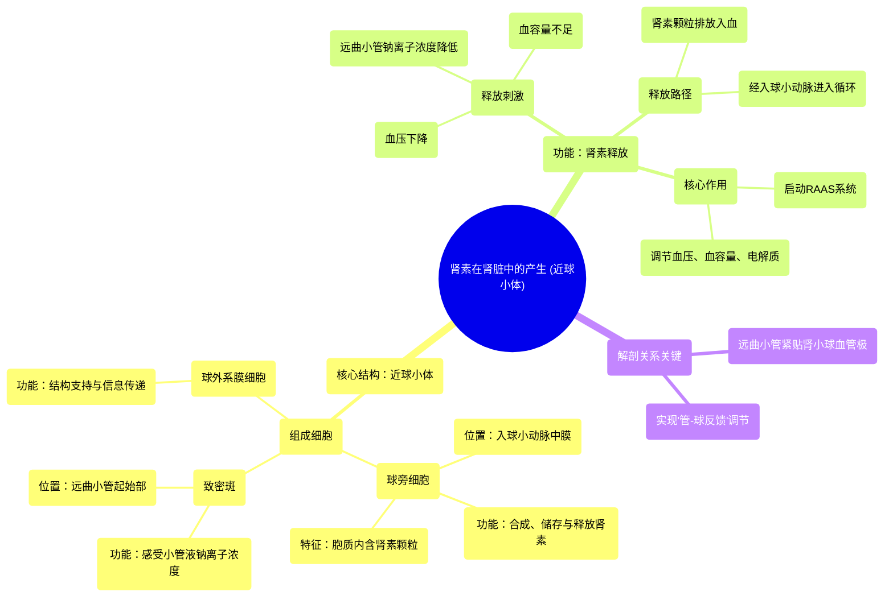

# 23 Renin production in the kidneys Renal system physiology NCLEX-RN Khan Academy

  <video controls preload="metadata" playsinline>
    <source src="https://helly.s3.bitiful.net/心血管学科/%E4%B8%93%E8%BE%91%2002%EF%BC%9A%E5%BF%83%E8%A1%80%E7%AE%A1%E7%B3%BB%E7%BB%9F%E6%A6%82%E8%A7%88%20%28Cardiovascular%20System%29/23%20Renin%20production%20in%20the%20kidneys%20Renal%20system%20physiology%20NCLEX-RN%20Khan%20Academy.mp4" type="video/mp4">
    
您的浏览器不支持播放，请升级。

  </video>

::: tip ⚡️ 核心考点 (30s速读)
*   **核心考点**：肾素由肾脏的**球旁细胞**合成与释放，是肾素-血管紧张素-醛固酮系统（RAAS）的启动关键。
*   **临床意义**：RAAS系统调控血压、血容量和电解质平衡。肾素释放异常与高血压、心力衰竭、肾脏疾病等密切相关。
:::

## 🧠 深度精讲

*   **近球小体（球旁复合体）**：这是位于肾小球血管极的一个特殊结构，是肾素释放的“指挥部”。它由三种关键细胞组成：
    *   **球旁细胞**：位于入球小动脉中膜，是特化的平滑肌细胞，内含**肾素颗粒**，是肾素的合成与储存场所。
    *   **致密斑**：位于远曲小管起始部，是特化的肾小管上皮细胞。它能感受小管液中**钠离子浓度**的变化，并将信号传递给球旁细胞。
    *   **球外系膜细胞**：位于入球与出球小动脉及致密斑之间的三角区，起结构支持和信息传递作用。

*   **肾素的释放与作用**：当机体血压下降、血容量不足或远曲小管钠离子浓度降低时，会刺激**球旁细胞**将其颗粒内的肾素释放入血。肾素本身不直接升高血压，它像一把“钥匙”，能催化肝脏产生的血管紧张素原转变为血管紧张素I，从而启动整个RAAS级联反应，最终通过收缩血管、促进醛固酮分泌（保钠保水排钾）来升高血压、增加血容量。

*   **结构与功能的联系**：视频中强调的解剖位置关系至关重要。**远曲小管**紧贴**入球小动脉**和**出球小动脉**，这种紧密的空间排列使得致密斑能有效监测经过肾小管处理后的滤液成分，并就近调节球旁细胞的肾素分泌，实现高效的局部反馈调节（即**管-球反馈**）。

## 📚 双语术语表 (Terminology)
| 英文术语 | 中文翻译 | 定义/解释 |
| :--- | :--- | :--- |
| Afferent Arteriole | 入球小动脉 | 将血液输送至肾小球的小动脉。 |
| Efferent Arteriole | 出球小动脉 | 将血液从肾小球引出的小动脉。 |
| Distal Convoluted Tubule (DCT) | 远曲小管 | 肾单位的一部分，位于髓袢之后，对离子和水分进行重吸收和分泌。 |
| Macula Densa | 致密斑 | 远曲小管起始部特化的上皮细胞群，能感受小管液钠离子浓度。 |
| Juxtaglomerular (JG) Cells | 球旁细胞 | 位于入球小动脉中膜的特化平滑肌细胞，合成、储存并释放肾素。 |
| Granular Cells | 颗粒细胞 | 球旁细胞的别称，因其胞质内含肾素颗粒而得名。 |
| Mesangial Cells | 系膜细胞 | 位于肾小球毛细血管袢之间及球旁复合体区，起支持、收缩和信息传递作用。 |
| Juxtaglomerular Apparatus (JGA) | 近球小体 / 球旁复合体 | 由球旁细胞、致密斑和球外系膜细胞共同构成的功能性结构，是调节肾素释放的核心单位。 |
| Renin | 肾素 | 一种由球旁细胞释放的蛋白水解酶，是肾素-血管紧张素-醛固酮系统（RAAS）的启动因子。 |
| Endothelial Cells | 内皮细胞 | 衬覆于血管内壁的细胞。 |
| Smooth Muscle Cells | 平滑肌细胞 | 构成血管中膜（肌层）的细胞，可收缩以调节血管管径。 |

## 🗺️ 知识图谱

