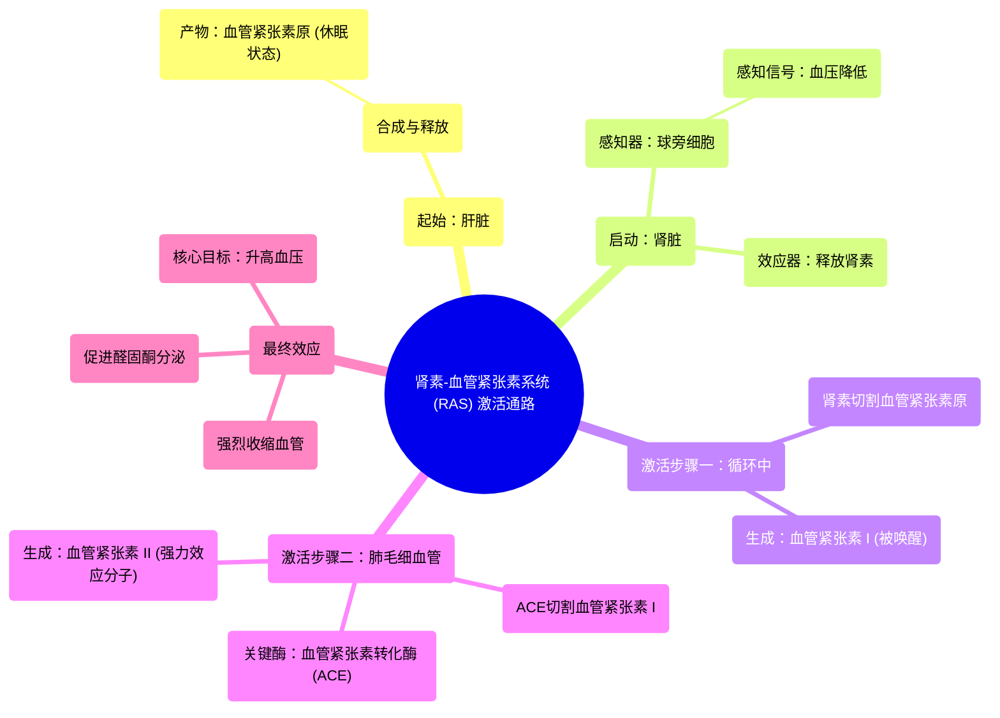

# 24 Activating angiotensin 2 Renal system physiology NCLEX-RN Khan Academy

  <video controls preload="metadata" playsinline>
    <source src="https://helly.s3.bitiful.net/心血管学科/%E4%B8%93%E8%BE%91%2002%EF%BC%9A%E5%BF%83%E8%A1%80%E7%AE%A1%E7%B3%BB%E7%BB%9F%E6%A6%82%E8%A7%88%20%28Cardiovascular%20System%29/24%20Activating%20angiotensin%202%20Renal%20system%20physiology%20NCLEX-RN%20Khan%20Academy.mp4" type="video/mp4">
    
您的浏览器不支持播放，请升级。

  </video>

::: tip ⚡️ 核心考点 (30s速读)
*   **核心考点**：血压调控是一个多器官参与的复杂过程，核心是**肾素-血管紧张素系统 (RAS)**。肝脏产生**血管紧张素原**，肾脏在血压降低时分泌**肾素**，肾素将血管紧张素原转化为**血管紧张素 I**，后者在肺部等处的**血管紧张素转化酶 (ACE)** 作用下，最终生成强效的**血管紧张素 II**，从而收缩血管、升高血压。
*   **临床意义**：RAS是高血压、心力衰竭等心血管疾病的关键病理生理环节。**ACE抑制剂**和**血管紧张素II受体拮抗剂 (ARB)** 是临床上通过阻断此系统来降压和治疗心衰的基石药物。
:::

## 🧠 深度精讲

*   **概念1：血压调控的器官协作**
    肾脏是血压调控的核心器官，但并非唯一。**肝脏**在其中扮演着至关重要的起始角色，它负责合成并释放一种名为**血管紧张素原**的大型蛋白质（由452个氨基酸组成）。这个蛋白质在血液中循环，但本身是“休眠”的，不具备生理活性。

*   **概念2：肾脏的启动信号——肾素**
    当血压下降时，肾脏入球小动脉壁上的**球旁细胞**（或称颗粒细胞）会感知到这一变化。这些细胞会向血液中释放一种名为**肾素**的蛋白质激素。肾素是激活整个系统的“钥匙”。

*   **概念3：激素的相遇与第一次激活**
    在血液循环中，来自肝脏的**血管紧张素原**与来自肾脏的**肾素**相遇。肾素像一把“分子剪刀”，在血管紧张素原的特定部位进行切割，切下一个由10个氨基酸组成的短肽链，这个短肽就是**血管紧张素 I**。至此，休眠的蛋白质被“唤醒”，转化为具有活性的激素信使。

*   **概念4：最终的强力效应分子——血管紧张素 II 的生成**
    血管紧张素 I 在血液中继续循环，当它流经肺部等器官的**毛细血管**时，会遇到位于血管内皮细胞表面的**血管紧张素转化酶**。这个酶会再次切割血管紧张素 I，去掉最后两个氨基酸，生成一个由8个氨基酸组成的、效力极强的激素——**血管紧张素 II**。血管紧张素 II 是RAS系统的核心效应分子，它通过强烈收缩血管、促进醛固酮分泌等机制，最终实现升高血压的目标。

## 📚 双语术语表 (Terminology)
| 英文术语 | 中文翻译 | 定义/解释 |
| :--- | :--- | :--- |
| Angiotensinogen | 血管紧张素原 | 由肝脏合成并释放入血的大型蛋白质前体，是肾素-血管紧张素系统的起始底物。 |
| Renin | 肾素 | 由肾脏球旁细胞分泌的一种蛋白水解酶，能将血管紧张素原转化为血管紧张素 I。 |
| Angiotensin I | 血管紧张素 I | 由肾素作用于血管紧张素原后产生的十肽，活性较弱，是血管紧张素 II 的前体。 |
| Angiotensin Converting Enzyme (ACE) | 血管紧张素转化酶 | 主要存在于肺血管内皮细胞表面的一种酶，能将血管紧张素 I 转化为具有强效活性的血管紧张素 II。 |
| Angiotensin II | 血管紧张素 II | RAS系统的核心效应肽，具有强烈的缩血管、促醛固酮分泌等作用，是升高血压的关键分子。 |
| Juxtaglomerular Cells | 球旁细胞 | 位于肾脏入球小动脉壁上的特化细胞，能感知血压和钠离子浓度变化，并分泌肾素。 |
| Afferent Arteriole | 入球小动脉 | 将血液输送至肾小球进行滤过的微小动脉。 |
| Endothelium | 内皮（层） | 血管内壁的单层细胞层，具有分泌、屏障和信号转导等多种功能。 |

## 🗺️ 知识图谱

