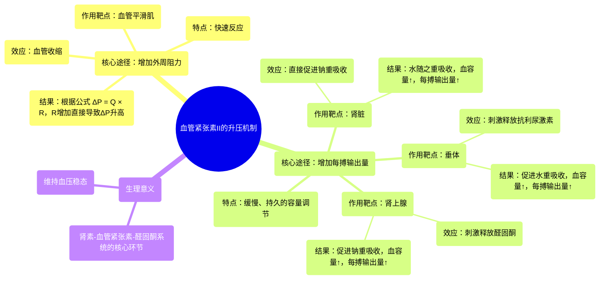

# 25 Angiotensin 2 raises blood pressure Renal system physiology NCLEX-RN Khan Academy

  <video controls preload="metadata" playsinline>
    <source src="https://helly.s3.bitiful.net/心血管学科/%E4%B8%93%E8%BE%91%2002%EF%BC%9A%E5%BF%83%E8%A1%80%E7%AE%A1%E7%B3%BB%E7%BB%9F%E6%A6%82%E8%A7%88%20%28Cardiovascular%20System%29/25%20Angiotensin%202%20raises%20blood%20pressure%20Renal%20system%20physiology%20NCLEX-RN%20Khan%20Academy.mp4" type="video/mp4">
    
您的浏览器不支持播放，请升级。

  </video>

::: tip ⚡️ 核心考点 (30s速读)
*   **核心考点**：血管紧张素II通过作用于多个靶器官，从**增加外周阻力**和**增加每搏输出量**两个核心途径来升高血压。
*   **临床意义**：理解血管紧张素II的作用机制是掌握高血压病理生理及降压药（如ACEI、ARB）作用原理的基础。
:::

## 🧠 深度精讲

*   **概念1：血管紧张素II的升压机制**
    血管紧张素II是一种由八个氨基酸组成的小分子激素。它通过血液循环作用于多个靶器官，协同升高血压。其作用可以概括为“开源节流”：
    1.  **增加外周阻力（“收紧管道”）**：直接作用于血管平滑肌，引起**血管收缩**。根据血流动力学公式 **ΔP = Q × R**（血压变化 = 心输出量 × 外周阻力），在流量（Q）不变的情况下，增加阻力（R）可直接提升血压。这是一个**快速反应**。
    2.  **增加每搏输出量（“扩充容量”）**：通过作用于肾脏、垂体和肾上腺，增加体内水钠潴留，从而增加血容量和每搏输出量（Q的重要组成部分），进而升高血压。这是一个相对**缓慢**的过程。
        *   **直接作用于肾脏**：促进**钠的重吸收**，水随之被动重吸收。
        *   **作用于垂体**：刺激释放**抗利尿激素**，主要促进**水的重吸收**。
        *   **作用于肾上腺**：刺激释放**醛固酮**，主要促进**钠的重吸收**。

*   **概念2：水与钠重吸收的异同**
    两者最终都通过增加血容量来提升每搏输出量和血压，但机制和侧重点不同：
    *   **钠重吸收**：是“主动”过程。重吸收钠后，通过渗透压作用“被动”将水拉回血液。这直接增加了血液的**渗透压**。
    *   **水重吸收**：是更“直接”的容量补充。主要通过抗利尿激素作用于集合管，增加水的通透性来实现，对血液渗透压的直接影响与钠重吸收不同。

## 📚 双语术语表 (Terminology)
| 英文术语 | 中文翻译 | 定义/解释 |
| :--- | :--- | :--- |
| Angiotensin II | 血管紧张素II | 一种由八个氨基酸组成的肽类激素，是肾素-血管紧张素-醛固酮系统的核心效应分子，主要功能是升高血压。 |
| Vasoconstriction | 血管收缩 | 血管平滑肌收缩导致血管管腔变窄，从而增加外周阻力。 |
| Stroke Volume | 每搏输出量 | 一次心搏中，一侧心室射出的血液量。是心输出量的组成部分。 |
| Total Peripheral Resistance | 总外周阻力 | 体循环中所有小动脉和微动脉对血流产生的阻力总和。 |
| ADH (Antidiuretic Hormone) | 抗利尿激素 | 由垂体后叶释放的激素，主要作用是增加肾脏集合管对水的重吸收，减少尿量，浓缩尿液。 |
| Aldosterone | 醛固酮 | 由肾上腺皮质分泌的激素，主要作用是促进肾脏远曲小管和集合管对钠离子的重吸收和钾离子的排泄。 |
| Reabsorption | 重吸收 | 在肾脏中，将原尿中的有用物质（如水、葡萄糖、钠离子等）重新吸收回血液的过程。 |
| ΔP = Q × R | 血压变化 = 心输出量 × 外周阻力 | 血流动力学的基本公式，用于分析血压的决定因素。 |

## 🗺️ 知识图谱

