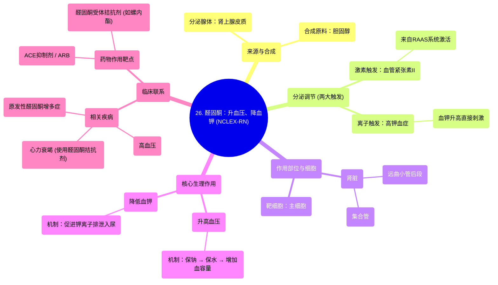

# 26 Aldosterone raises blood pressure and lowers potassium NCLEX-RN Khan Academy

  <video controls preload="metadata" playsinline>
    <source src="https://helly.s3.bitiful.net/心血管学科/%E4%B8%93%E8%BE%91%2002%EF%BC%9A%E5%BF%83%E8%A1%80%E7%AE%A1%E7%B3%BB%E7%BB%9F%E6%A6%82%E8%A7%88%20%28Cardiovascular%20System%29/26%20Aldosterone%20raises%20blood%20pressure%20and%20lowers%20potassium%20NCLEX-RN%20Khan%20Academy.mp4" type="video/mp4">
    
您的浏览器不支持播放，请升级。

  </video>

::: tip ⚡️ 核心考点 (30s速读)
*   **核心考点**：醛固酮是肾上腺皮质分泌的激素，其核心作用是**升高血压**和**降低血钾**。它通过作用于肾脏远曲小管和集合管的主细胞，促进钠的重吸收和钾的排泄。
*   **临床意义**：理解醛固酮的分泌调节（血管紧张素II和高血钾）和作用机制，是掌握高血压、心力衰竭、原发性醛固酮增多症等疾病病理生理及药物治疗（如ACEI、ARB、醛固酮受体拮抗剂）的关键。
:::

## 🧠 深度精讲

*   **醛固酮的来源与合成**：
    醛固酮由**肾上腺皮质**（肾上腺的外层）分泌。其合成原料是**胆固醇**，在细胞内经过一系列酶促反应转化而来。这解释了为什么胆固醇是合成多种类固醇激素（包括醛固酮）的必要前体物质。

*   **醛固酮的分泌调节（两大触发因素）**：
    1.  **血管紧张素II (Angiotensin II)**：这是肾素-血管紧张素-醛固酮系统 (RAAS) 的核心环节。当机体血压降低或血容量不足时，RAAS系统被激活，最终产生的血管紧张素II会刺激肾上腺皮质分泌醛固酮。
    2.  **高钾血症 (Hyperkalemia)**：血液中**钾离子 (K+)** 浓度升高，会直接刺激肾上腺皮质细胞分泌醛固酮。这是一种快速、直接的反馈调节机制，旨在通过排钾来维持血钾稳定。

*   **醛固酮的作用部位与机制**：
    *   **作用部位**：主要在肾脏的**远曲小管后段**和**集合管**。
    *   **靶细胞**：**主细胞 (Principal Cells)**。
    *   **作用机制**：
        1.  **保钠排钾**：醛固酮进入主细胞后，与胞内受体结合，促进基因表达，合成更多的钠通道 (ENaC) 和钠钾泵 (Na+/K+-ATPase)。
        2.  **连锁效应**：
            *   管腔侧的钠通道增加，使更多钠离子 (Na+) 从尿液中重吸收回主细胞内。
            *   基底侧的钠钾泵活性增强，将细胞内钠泵入血液，同时将血液中的钾泵入细胞。
            *   细胞内钾离子浓度升高，通过管腔侧的钾通道排入尿液。
        3.  **最终效果**：钠的重吸收增加，伴随水的重吸收增加，从而**增加血容量，升高血压**；同时，钾的排泄增加，导致**血钾降低**。

*   **整体生理路径回顾**：
    这是一个从信号到效应的完整链条：**低血压/低血容量/高血钾 → (激活RAAS或直接刺激) → 血管紧张素II/高血钾 → 刺激肾上腺皮质 → 分泌醛固酮 → 作用于肾脏主细胞 → 保钠、排水、排钾 → 血容量↑、血压↑、血钾↓**。

## 📚 双语术语表 (Terminology)
| 英文术语 | 中文翻译 | 定义/解释 |
| :--- | :--- | :--- |
| Aldosterone | 醛固酮 | 由肾上腺皮质分泌的类固醇激素，主要功能是促进肾脏保钠排钾，从而升高血压。 |
| Adrenal Gland | 肾上腺 | 位于肾脏上方的内分泌腺体，分为皮质（分泌醛固酮、皮质醇等）和髓质（分泌肾上腺素、去甲肾上腺素）。 |
| Cortex | 皮质 | 肾上腺的外层部分，分泌类固醇激素，包括醛固酮。 |
| Medulla | 髓质 | 肾上腺的内部部分，分泌儿茶酚胺类激素（如肾上腺素）。 |
| Angiotensin II | 血管紧张素II | RAAS系统中的关键活性肽，具有强效缩血管作用，并能刺激醛固酮分泌。 |
| Principal Cell | 主细胞 | 肾脏远曲小管和集合管中的一种上皮细胞，是醛固酮作用的主要靶细胞，负责钠重吸收和钾分泌。 |
| Distal Convoluted Tubule | 远曲小管 | 肾单位的一部分，位于髓袢之后，是醛固酮调节水盐平衡的重要部位之一。 |
| Collecting Duct | 集合管 | 汇集多个肾单位滤液的管道，是尿液浓缩和离子调节（尤其是钾和酸）的最后场所，受醛固酮调节。 |
| Peritubular Capillary | 管周毛细血管 | 缠绕在肾小管周围的毛细血管网，负责重吸收肾小管回流的物质（如水、钠）进入血液循环。 |
| Renin-Angiotensin-Aldosterone System (RAAS) | 肾素-血管紧张素-醛固酮系统 | 机体调节血压和血容量的核心激素系统。 |

## 🗺️ 知识图谱

