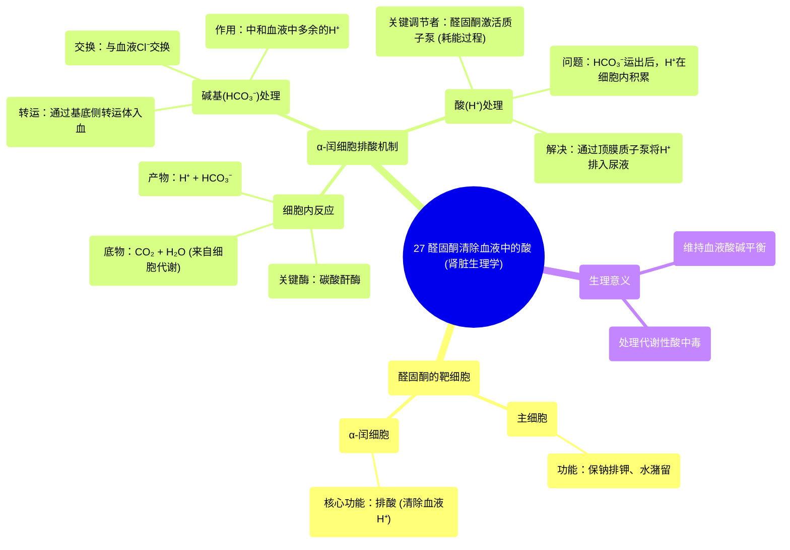

# 27 Aldosterone removes acid from the blood Renal system physiology NCLEX-RN Khan Academy

  <video controls preload="metadata" playsinline>
    <source src="https://helly.s3.bitiful.net/心血管学科/%E4%B8%93%E8%BE%91%2002%EF%BC%9A%E5%BF%83%E8%A1%80%E7%AE%A1%E7%B3%BB%E7%BB%9F%E6%A6%82%E8%A7%88%20%28Cardiovascular%20System%29/27%20Aldosterone%20removes%20acid%20from%20the%20blood%20Renal%20system%20physiology%20NCLEX-RN%20Khan%20Academy.mp4" type="video/mp4">
    
您的浏览器不支持播放，请升级。

  </video>

::: tip ⚡️ 核心考点 (30s速读)
*   **核心考点**：醛固酮不仅作用于主细胞调节钾、钠和水，还作用于α-闰细胞，通过促进质子（H⁺）排入尿液和碳酸氢盐（HCO₃⁻）重吸收入血，从而帮助血液清除多余的酸，维持酸碱平衡。
*   **临床意义**：理解醛固酮的这一功能对于处理代谢性酸中毒、评估肾上腺皮质功能以及理解某些利尿剂（如螺内酯）的作用机制至关重要。
:::

## 🧠 深度精讲

*   **醛固酮的双重作用**：在之前的视频中，我们学习了醛固酮作用于肾脏的**主细胞**，导致**保钠排钾**和**水潴留**。本视频重点介绍了醛固酮的另一个关键作用靶点——**α-闰细胞**，其核心功能是**排酸**。
*   **α-闰细胞的功能**：α-闰细胞的主要任务是清除血液中过多的**质子（H⁺）**，即酸。与之功能相反的是**β-闰细胞**（本视频未详述，留待后续），其主要功能是**保酸**。
*   **排酸的分子机制**：
    1.  **起点**：所有细胞代谢都会产生二氧化碳（CO₂）和水（H₂O）。在α-闰细胞内，**碳酸酐酶**催化CO₂和H₂O反应，生成**质子（H⁺）**和**碳酸氢根离子（HCO₃⁻）**。
    2.  **碱基入血**：细胞基底侧膜上的转运体将生成的HCO₃⁻泵入**血液**，同时从血液中交换回一个氯离子（Cl⁻）。进入血液的HCO₃⁻可以立即与多余的H⁺结合，生成CO₂和H₂O（逆向反应），从而**中和血液中的酸**。CO₂最终可经肺呼出。
    3.  **酸排出细胞**：然而，上述过程在将HCO₃⁻送出的同时，却在细胞内积累了H⁺。为了持续排酸，必须将细胞内的H⁺排出去。
*   **醛固酮的关键角色**：醛固酮在此处激活细胞顶膜（朝向尿液侧）的**质子泵（H⁺-ATPase）**。这是一个**耗能（ATP）**的主动转运过程。在醛固酮的驱动下，质子泵将细胞内积累的H⁺主动分泌到**尿液**中，从而完成整个“清除血液酸负荷”的循环。
*   **过程总结**：通过α-闰细胞的活动，血液中一个多余的H⁺被“打包”处理：其对应的HCO₃⁻被回收入血用于缓冲，而H⁺本身则被排入尿液。醛固酮通过增强质子泵的活性，是这一排酸过程的**关键调节者**。

## 📚 双语术语表 (Terminology)
| 英文术语 | 中文翻译 | 定义/解释 |
| :--- | :--- | :--- |
| Aldosterone | 醛固酮 | 一种由肾上腺皮质分泌的激素，主要作用于肾脏，调节钠、钾平衡和血压，并参与酸碱平衡调节。 |
| Principal cell | 主细胞 | 肾远曲小管和集合管的一种上皮细胞，是醛固酮调节钠重吸收和钾排泄的主要靶细胞。 |
| Alpha-intercalated cell (α-IC) | α-闰细胞 | 肾集合管的一种上皮细胞，主要功能是向尿液中分泌质子（H⁺）并重吸收碳酸氢盐（HCO₃⁻），从而排泄酸。 |
| Beta-intercalated cell (β-IC) | β-闰细胞 | 肾集合管的一种上皮细胞，功能与α-闰细胞大致相反，主要分泌HCO₃⁻并重吸收H⁺（保酸）。 |
| Proton (H⁺) | 质子 (氢离子) | 氢原子失去一个电子后形成的阳离子，是酸性的体现。溶液中H⁺浓度越高，酸性越强。 |
| Bicarbonate (HCO₃⁻) | 碳酸氢盐 (碳酸氢根离子) | 血液中最主要的缓冲碱，能结合H⁺生成碳酸，进而分解为CO₂和水，对维持血液酸碱平衡至关重要。 |
| Carbonic anhydrase | 碳酸酐酶 | 一种催化二氧化碳和水可逆地生成碳酸的酶，广泛存在于红细胞、肾小管上皮细胞等，在气体运输和酸碱平衡中起核心作用。 |
| Basolateral surface | 基底侧膜 | 肾小管上皮细胞靠近毛细血管和细胞间隙的一侧膜。 |
| Apical surface | 顶膜 (管腔膜) | 肾小管上皮细胞朝向管腔（尿液）的一侧膜。 |
| H⁺-ATPase (Proton pump) | 质子泵 (氢离子泵) | 一种消耗ATP将质子（H⁺）逆浓度梯度泵出细胞的膜蛋白，在α-闰细胞排酸过程中是关键执行者。 |

## 🗺️ 知识图谱

