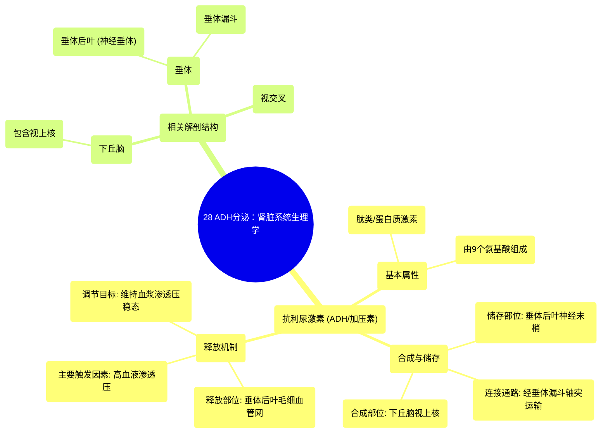

# 28 ADH secretion Renal system physiology NCLEX-RN Khan Academy

  <video controls preload="metadata" playsinline>
    <source src="https://helly.s3.bitiful.net/心血管学科/%E4%B8%93%E8%BE%91%2002%EF%BC%9A%E5%BF%83%E8%A1%80%E7%AE%A1%E7%B3%BB%E7%BB%9F%E6%A6%82%E8%A7%88%20%28Cardiovascular%20System%29/28%20ADH%20secretion%20Renal%20system%20physiology%20NCLEX-RN%20Khan%20Academy.mp4" type="video/mp4">
    
您的浏览器不支持播放，请升级。

  </video>

::: tip ⚡️ 核心考点 (30s速读)
*   **核心考点**：抗利尿激素（ADH/加压素）由下丘脑视上核的神经细胞合成，储存于垂体后叶，其释放主要受血液渗透压（浓度）调节。
*   **临床意义**：理解ADH的合成、储存、释放路径及调节机制，是掌握机体水平衡、尿量调节及诊断尿崩症等疾病的基础。
:::

## 🧠 深度精讲

*   **抗利尿激素（ADH）概述**：抗利尿激素，也称为加压素，是一种由9个氨基酸组成的肽类（蛋白质）激素。其名称“加压素”提示了其具有收缩血管的作用，但其核心生理功能是抗利尿，即减少尿液生成，保留体内水分。
*   **ADH的合成与储存位置**：ADH在下丘脑的**视上核**（位于视交叉上方）的神经细胞胞体内合成。这些神经细胞的轴突向下延伸，穿过**垂体漏斗**（垂体柄），终止于**垂体后叶**。因此，ADH是在下丘脑合成，然后沿轴突运输并储存在垂体后叶的神经末梢内，等待释放。
*   **ADH的释放机制**：当机体需要时（主要触发因素见下文），储存ADH的神经末梢“放电”，将ADH直接释放到垂体后叶丰富的毛细血管网中，随后进入全身血液循环。
*   **ADH释放的主要触发因素**：**血液渗透压升高**（即血液变“浓”）是刺激ADH释放的最主要因素。渗透压反映了血液中所有溶质（如钠离子、蛋白质等）的浓度。机体通过下丘脑的渗透压感受器监控血液浓度，并将其维持在一个狭窄的理想范围内（约280-300毫渗量/升）。当渗透压高于此范围（如脱水时），会强烈刺激视上核，导致ADH大量释放。

## 📚 双语术语表 (Terminology)
| 英文术语 | 中文翻译 | 定义/解释 |
| :--- | :--- | :--- |
| Anti-diuretic Hormone (ADH) | 抗利尿激素 | 一种由下丘脑合成、垂体后叶释放的肽类激素，主要作用是促进肾脏远曲小管和集合管对水的重吸收，减少尿量。 |
| Vasopressin | 加压素 | 抗利尿激素的别名，强调其具有收缩血管（升压）的潜在作用。 |
| Hypothalamus | 下丘脑 | 位于丘脑下方的大脑区域，是神经内分泌系统的核心，负责合成ADH等激素，并调节垂体功能。 |
| Supraoptic Nucleus | 视上核 | 下丘脑内的一个神经核团，是合成ADH的主要部位。 |
| Posterior Pituitary | 垂体后叶 | 垂体的后部，是下丘脑神经细胞轴突的末梢部位，用于储存和释放ADH及催产素。 |
| Infundibulum | 垂体漏斗（垂体柄） | 连接下丘脑和垂体的结构，内部有下丘脑神经细胞的轴突通过。 |
| Osmolarity | 渗透压 | 溶液浓度的度量，指每升溶液中溶质颗粒（离子或分子）的总数。在生理学中，特指血浆渗透压，是调节ADH释放的关键信号。 |

## 🗺️ 知识图谱

