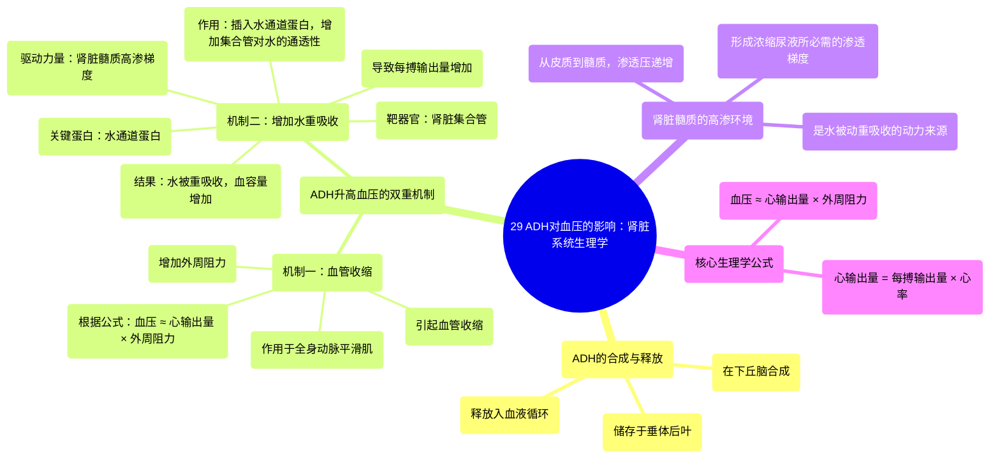

# 29 ADH effects on blood pressure Renal system physiology NCLEX-RN Khan Academy

  <video controls preload="metadata" playsinline>
    <source src="https://helly.s3.bitiful.net/心血管学科/%E4%B8%93%E8%BE%91%2002%EF%BC%9A%E5%BF%83%E8%A1%80%E7%AE%A1%E7%B3%BB%E7%BB%9F%E6%A6%82%E8%A7%88%20%28Cardiovascular%20System%29/29%20ADH%20effects%20on%20blood%20pressure%20Renal%20system%20physiology%20NCLEX-RN%20Khan%20Academy.mp4" type="video/mp4">
    
您的浏览器不支持播放，请升级。

  </video>

::: tip ⚡️ 核心考点 (30s速读)
*   **核心考点**：抗利尿激素通过两种主要机制升高血压：1. 作用于全身血管平滑肌，引起血管收缩，增加外周阻力；2. 作用于肾脏集合管，增加水通道蛋白的插入，促进水的重吸收，增加血容量和每搏输出量。
*   **临床意义**：理解ADH的作用机制对于处理低血压、休克、尿崩症（ADH缺乏）以及抗利尿激素分泌异常综合征（SIADH，ADH过量）等临床状况至关重要。
:::

## 🧠 深度精讲

*   **概念1：抗利尿激素的合成与释放**
    抗利尿激素是一种由氨基酸组成的小肽类激素，在下丘脑合成，储存于垂体后叶，并在需要时释放入血，随血液循环至全身靶器官。

*   **概念2：ADH升高血压的机制一：血管收缩**
    ADH直接作用于全身动脉血管的平滑肌，使其收缩（血管收缩）。血管管径变小导致外周阻力增加。根据血流动力学公式（动脉压 ≈ 心输出量 × 外周阻力），在外周阻力增加而心输出量不变的情况下，动脉血压会随之升高。

*   **概念3：ADH升高血压的机制二：增加水重吸收**
    ADH更重要的作用靶点是肾脏的集合管。在集合管细胞膜上，存在一种称为水通道蛋白的特殊通道。在没有ADH时，这些通道位于细胞内部，细胞膜对水不通透，水分无法被重吸收，随尿液排出。当ADH与受体结合后，会促使细胞内的水通道蛋白插入到集合管细胞的管腔膜上。

*   **概念4：肾脏髓质的高渗梯度**
    肾脏的髓质组织间液从皮质到髓质深处，渗透压逐渐升高（从约300毫渗量到1200毫渗量），形成一个由低到高的盐分（渗透压）梯度。这个高渗环境是尿液浓缩的关键。

*   **概念5：水重吸收的驱动过程**
    当ADH使集合管对水通透后，流经集合管的尿液（此时渗透压较低）与髓质高渗的组织间液之间就形成了渗透压差。水分会顺着渗透梯度，通过水通道蛋白，从集合管腔被动扩散到高渗的组织间液中，然后被周围的毛细血管重吸收回血液循环。这个过程减少了水分丢失，增加了血容量，从而增加了心脏的每搏输出量，最终导致血压升高。

## 📚 双语术语表 (Terminology)
| 英文术语 | 中文翻译 | 定义/解释 |
| :--- | :--- | :--- |
| Antidiuretic Hormone (ADH) | 抗利尿激素 | 一种由垂体后叶释放的激素，主要功能是减少尿液排出（抗利尿）并升高血压。 |
| Vasoconstriction | 血管收缩 | 血管平滑肌收缩，导致血管管径变小。 |
| Peripheral Resistance | 外周阻力 | 血液在血管系统中流动所遇到的阻力，主要受小动脉管径影响。 |
| Stroke Volume | 每搏输出量 | 一次心搏中，一侧心室射出的血液量。 |
| Aquaporin | 水通道蛋白 | 细胞膜上的一种蛋白质通道，专门允许水分子快速通过。 |
| Collecting Duct | 集合管 | 肾单位的最后一段，是ADH调节水重吸收的主要部位。 |
| Osmotic Gradient | 渗透梯度 | 溶液中溶质浓度在不同区域形成的差异，是水被动跨膜运输的动力。 |
| Milliosmole (mOsm) | 毫渗量 | 渗透压的单位，用于表示溶液的渗透浓度。 |
| Reabsorption | 重吸收 | 在肾脏中，将滤过液中的有用物质（如水、电解质）重新吸收回血液的过程。 |

## 🗺️ 知识图谱

