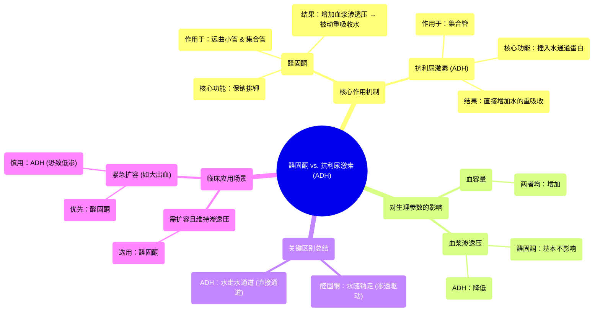

# 30 Aldosterone and ADH Renal system physiology NCLEX-RN Khan Academy

  <video controls preload="metadata" playsinline>
    <source src="https://helly.s3.bitiful.net/心血管学科/%E4%B8%93%E8%BE%91%2002%EF%BC%9A%E5%BF%83%E8%A1%80%E7%AE%A1%E7%B3%BB%E7%BB%9F%E6%A6%82%E8%A7%88%20%28Cardiovascular%20System%29/30%20Aldosterone%20and%20ADH%20Renal%20system%20physiology%20NCLEX-RN%20Khan%20Academy.mp4" type="video/mp4">
    
您的浏览器不支持播放，请升级。

  </video>

::: tip ⚡️ 核心考点 (30s速读)
*   **核心考点**：醛固酮通过重吸收钠离子（Na⁺）来增加血浆渗透压，从而“被动”重吸收水，主要影响血容量，对血浆渗透压影响不大。抗利尿激素（ADH）则直接通过水通道蛋白（水孔蛋白）增加集合管对水的通透性，主动重吸收水，主要影响血浆渗透压。
*   **临床意义**：理解两者区别是处理体液平衡紊乱（如低血容量、高钠血症、低钠血症）的关键。例如，大出血时优先需要提升血容量（醛固酮作用），而调节血浆渗透压则依赖ADH。
:::

## 🧠 深度精讲

*   **醛固酮的作用机制**：
    醛固酮作用于肾单位的远曲小管和集合管。其主要功能是**重吸收钠离子（Na⁺）** 并**分泌钾离子（K⁺）**。钠离子是血浆中主要的不可自由跨膜溶质，其重吸收会增加血浆的**渗透压**（即溶质浓度）。根据渗透原理，水会顺着渗透压梯度从肾小管腔被动进入血液。因此，醛固酮是通过“保钠”来间接“保水”，从而增加**血容量**。

*   **抗利尿激素（ADH）的作用机制**：
    ADH（又称血管加压素）主要作用于集合管。当机体需要保留水分时，ADH会促使细胞膜上插入**水通道蛋白（水孔蛋白）**，极大地增加集合管对水的通透性。在肾脏髓质高渗梯度的环境下，水得以被大量重吸收回血液。这个过程**不直接改变溶质（如钠）的数量**，而是直接改变水的重吸收量。

*   **关键区别对比**：
    1.  **作用目标**：醛固酮主要作用于**钠离子**；ADH直接作用于**水**。
    2.  **作用方式**：醛固酮通过改变**渗透压**来驱动水移动（水随钠走）；ADH通过开放**水通道**让水通过。
    3.  **对血浆渗透压和血容量的影响**：
        *   **醛固酮**：同时增加血容量和血浆溶质总量（渗量），由于分子（溶质）和分母（血容量）成比例增加，因此对最终的血浆**渗透压**影响甚微。
        *   **ADH**：主要增加**血容量**。由于它不增加溶质，只增加水（即只增加分母），所以会导致血浆**渗透压下降**。

*   **临床应用场景分析**：
    *   **场景一：需增加血容量但维持渗透压不变**（如某些慢性心衰患者的管理）。
        *   **选择**：使用**醛固酮**（或其类似物）。
        *   **理由**：它能增加容量而不显著改变渗透压。
    *   **场景二：急需增加血容量，无论渗透压如何**（如急性大出血、休克）。
        *   **选择**：可同时或优先使用**醛固酮**。
        *   **理由**：此时救命的关键是快速恢复有效循环血量，对渗透压变化的容忍度较高。单独使用ADH虽然也能扩容，但会导致低渗状态，可能引起脑水肿等并发症。

## 📚 双语术语表 (Terminology)
| 英文术语 | 中文翻译 | 定义/解释 |
| :--- | :--- | :--- |
| Aldosterone | 醛固酮 | 由肾上腺皮质分泌的激素，主要功能是保钠排钾，从而调节血容量和血压。 |
| ADH (Antidiuretic Hormone) | 抗利尿激素（血管加压素） | 由下丘脑合成、垂体后叶释放的激素，通过增加肾脏集合管对水的重吸收来浓缩尿液、维持体液渗透压平衡。 |
| Nephron | 肾单位 | 肾脏结构和功能的基本单位，包括肾小体和肾小管。 |
| Tubule | 肾小管 | 肾单位中负责重吸收和分泌的部分，包括近曲小管、髓袢、远曲小管和集合管。 |
| Osmolarity | 渗透压 | 溶液溶质浓度的度量，单位是 Osm/L 或 mOsm/L，决定水跨膜移动的方向。 |
| Tonicity | 张力 | 特指溶液中不能自由通过细胞膜的溶质所产生的有效渗透压，是引起细胞肿胀或皱缩的原因。 |
| Water Channel (Aquaporin) | 水通道蛋白（水孔蛋白） | 细胞膜上允许水分子快速通过的蛋白质通道，ADH可调节其在集合管细胞膜上的数量。 |
| Sodium (Na⁺) Reabsorption | 钠离子重吸收 | 肾小管将滤液中的钠离子主动转运回血液的过程，是醛固酮的核心作用。 |
| Potassium (K⁺) Secretion | 钾离子分泌 | 肾小管将血液中的钾离子排入尿液的过程，与醛固酮的保钠作用耦联。 |

## 🗺️ 知识图谱

