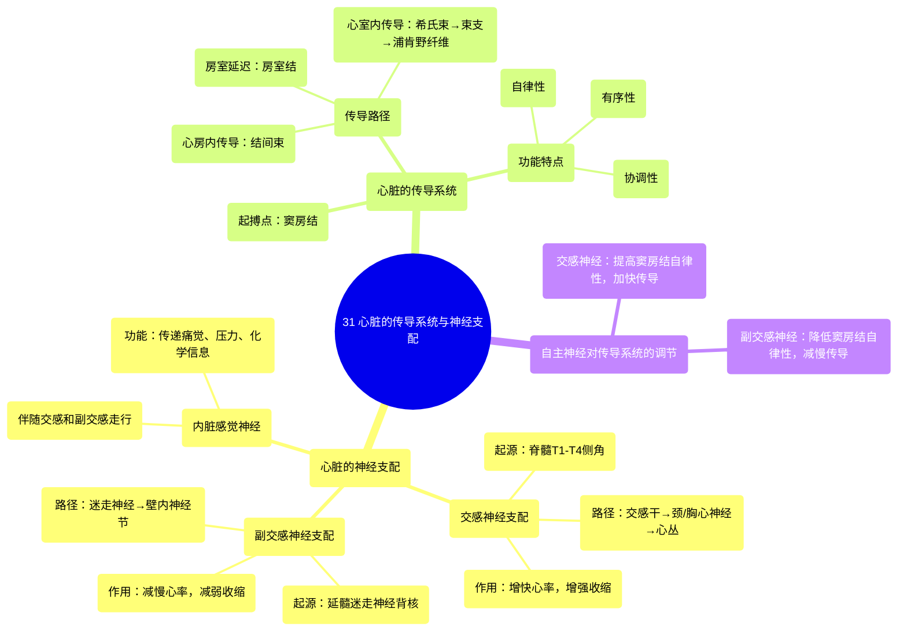

# 31 Conduction system of the heart

  <video controls preload="metadata" playsinline>
    <source src="https://helly.s3.bitiful.net/心血管学科/%E4%B8%93%E8%BE%91%2002%EF%BC%9A%E5%BF%83%E8%A1%80%E7%AE%A1%E7%B3%BB%E7%BB%9F%E6%A6%82%E8%A7%88%20%28Cardiovascular%20System%29/31%20Conduction%20system%20of%20the%20heart.mp4" type="video/mp4">
    
您的浏览器不支持播放，请升级。

  </video>

::: tip ⚡️ 核心考点 (30s速读)
*   **核心考点**：心脏受自主神经系统（交感与副交感）双重支配，并拥有独立的传导系统。交感神经（T1-T4）增快心率和增强收缩力；副交感神经（迷走神经）则起相反作用。传导系统（窦房结、房室结等）是心脏自主节律的基础，受自主神经调节。
*   **临床意义**：理解此系统是分析心律失常、心肌缺血、自主神经功能紊乱（如神经心源性晕厥）及药物（如β受体阻滞剂、阿托品）作用机制的基础。心脏移植后，供体心脏的神经支配被切断，其心率主要依赖于内在传导系统和体液调节。
:::

## 🧠 深度精讲

*   **心脏的自主神经支配**：心脏接受交感神经和副交感神经（迷走神经）的双重支配，两者功能相互拮抗，共同精细调节心脏功能以适应机体需求。
    *   **交感神经支配**：
        *   **起源**：节前神经元胞体位于脊髓T1-T4（有时包括T5）节段的侧角。
        *   **路径**：节前纤维经白交通支进入交感干，可在相应胸神经节或上行至颈神经节（上、中、下颈神经节）换元。节后纤维形成颈心神经和胸心神经（心肺内脏神经），加入心丛，支配心脏。
        *   **作用**：释放去甲肾上腺素，作用于心肌β1受体，**增快心率（正性变时作用）、增强心肌收缩力（正性变力作用）、加快房室传导（正性变传导作用）**。
    *   **副交感神经支配**：
        *   **起源**：节前神经元胞体位于延髓的迷走神经背核。
        *   **路径**：节前纤维走行于迷走神经中，到达心脏后，在心壁内的神经节（壁内神经节）换元。节后纤维极短，支配窦房结、房室结、心房肌等。
        *   **作用**：释放乙酰胆碱，作用于心肌M受体，**减慢心率（负性变时作用）、减弱心房肌收缩力（负性变力作用）、减慢房室传导（负性变传导作用）**。对心室肌的支配较少。
    *   **内脏感觉神经**：伴随交感和副交感神经走行，将心脏的痛觉、压力、化学感受（如缺血、牵张）信息传回中枢（脊髓和延髓），参与心血管反射调节。

*   **心脏的传导系统**：这是心脏特有的、能自动产生和传导兴奋的组织系统，确保心房和心室有序、协调地收缩与舒张。
    *   **组成与顺序**：**窦房结 → 结间束 → 房室结 → 房室束（希氏束） → 左右束支 → 浦肯野纤维网**。
    *   **功能特点**：
        *   **自律性**：窦房结是正常心脏的**起搏点**，因其自律性最高（约60-100次/分）。房室结（约40-60次/分）和浦肯野纤维（约20-40次/分）为潜在起搏点。
        *   **传导顺序**：兴奋从窦房结开始，经心房肌和结间束传至房室结，在此有约0.1秒的生理性延迟（保证心房收缩完毕心室再收缩），然后经房室束、束支、浦肯野纤维快速传遍整个心室，使心室肌由心尖向心底同步收缩，高效泵血。
        *   **与神经系统的关系**：自主神经系统不直接引发心跳，而是通过影响传导系统（尤其是窦房结和房室结）的自律性和传导速度来**调节**心率与收缩力。例如，运动时交感神经兴奋使心率加快；休息时迷走神经张力增高使心率减慢。

## 📚 双语术语表 (Terminology)
| 英文术语 | 中文翻译 | 定义/解释 |
| :--- | :--- | :--- |
| Sympathetic nervous system | 交感神经系统 | 自主神经系统的组成部分，负责“战斗或逃跑”反应，对心脏起兴奋作用。 |
| Parasympathetic nervous system | 副交感神经系统 | 自主神经系统的组成部分，负责“休息和消化”状态，对心脏起抑制作用。 |
| Vagus nerve | 迷走神经 | 第X对脑神经，是支配心脏的主要副交感神经。 |
| Cardiac plexus | 心丛 | 位于主动脉弓下方和气管分叉处的神经网络，是交感和副交感神经纤维在心脏周围的交汇处。 |
| SA node (Sinoatrial node) | 窦房结 | 位于右心房上腔静脉入口处，是心脏正常的起搏点，产生初始电冲动。 |
| AV node (Atrioventricular node) | 房室结 | 位于房间隔下部，冠状窦口前方，将心房兴奋传导至心室，并产生生理性延迟。 |
| Bundle of His | 房室束（希氏束） | 连接房室结和左右束支的传导纤维束，穿过心脏的纤维骨架。 |
| Bundle branches | 束支 | 分为左束支和右束支，沿室间隔两侧下行，将兴奋传向心室。 |
| Purkinje fibers | 浦肯野纤维 | 束支的终末分支，网状分布于心室心内膜下，以极快速度将兴奋传至整个心室肌。 |
| Pacemaker | 起搏器 | 指能够自发产生节律性兴奋的细胞或组织，在心脏特指窦房结。 |
| Visceral afferent neuron | 内脏传入神经元 | 负责从内脏器官（如心脏）向中枢神经系统传递感觉信息（如疼痛、压力）的神经元。 |

## 🗺️ 知识图谱

