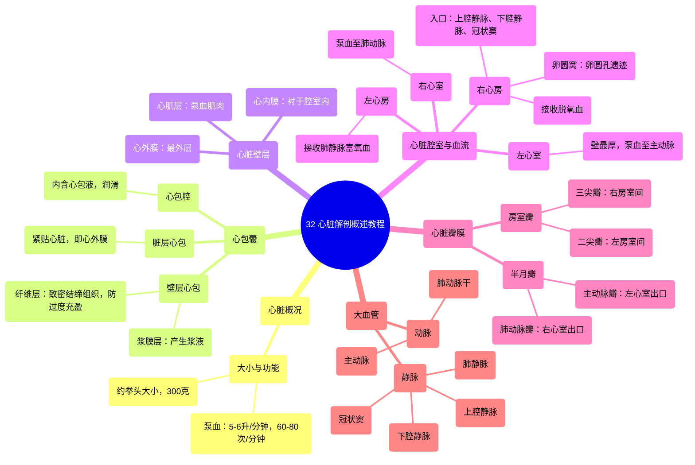

# 32 Overview of Heart Anatomy Tutorial

  <video controls preload="metadata" playsinline>
    <source src="https://helly.s3.bitiful.net/心血管学科/%E4%B8%93%E8%BE%91%2002%EF%BC%9A%E5%BF%83%E8%A1%80%E7%AE%A1%E7%B3%BB%E7%BB%9F%E6%A6%82%E8%A7%88%20%28Cardiovascular%20System%29/32%20Overview%20of%20Heart%20Anatomy%20Tutorial.mp4" type="video/mp4">
    
您的浏览器不支持播放，请升级。

  </video>

::: tip ⚡️ 核心考点 (30s速读)
*   **核心考点**：心脏解剖的核心在于理解其三层结构（心包、心肌、心内膜）、四个腔室（右心房/室、左心房/室）及连接它们的瓣膜与血管系统。
*   **临床意义**：心包积液可导致心脏压塞；冠状动脉阻塞引发心肌梗死；瓣膜病变影响血流动力学，是临床常见心脏疾病的解剖学基础。
:::

## 🧠 深度精讲

*   **心脏概况**：人类心脏约拳头大小，重300克，终生以60-80次/分钟的频率搏动，每分钟泵出5-6升血液，是一个高效的动力泵。
*   **心包囊**：心脏的“包装”，为双层囊状结构，包裹心脏及大血管根部。
    *   **壁层心包**：外层，由**纤维层**（致密不规则结缔组织，防止心脏过度充盈并固定心脏于纵隔）和**浆膜层**（产生浆液）构成。
    *   **脏层心包**：紧贴心脏表面的浆膜层，与壁层浆膜层相延续。
    *   **心包腔**：位于壁、脏两层浆膜层之间的潜在腔隙，内含**心包液**，起润滑作用，减少心脏搏动时的摩擦。
    *   **心外膜**：通常指脏层心包及其下方的脂肪组织。
*   **心脏腔室与血流**：
    *   **右心房**：接收来自全身的脱氧血。入口：**上腔静脉**（收集膈以上静脉血）、**下腔静脉**（收集膈以下静脉血）、**冠状窦**（收集心脏自身静脉血）。房间隔上有**卵圆窝**，为胎儿期**卵圆孔**的遗迹。
    *   **右心室**：接收右心房的血液，通过**肺动脉瓣**将血液泵入**肺动脉干**，流向肺部进行氧合。
    *   **左心房**：接收来自肺静脉的富氧血。
    *   **左心室**：心脏最厚壁的腔室，接收左心房的血液，通过**主动脉瓣**将血液泵入**主动脉**，供应全身。
*   **心脏瓣膜**：确保血液单向流动。
    *   **房室瓣**：位于心房与心室之间。右房室瓣为**三尖瓣**，左房室瓣为**二尖瓣**（僧帽瓣）。
    *   **半月瓣**：位于心室与大动脉之间。右心室出口为**肺动脉瓣**，左心室出口为**主动脉瓣**。
*   **心脏壁层**：从内到外依次为：
    *   **心内膜**：衬于心脏腔室内表面，与血液直接接触。
    *   **心肌层**：心脏的肌肉层，负责收缩泵血。
    *   **心外膜**：即脏层心包。

## 📚 双语术语表 (Terminology)
| 英文术语 | 中文翻译 | 定义/解释 |
| :--- | :--- | :--- |
| Pericardial Sac | 心包囊 | 包裹心脏及大血管根部的双层囊状结构。 |
| Parietal Pericardium | 壁层心包 | 心包囊的外层，包括纤维层和浆膜层。 |
| Fibrous Layer | 纤维层 | 壁层心包的外层，由致密不规则结缔组织构成，起保护和固定作用。 |
| Serous Layer | 浆膜层 | 产生浆液的膜层，分为壁层和脏层。 |
| Visceral Pericardium | 脏层心包 | 紧贴心脏表面的浆膜层，即心外膜的组成部分。 |
| Pericardial Space/Cavity | 心包腔 | 壁层与脏层浆膜之间的潜在腔隙，内含心包液。 |
| Pericardial Fluid | 心包液 | 心包腔内的润滑液，减少心脏搏动时的摩擦。 |
| Epicardium | 心外膜 | 心脏壁的最外层，通常指脏层心包及其下方的脂肪组织。 |
| Myocardium | 心肌层 | 心脏的中层，由心肌细胞构成，负责泵血。 |
| Endocardium | 心内膜 | 心脏壁的内层，衬于心脏腔室内表面。 |
| Superior Vena Cava (SVC) | 上腔静脉 | 将膈肌以上身体的脱氧血输送至右心房的大静脉。 |
| Inferior Vena Cava (IVC) | 下腔静脉 | 将膈肌以下身体的脱氧血输送至右心房的大静脉。 |
| Coronary Sinus | 冠状窦 | 心脏静脉的主要汇集处，将心肌的脱氧血输送至右心房。 |
| Right Atrium | 右心房 | 接收全身回流的脱氧血的心脏腔室。 |
| Fossa Ovalis | 卵圆窝 | 房间隔上的凹陷，是胎儿期卵圆孔的遗迹。 |
| Foramen Ovale | 卵圆孔 | 胎儿期连接左右心房、允许血液绕开肺循环的通道。 |
| Pulmonary Valve | 肺动脉瓣 | 位于右心室与肺动脉干之间的半月瓣，防止血液倒流回心室。 |
| Aortic Valve | 主动脉瓣 | 位于左心室与主动脉之间的半月瓣，防止血液倒流回心室。 |
| Tricuspid Valve | 三尖瓣 | 位于右心房与右心室之间的房室瓣（三个瓣叶）。 |
| Mitral Valve | 二尖瓣（僧帽瓣） | 位于左心房与左心室之间的房室瓣（两个瓣叶）。 |

## 🗺️ 知识图谱

