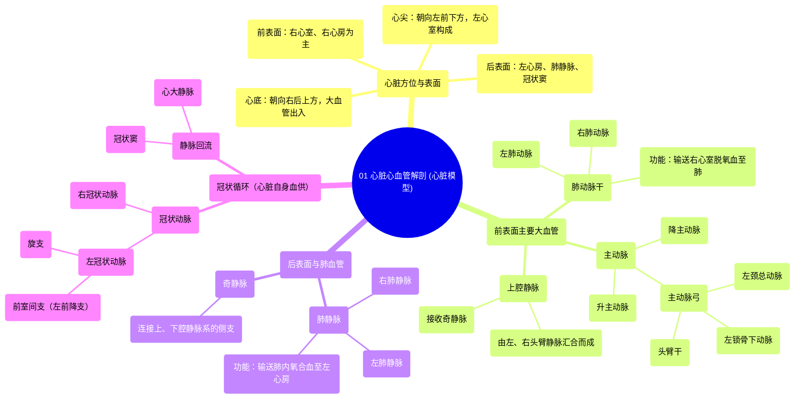

# 01 Cardiovascular Anatomy of the Heart Heart Model

  <video controls preload="metadata" playsinline>
    <source src="https://helly.s3.bitiful.net/心血管学科/%E4%B8%93%E8%BE%91%2003%EF%BC%9A%E5%BF%83%E8%A1%80%E7%AE%A1%E7%94%9F%E7%90%86%E5%AD%A6%E6%B7%B1%E5%BA%A6%E7%B2%BE%E8%AE%B2%20%28Cardiovascular%20Physiology%29/01%20Cardiovascular%20Anatomy%20of%20the%20Heart%20Heart%20Model.mp4" type="video/mp4">
    
您的浏览器不支持播放，请升级。

  </video>

::: tip ⚡️ 核心考点 (30s速读)
*   **核心考点**：掌握心脏的前、后、下（心尖）、上（心底）四个表面；识别心脏前表面的主要大血管（主动脉、肺动脉干）及其分支；区分肺动脉（蓝色，输送脱氧血）与肺静脉（红色，输送氧合血）的功能与颜色标记。
*   **临床意义**：理解冠状动脉（右冠状动脉、左冠状动脉及其左前降支）是升主动脉的第一对分支，为心肌供血，其阻塞是心肌梗死的主要原因。识别上、下腔静脉及冠状窦等静脉回流路径。
:::

## 🧠 深度精讲
*   **心脏方位与表面**：心脏并非垂直位于胸腔正中。其**心底**朝向右后上方（指向右肩），主要由左心房构成，是大血管进出的地方。**心尖**朝向左前下方，由左心室构成，是体表可触及心尖搏动的位置。**前表面**（胸肋面）主要由右心室和右心房构成；**后表面**（心底面）主要由左心房构成；**下表面**（膈面）主要由左、右心室构成。
*   **心脏前表面主要结构**：
    *   **心耳**：左、右心房前部的肌性小囊状突起。**左心耳**是房颤时血栓好发部位，具有临床重要性。
    *   **大血管根部（由右向左）**：
        1.  **上腔静脉**：收集头颈、上肢和胸部的静脉血，注入右心房。
        2.  **主动脉**：体循环的动脉主干。视频中可见**升主动脉**、**主动脉弓**及其三大分支（从右向左）：**头臂干**（分为右锁骨下动脉和右颈总动脉）、**左颈总动脉**、**左锁骨下动脉**。主动脉弓移行为**降主动脉**（胸主动脉、腹主动脉）。
        3.  **肺动脉干**：起自右心室，在主动脉弓下方分为**左、右肺动脉**，将右心室的**脱氧血**输送至肺。注意：肺动脉是**唯一**输送脱氧血的动脉。
*   **心脏后表面与肺血管**：
    *   **肺静脉**：左、右各两条，将肺内**氧合血**输送回左心房。注意：肺静脉是**唯一**输送氧合血的静脉。
    *   **奇静脉**：起自右腰升静脉，沿脊柱右侧上行，注入上腔静脉，是上、下腔静脉系重要的侧支循环通路。
*   **冠状循环（心脏自身的血供）**：
    *   **冠状动脉**：是升主动脉根部发出的第一对分支，分为**左冠状动脉**和**右冠状动脉**，在心脏表面走行并分支，为心肌供血。
    *   **左冠状动脉**：主要分为**前室间支**（左前降支，供应左心室前壁、室间隔前2/3）和**旋支**（供应左心室侧壁、后壁）。
    *   **静脉回流**：心脏的静脉血主要通过**冠状窦**（位于心脏后表面的冠状沟内）收集，最终汇入右心房。

## 📚 双语术语表 (Terminology)
| 英文术语 | 中文翻译 | 定义/解释 |
| :--- | :--- | :--- |
| Anterior surface | 前表面（胸肋面） | 心脏朝向前胸壁的一面，主要由右心室和右心房构成。 |
| Posterior surface | 后表面（心底面） | 心脏朝向后方的面，主要由左心房构成，毗邻食管和胸主动脉。 |
| Apex | 心尖 | 心脏左下部呈钝圆形的尖端，由左心室构成，朝向左前下方。 |
| Base | 心底 | 心脏右后上方的部分，主要由左心房构成，是大血管出入的部位。 |
| Left atrium | 左心房 | 接收来自肺静脉的氧合血，并将其泵入左心室。 |
| Right atrium | 右心房 | 接收来自上、下腔静脉和冠状窦的体循环静脉血，并将其泵入右心室。 |
| Pulmonary trunk | 肺动脉干 | 起自右心室，将脱氧血输送至肺的动脉主干。 |
| Pulmonary artery | 肺动脉 | 肺动脉干的分支（左、右肺动脉），将血液输送至相应肺叶。 |
| Pulmonary vein | 肺静脉 | 将肺内氧合血输送回左心房的血管（通常左、右各两条）。 |
| Aorta | 主动脉 | 体循环的动脉主干，起自左心室。分为升主动脉、主动脉弓和降主动脉。 |
| Ascending aorta | 升主动脉 | 主动脉的起始段，发自左心室，其根部发出左、右冠状动脉。 |
| Aortic arch | 主动脉弓 | 升主动脉的延续，呈弓形弯向左后方，发出头臂干、左颈总动脉和左锁骨下动脉。 |
| Brachiocephalic trunk | 头臂干 | 主动脉弓的第一个分支，向右上行，分为右锁骨下动脉和右颈总动脉。 |
| Superior vena cava | 上腔静脉 | 收集头颈部、上肢和胸部的静脉血，注入右心房。 |
| Inferior vena cava | 下腔静脉 | 收集腹部、盆部和下肢的静脉血，注入右心房。 |
| Azygos vein | 奇静脉 | 沿脊柱右侧上行的静脉，连接上、下腔静脉系，是重要的侧支循环通路。 |
| Coronary artery | 冠状动脉 | 供应心肌血液的动脉，起自升主动脉根部，分为左冠状动脉和右冠状动脉。 |
| Anterior interventricular artery | 前室间支（左前降支） | 左冠状动脉的主要分支之一，沿前室间沟下行，供应左心室前壁和室间隔前部。 |

## 🗺️ 知识图谱

