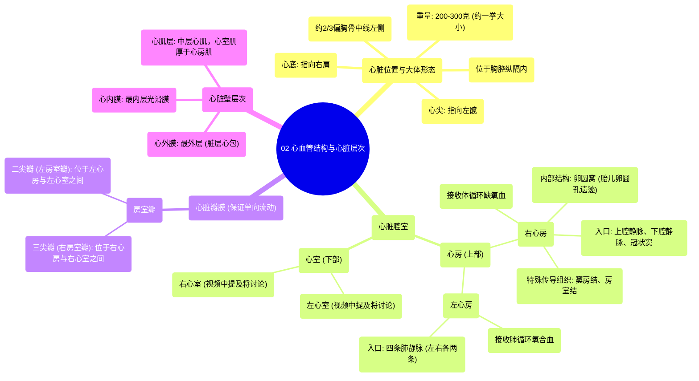

# 02 Cardiovascular Structures and Layers of the Heart

  <video controls preload="metadata" playsinline>
    <source src="https://helly.s3.bitiful.net/心血管学科/%E4%B8%93%E8%BE%91%2003%EF%BC%9A%E5%BF%83%E8%A1%80%E7%AE%A1%E7%94%9F%E7%90%86%E5%AD%A6%E6%B7%B1%E5%BA%A6%E7%B2%BE%E8%AE%B2%20%28Cardiovascular%20Physiology%29/02%20Cardiovascular%20Structures%20and%20Layers%20of%20the%20Heart.mp4" type="video/mp4">
    
您的浏览器不支持播放，请升级。

  </video>

::: tip ⚡️ 核心考点 (30s速读)
*   **核心考点**：心脏位于胸腔纵隔内，约2/3偏左。心尖指向左髋，心底指向右肩。心脏分为四个腔室：右心房、右心室、左心房、左心室。心房与心室之间由房室瓣分隔，保证血液单向流动。
*   **临床意义**：理解心脏位置是进行心脏听诊、心电图电极放置和影像学检查的基础。瓣膜结构异常（如三尖瓣关闭不全）会导致血液反流，是心脏杂音和心力衰竭的常见原因。
:::

## 🧠 深度精讲

*   **心脏的位置与大体形态**：心脏并非位于胸腔正中，而是大部分（约三分之二）位于胸骨中线左侧。其形态像一个倒置的圆锥体，心尖朝向左前下方（指向左髋），心底朝向右后上方（指向右肩）。心脏重量约为200-300克，与本人拳头大小相仿。它被包裹在纵隔内，纵隔是胸腔中部的一个区域，包含心脏、大血管、气管、食管等重要结构。
*   **心脏的腔室：心房**：心脏上部两个腔室称为心房。
    *   **右心房**：接收全身回流的缺氧血。有三条主要血管将血液汇入右心房：**上腔静脉**（收集头颈、上肢血液）、**下腔静脉**（收集腹部、盆腔、下肢血液）以及**冠状窦**（收集心脏自身静脉血）。右心房内壁有**卵圆窝**，是胎儿时期**卵圆孔**闭合后留下的痕迹。右心房还是心脏起搏点**窦房结**和**房室结**的所在地。
    *   **左心房**：接收来自肺部的富氧血。共有四条**肺静脉**（左、右各两条）将氧合血从肺部输送至左心房。
*   **心脏的瓣膜：房室瓣**：心房和心室之间的开口处有瓣膜，防止心室收缩时血液倒流回心房。
    *   **三尖瓣（右房室瓣）**：位于右心房与右心室之间，因其有三个瓣叶而得名。
    *   **二尖瓣（左房室瓣）**：位于左心房与左心室之间，有两个瓣叶。视频字幕中虽未明确提及二尖瓣，但根据解剖结构，它是左心系统的关键瓣膜。
*   **心脏的层次（视频主题延伸）**：心脏壁由内向外分为三层：
    *   **心内膜**：最内层，光滑，覆盖心脏内腔和瓣膜，减少血流阻力。
    *   **心肌层**：中层，由心肌细胞构成，是心脏收缩的动力来源。心室肌比心房肌厚得多，尤其是左心室。
    *   **心外膜**：最外层，即脏层心包，为浆膜层，光滑并分泌少量浆液。其外还有纤维性心包，共同构成心包，对心脏起固定和保护作用。

## 📚 双语术语表 (Terminology)
| 英文术语 | 中文翻译 | 定义/解释 |
| :--- | :--- | :--- |
| Mediastinum | 纵隔 | 胸腔中部的一个区域，包含心脏、大血管、气管、食管等结构。 |
| Apex of the heart | 心尖 | 心脏的左下尖端，朝向左前下方，通常在心尖搏动点可触及心跳。 |
| Base of the heart | 心底 | 心脏的右上部分，朝向右后上方，是大血管出入的部位。 |
| Atria (单数: Atrium) | 心房 | 心脏上部的两个腔室，负责接收回心血液。 |
| Right Atrium | 右心房 | 接收来自上、下腔静脉和冠状窦的缺氧血。 |
| Left Atrium | 左心房 | 接收来自肺静脉的氧合血。 |
| Inferior Vena Cava (IVC) | 下腔静脉 | 将膈肌以下身体部位的缺氧血输送回右心房的大静脉。 |
| Superior Vena Cava (SVC) | 上腔静脉 | 将头颈、上肢的缺氧血输送回右心房的大静脉。 |
| Coronary Sinus | 冠状窦 | 心脏静脉血的主要汇集处，将心肌的缺氧血引回右心房。 |
| Fossa Ovalis | 卵圆窝 | 右心房房间隔上的一个凹陷，是胎儿时期卵圆孔闭合后的遗迹。 |
| Foramen Ovale | 卵圆孔 | 胎儿时期连接左右心房的孔道，出生后通常闭合。 |
| Pulmonary Veins | 肺静脉 | 将氧合血从肺部输送至左心房的血管（通常左右肺各两条）。 |
| Tricuspid Valve | 三尖瓣 | 位于右心房和右心室之间的房室瓣，有三个瓣叶。 |
| Atrioventricular (AV) Valve | 房室瓣 | 心房与心室之间瓣膜的总称，包括三尖瓣和二尖瓣。 |
| SA Node (Sinoatrial Node) | 窦房结 | 位于右心房壁的起搏细胞团，是正常心脏节律的起源点。 |
| AV Node (Atrioventricular Node) | 房室结 | 位于房间隔下部的特殊传导组织，负责将电冲动从心房传导至心室。 |

## 🗺️ 知识图谱

