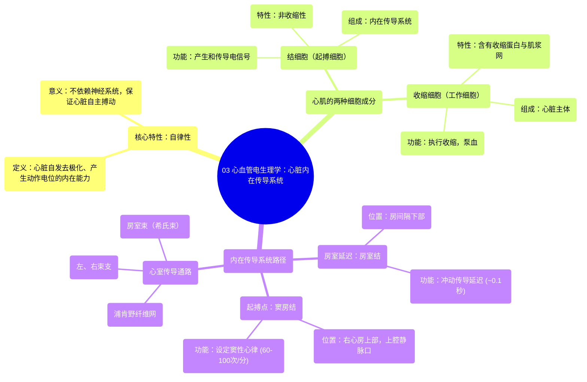

# 03 Cardiovascular Electrophysiology Intrinsic Cardiac Conduction System

  <video controls preload="metadata" playsinline>
    <source src="https://helly.s3.bitiful.net/心血管学科/%E4%B8%93%E8%BE%91%2003%EF%BC%9A%E5%BF%83%E8%A1%80%E7%AE%A1%E7%94%9F%E7%90%86%E5%AD%A6%E6%B7%B1%E5%BA%A6%E7%B2%BE%E8%AE%B2%20%28Cardiovascular%20Physiology%29/03%20Cardiovascular%20Electrophysiology%20Intrinsic%20Cardiac%20Conduction%20System.mp4" type="video/mp4">
    
您的浏览器不支持播放，请升级。

  </video>

::: tip ⚡️ 核心考点 (30s速读)
*   **核心考点**：心脏具有**自律性**，即无需神经系统指令即可自发产生节律性电活动的能力。这一特性由心脏的**内在传导系统**实现。
*   **临床意义**：理解自律性是理解正常心律（窦性心律）和各种心律失常（如心动过速、心动过缓、传导阻滞）的基础。传导系统的任何部分都可能成为异常起搏点。
:::

## 🧠 深度精讲

*   **概念1：心脏的自律性**
    自律性是心脏最核心的电生理特性之一。它指的是心脏**自身**具有的、不依赖于外部神经系统的内在能力，能够**自发地、节律性地去极化**，从而产生并传导动作电位，最终触发心肌收缩。这保证了心脏即使在离体或神经支配被切断的情况下，仍能维持基本的搏动。

*   **概念2：心肌的两种细胞成分**
    心肌组织由功能不同的两类细胞构成：
    1.  **结细胞**：也称为**起搏细胞**。它们是**非收缩性**的，核心功能是产生和传导电信号（动作电位）。它们构成了心脏的**内在传导系统**。
    2.  **收缩细胞**：即普通的心肌工作细胞。它们含有丰富的收缩蛋白（如肌动蛋白、肌球蛋白）和肌浆网，负责执行电信号指令，产生机械收缩，将血液泵出心脏。它们构成了心脏的绝大部分质量。

*   **概念3：内在传导系统的组成与路径**
    心脏的“电路系统”由一系列特化的结细胞结构组成，电冲动按特定顺序传播：
    1.  **窦房结**：位于右心房上部，上腔静脉入口处。它是心脏的**正常起搏点**，以每分钟60-100次的频率（**窦性心律**）自发产生冲动。
    2.  **房室结**：位于房间隔下部，右心房侧。主要功能是**延迟**冲动从心房传向心室（约0.1秒），确保心房收缩完毕心室再开始收缩。
    3.  **房室束**：也称**希氏束**。是连接房室结与心室肌的唯一电传导通路，穿过心脏的纤维骨架。
    4.  **左右束支**：房室束在室间隔顶部分为左、右束支，分别沿室间隔两侧下行。
    5.  **浦肯野纤维**：束支的终末分支，呈网状深入心室肌，以极快速度将电冲动同步传导至左右心室，引发协调的心室收缩。

## 📚 双语术语表 (Terminology)
| 英文术语 | 中文翻译 | 定义/解释 |
| :--- | :--- | :--- |
| Electrophysiology | 电生理学 | 研究生物细胞电活动的学科，在心脏领域特指心脏电活动的产生与传导。 |
| Automaticity | 自律性 | 心脏起搏细胞自发产生节律性动作电位的内在能力。 |
| Myocardium | 心肌 | 构成心脏壁的肌肉组织，包括起搏细胞和收缩细胞。 |
| Nodal Cells | 结细胞 / 起搏细胞 | 心脏内特化的、具有自律性和传导性的非收缩细胞。 |
| Contractile Cells | 收缩细胞 | 构成心脏主体的、含有收缩蛋白并能产生机械力的心肌工作细胞。 |
| SA Node | 窦房结 | 位于右心房，是心脏的正常起搏点，设定窦性心律。 |
| Sinus Rhythm | 窦性心律 | 由窦房结主导的正常心脏节律，频率一般为60-100次/分。 |
| AV Node | 房室结 | 位于心房与心室交界处，负责传导延迟，是房室间的唯一电连接。 |
| AV Bundle / Bundle of His | 房室束 / 希氏束 | 连接房室结与心室肌的传导纤维束。 |
| Bundle Branches | 束支 | 房室束在室间隔的分支，分为左束支和右束支。 |
| Purkinje Fibers | 浦肯野纤维 | 束支的终末细小分支，负责将电冲动快速、同步地传导至整个心室肌。 |
| Extrinsic Innervation | 外在神经支配 | 指自主神经系统（交感和副交感神经）对心脏节律和收缩力的调节。 |

## 🗺️ 知识图谱

