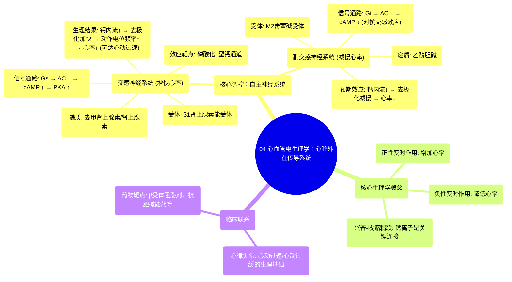

# 04 Cardiovascular Electrophysiology Extrinsic Cardiac Conduction System

  <video controls preload="metadata" playsinline>
    <source src="https://helly.s3.bitiful.net/心血管学科/%E4%B8%93%E8%BE%91%2003%EF%BC%9A%E5%BF%83%E8%A1%80%E7%AE%A1%E7%94%9F%E7%90%86%E5%AD%A6%E6%B7%B1%E5%BA%A6%E7%B2%BE%E8%AE%B2%20%28Cardiovascular%20Physiology%29/04%20Cardiovascular%20Electrophysiology%20Extrinsic%20Cardiac%20Conduction%20System.mp4" type="video/mp4">
    
您的浏览器不支持播放，请升级。

  </video>

::: tip ⚡️ 核心考点 (30s速读)
*   **核心考点**：心脏外在神经支配通过交感与副交感神经系统，分别使用去甲肾上腺素/肾上腺素和乙酰胆碱作为递质，作用于心肌细胞上的特定受体（β1和M2），通过复杂的细胞内信号转导（如cAMP、蛋白激酶A），最终调节L型钙通道的开放，从而精细控制心率和心肌收缩力。
*   **临床意义**：理解此机制是解释心动过速、心动过缓等心律失常生理基础的关键，也是β受体阻滞剂、抗胆碱能药物等心血管药物作用的靶点。
:::

## 🧠 深度精讲

本视频重点讲解了心脏如何接受自主神经系统（交感神经和副交感神经）的调控，即“外在神经支配”。这与心脏自身固有的传导系统（内在部分）共同协作，使心率能根据身体需求动态变化。

*   **核心调控目标**：调节心率。交感神经**增快**心率（正性变时作用），副交感神经（主要通过迷走神经）**减慢**心率（负性变时作用）。
*   **交感神经通路（增快心率）**：
    1.  **递质与受体**：交感神经末梢释放**去甲肾上腺素**和**肾上腺素**，作用于心肌细胞膜上的 **β1肾上腺素能受体**。
    2.  **信号转导**：受体激活后，启动 **G刺激蛋白** → 激活**腺苷酸环化酶** → 将ATP转化为**环磷酸腺苷** → 激活**蛋白激酶A**。
    3.  **最终效应**：蛋白激酶A**磷酸化**细胞膜上的**L型钙通道**，使其开放概率增加，导致更多**钙离子**内流。
    4.  **生理结果**：细胞去极化更快，动作电位产生更频繁，从而**增加心率**。当心率显著增加至>100次/分，即为**心动过速**（如运动时的窦性心动过速）。
*   **副交感神经通路（减慢心率）**：
    1.  **递质与受体**：迷走神经等副交感神经末梢释放**乙酰胆碱**，作用于心肌细胞膜上的 **M2毒蕈碱受体**。
    2.  **信号转导**：受体激活后，启动 **G抑制蛋白**。视频在此处中断，但后续机制通常是G抑制蛋白抑制腺苷酸环化酶活性，降低cAMP水平，从而对抗交感神经的作用。
    3.  **预期效应**：减少L型钙通道的磷酸化和开放，钙内流减少，细胞去极化减慢，动作电位频率降低，从而**减慢心率**。

## 📚 双语术语表 (Terminology)
| 英文术语 | 中文翻译 | 定义/解释 |
| :--- | :--- | :--- |
| Extrinsic innervation | 外在神经支配 | 来自心脏外部的神经系统（自主神经）对心脏的调控。 |
| Sympathetic nervous system | 交感神经系统 | 自主神经系统的组成部分，负责“战斗或逃跑”反应，可增快心率、增强心肌收缩力。 |
| Parasympathetic nervous system | 副交感神经系统 | 自主神经系统的组成部分，负责“休息和消化”状态，可减慢心率。 |
| Norepinephrine/Epinephrine | 去甲肾上腺素/肾上腺素 | 交感神经释放的主要神经递质，可激活β1受体。 |
| Acetylcholine | 乙酰胆碱 | 副交感神经释放的主要神经递质，可激活M2受体。 |
| Beta-1 adrenergic receptor (β1) | β1肾上腺素能受体 | 主要存在于心脏和肾脏球旁细胞，介导儿茶酚胺类递质的心脏兴奋效应。 |
| Muscarinic type 2 receptor (M2) | M2毒蕈碱受体 | 主要存在于心脏，介导乙酰胆碱的抑制性效应。 |
| G-stimulatory/inhibitory protein | G刺激/抑制蛋白 | 位于细胞膜内的信号转导蛋白，负责将受体激活信号传递给下游效应器。 |
| Adenylate cyclase | 腺苷酸环化酶 | 一种膜结合酶，被激活后可将ATP催化生成cAMP。 |
| Cyclic AMP (cAMP) | 环磷酸腺苷 | 重要的第二信使，其水平升高可激活蛋白激酶A。 |
| Protein Kinase A (PKA) | 蛋白激酶A | 一种依赖于cAMP的蛋白激酶，通过磷酸化多种靶蛋白（如离子通道）发挥作用。 |
| L-type calcium channel | L型钙通道 | 电压门控钙通道的一种，对心肌细胞动作电位的平台期和兴奋-收缩耦联至关重要。 |
| Phosphorylation | 磷酸化 | 蛋白激酶将磷酸基团共价连接到蛋白质（如离子通道）上的过程，常可改变其功能。 |
| Tachycardia | 心动过速 | 心率异常增快，通常指静息心率 > 100次/分钟。 |
| Vagus nerve | 迷走神经 | 第X对脑神经，是副交感神经系统支配心脏的主要通路。 |

## 🗺️ 知识图谱

