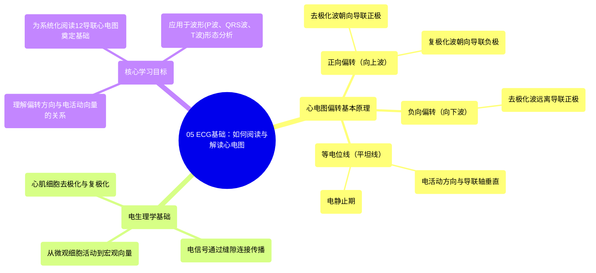

# 05 ECG Basics How to Read & Interpret ECGs Updated Lecture

  <video controls preload="metadata" playsinline>
    <source src="https://helly.s3.bitiful.net/心血管学科/%E4%B8%93%E8%BE%91%2003%EF%BC%9A%E5%BF%83%E8%A1%80%E7%AE%A1%E7%94%9F%E7%90%86%E5%AD%A6%E6%B7%B1%E5%BA%A6%E7%B2%BE%E8%AE%B2%20%28Cardiovascular%20Physiology%29/05%20ECG%20Basics%20How%20to%20Read%20%26%20Interpret%20ECGs%20Updated%20Lecture.mp4" type="video/mp4">
    
您的浏览器不支持播放，请升级。

  </video>

::: tip ⚡️ 核心考点 (30s速读)
*   **核心考点**：心电图（ECG/EKG）记录的是心脏电活动的向量（方向和大小）。电信号朝向某个导联的正极移动，产生**向上偏转**；远离正极移动，则产生**向下偏转**。这是解读所有心电图波形的基础。
*   **临床意义**：理解电活动方向与偏转的关系，是系统分析P波、QRS波群、T波形态，以及诊断心室肥厚、束支传导阻滞、心肌梗死等疾病的关键第一步。
:::

## 🧠 深度精讲

*   **心电图偏转的基本原理**：心电图机通过体表电极记录心脏整体的电活动向量。可以将其简化为一个组织模型：在一段心肌组织两端放置正负电极。
    1.  **正向偏转（向上波）**：当去极化波（正电荷移动）**朝向**记录导联的**正极**移动时，心电图机记录到一个**向上的偏转**。同理，复极化波（负电荷移动）**朝向**记录导联的**负极**移动时，也产生向上偏转。
    2.  **负向偏转（向下波）**：当去极化波（正电荷移动）**远离**记录导联的**正极**（或朝向负极）移动时，心电图机记录到一个**向下的偏转**。
    3.  **等电位线（平坦线）**：当电活动方向与导联轴垂直，或心脏处于电静止期（如静息状态）时，记录到的就是一条平坦的基线，称为等电位线。

*   **从细胞到整体**：单个心肌细胞去极化（钠/钙离子内流）后，电信号通过细胞间的**缝隙连接**迅速传播至整个心肌，形成宏观的电活动向量。心电图捕捉的正是这个整体向量的投影。

*   **系统化阅读的基石**：这一原理是后续学习12导联体系、心电轴、以及分析P波（心房除极）、QRS波（心室除极）、T波（心室复极）等各个波形形态的物理生理学基础。例如，在某个导联出现异常高大的R波（向上偏转），可能提示电活动向量异常增大并指向该导联正极。

## 📚 双语术语表 (Terminology)
| 英文术语 | 中文翻译 | 定义/解释 |
| :--- | :--- | :--- |
| EKG / ECG | 心电图 | 记录心脏电活动的图形。EKG源于德文Elektrokardiogramm。 |
| Depolarization | 去极化 | 心肌细胞受刺激后，膜电位由负变正的过程，对应心脏的收缩激动。 |
| Repolarization | 复极化 | 心肌细胞恢复静息膜电位的过程，对应心脏的舒张恢复。 |
| Deflection | 偏转 | 心电图上的波形起伏，分为向上（正向）和向下（负向）偏转。 |
| Positive Electrode | 正极（探查电极） | 心电图导联中设定为正向的电极，电活动朝向它则记录到向上波。 |
| Negative Electrode | 负极（参考电极） | 导联中设定为负向的电极。 |
| Isoelectric Line | 等电位线 | 心电图上平坦的基线，表示无净电活动指向该导联。 |
| Gap Junctions | 缝隙连接 | 心肌细胞间的特殊连接结构，允许离子快速通过，实现电信号传导。 |
| Lead | 导联 | 通过特定电极组合，从不同角度记录心脏电活动的“视角”。 |
| 12-lead EKG | 12导联心电图 | 标准心电图检查，包含6个肢体导联和6个胸导联，提供心脏电活动的立体视图。 |

## 🗺️ 知识图谱

