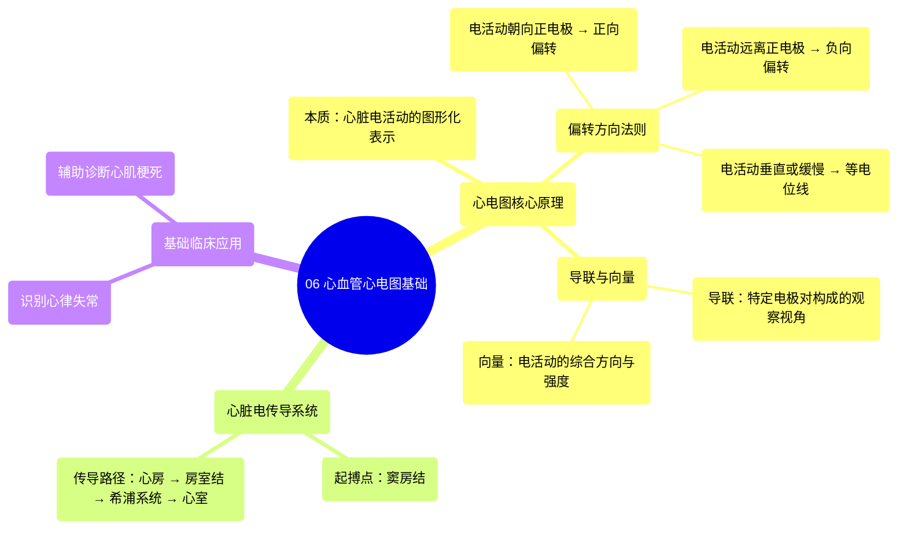

# 06 Cardiovascular ECG Basics

  <video controls preload="metadata" playsinline>
    <source src="https://helly.s3.bitiful.net/心血管学科/%E4%B8%93%E8%BE%91%2003%EF%BC%9A%E5%BF%83%E8%A1%80%E7%AE%A1%E7%94%9F%E7%90%86%E5%AD%A6%E6%B7%B1%E5%BA%A6%E7%B2%BE%E8%AE%B2%20%28Cardiovascular%20Physiology%29/06%20Cardiovascular%20ECG%20Basics.mp4" type="video/mp4">
    
您的浏览器不支持播放，请升级。

  </video>

::: tip ⚡️ 核心考点 (30s速读)
*   **核心考点**：心电图是心脏电活动的图形化表示。电极记录电信号的方向决定了波形的偏转方向：电活动朝向正电极产生正向偏转，远离正电极则产生负向偏转。
*   **临床意义**：掌握此原理是解读心电图、识别心律失常和心肌梗死等心脏疾病的基础。导联II是观察心脏整体电活动序列的经典视角。
:::

## 🧠 深度精讲

*   **心电图本质**：心电图并非直接记录心脏的机械收缩，而是记录其**电活动**的传播过程。这种电活动通过放置在体表的电极捕捉，并以波形图的形式呈现出来。
*   **偏转方向原理**：这是理解心电图波形的基石。关键在于电信号传播方向与**正电极**的关系。
    *   **正向偏转**：当心肌细胞的去极化波（电活动）传播方向**朝向**记录导联的**正电极**时，该导联记录到一个向上的波形（如P波、R波）。
    *   **负向偏转**：当去极化波传播方向**远离**正电极时，记录到一个向下的波形（如Q波、S波）。
    *   **等电位线**：可能出现于电活动传播非常缓慢、或电活动方向恰好与导联轴**垂直**时，表现为一条平坦的线。
*   **导联与向量**：每个心电图导联（如视频中强调的导联II）都有一条从负极指向正极的假想轴线。心脏的电活动可以看作一个综合的**电向量**。这个向量在导联轴上的投影，就决定了该导联上波形的形态和方向。
*   **心脏电传导序列（以导联II为例）**：
    1.  **起点**：电冲动起源于**窦房结**（位于右心房上部）。
    2.  **心房激动**：电波通过心房肌向**房室结**方向传播。这个传播方向的平均向量是指向房室结的。在导联II（正极在心脏心尖，负极在心脏基底部）上，此向量大致朝向正极，因此记录到**正向的P波**。
    3.  **后续过程**（视频后续内容会涉及）：电冲动经房室结、希氏束、束支向下传导至心室，引起心室肌的去极化（产生QRS波群）和复极化（产生T波）。

## 📚 双语术语表 (Terminology)

| 英文术语 | 中文翻译 | 定义/解释 |
| :--- | :--- | :--- |
| EKG / ECG | 心电图 | 心脏电活动的图形化记录，是重要的临床诊断工具。 |
| Arrhythmia | 心律失常 | 心脏电冲动的形成、传导异常导致的心跳节律或速率不规则。 |
| Myocardial Infarction (MI) | 心肌梗死 | 部分心肌因血液供应中断而坏死的疾病，心电图有特征性改变。 |
| Cardiac Conduction System | 心脏传导系统 | 心脏内产生并传导电冲动的特殊心肌组织，包括窦房结、房室结等。 |
| Action Potential | 动作电位 | 心肌细胞膜电位快速、短暂的变化过程，是电活动的基础。 |
| Electrode | 电极 | 放置于体表用以探测心脏电信号的传感器。 |
| Lead | 导联 | 由两个电极（一正一负）构成的特定记录电路，提供观察心脏电活动的不同视角。 |
| Positive Deflection | 正向偏转 | 在心电图波形中向上的偏移，通常表示电活动朝向该导联的正电极。 |
| Negative Deflection | 负向偏转 | 在心电图波形中向下的偏移，通常表示电活动远离该导联的正电极。 |
| Vector | 向量 | 一个有大小和方向的量，用于表示心脏电活动的整体方向和强度。 |
| SA Node (Sinoatrial Node) | 窦房结 | 位于右心房上部，是正常心脏电冲动的起源点，即“天然起搏器”。 |
| AV Node (Atrioventricular Node) | 房室结 | 位于心房与心室交界处，负责将心房来的电冲动延迟后下传至心室。 |
| Depolarization | 去极化 | 心肌细胞由静息状态转为兴奋状态的过程，对应心电图的P波（心房）和QRS波（心室）。 |

## 🗺️ 知识图谱

