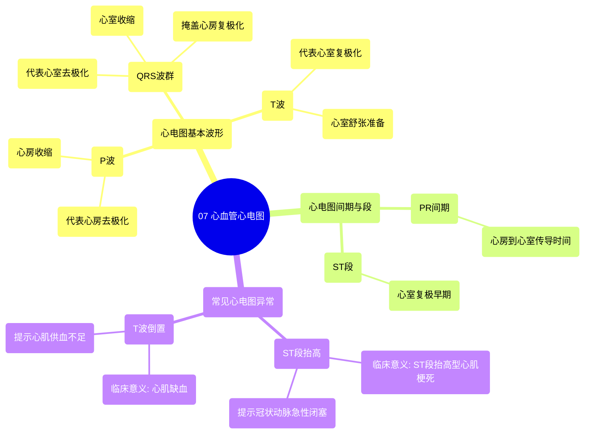

# 07 Cardiovascular ECG's

  <video controls preload="metadata" playsinline>
    <source src="https://helly.s3.bitiful.net/心血管学科/%E4%B8%93%E8%BE%91%2003%EF%BC%9A%E5%BF%83%E8%A1%80%E7%AE%A1%E7%94%9F%E7%90%86%E5%AD%A6%E6%B7%B1%E5%BA%A6%E7%B2%BE%E8%AE%B2%20%28Cardiovascular%20Physiology%29/07%20Cardiovascular%20ECG%27s.mp4" type="video/mp4">
    
您的浏览器不支持播放，请升级。

  </video>

::: tip ⚡️ 核心考点 (30s速读)
*   **核心考点**：掌握心电图三个基本波形（P波、QRS波群、T波）的生理意义，以及ST段抬高和T波倒置的临床意义。
*   **临床意义**：P波代表心房去极化，QRS波群代表心室去极化（并掩盖心房复极化），T波代表心室复极化。ST段抬高提示心肌梗死（STEMI），T波倒置提示心肌缺血。
:::

## 🧠 深度精讲
*   **心电图基本波形**：标准心电图由三个可区分的波形组成。第一个是“P波”，代表心房去极化，即心房肌细胞兴奋并开始收缩。第二个是“QRS波群”，代表心室去极化，即心室肌细胞兴奋并开始收缩。值得注意的是，心房复极化（心房肌细胞恢复静息状态）的电信号被掩盖在QRS波群中，因此无法单独观察到。第三个是“T波”，代表心室复极化，即心室肌细胞恢复静息状态，为下一次兴奋做准备。
*   **心电图间期与段**：“PR间期”指从P波起点到QRS波群起点的时程，主要反映电信号从心房经房室结传导至心室的时间。“ST段”指QRS波群终点到T波起点之间的线段，正常情况下应与基线（等电位线）持平。
*   **常见心电图异常**：
    *   **ST段抬高**：指ST段异常地高于基线。这是“ST段抬高型心肌梗死”（STEMI）的典型心电图表现，高度提示冠状动脉急性完全闭塞导致的心肌坏死，即通常所说的“心脏病发作”。
    *   **T波倒置**：指T波方向与正常相反，呈现负向偏转。这通常是“心肌缺血”的表现，意味着心肌组织供血/供氧不足，但尚未发生坏死。它是心绞痛、非ST段抬高型心肌梗死等疾病的重要线索。

## 📚 双语术语表 (Terminology)
| 英文术语 | 中文翻译 | 定义/解释 |
| :--- | :--- | :--- |
| EKG / ECG | 心电图 | 记录心脏电活动的图形。 |
| P wave | P波 | 心电图上的第一个正向波，代表心房去极化。 |
| QRS complex | QRS波群 | 紧随P波后的一个大的复合波，代表心室去极化，并掩盖了心房复极化。 |
| T wave | T波 | QRS波群后的一个正向波，代表心室复极化。 |
| Depolarization | 去极化 | 心肌细胞内部电位变正，产生动作电位并引发收缩的过程。 |
| Repolarization | 复极化 | 心肌细胞恢复内部负电位，为下一次兴奋做准备的过程。 |
| ST segment | ST段 | 心电图QRS波群终点至T波起点之间的线段。 |
| PR interval | PR间期 | 心电图P波起点至QRS波群起点之间的时程。 |
| ST segment elevation | ST段抬高 | ST段异常高于基线，是急性心肌梗死（STEMI）的特征性表现。 |
| STEMI | ST段抬高型心肌梗死 | 一种由冠状动脉完全闭塞引起的严重心脏病发作。 |
| T wave inversion | T波倒置 | T波方向与正常相反，常提示心肌缺血。 |
| Ischemia | 缺血 | 组织血液供应不足，导致缺氧的状态。 |
| Myocardial infarction | 心肌梗死 | 由于冠状动脉阻塞导致部分心肌坏死的疾病，俗称“心脏病发作”。 |

## 🗺️ 知识图谱

