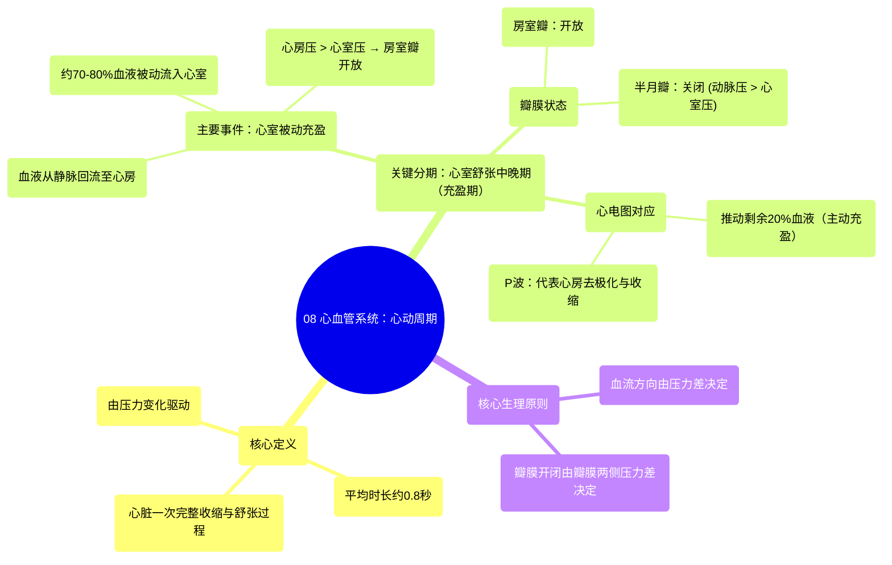

# 08 Cardiovascular Cardiac Cycle

  <video controls preload="metadata" playsinline>
    <source src="https://helly.s3.bitiful.net/心血管学科/%E4%B8%93%E8%BE%91%2003%EF%BC%9A%E5%BF%83%E8%A1%80%E7%AE%A1%E7%94%9F%E7%90%86%E5%AD%A6%E6%B7%B1%E5%BA%A6%E7%B2%BE%E8%AE%B2%20%28Cardiovascular%20Physiology%29/08%20Cardiovascular%20Cardiac%20Cycle.mp4" type="video/mp4">
    
您的浏览器不支持播放，请升级。

  </video>

::: tip ⚡️ 核心考点 (30s速读)
*   **核心考点**：心动周期是心脏一次收缩和舒张的完整过程，平均耗时约0.8秒。其核心在于**心腔内压力的变化**，这直接决定了瓣膜的开关和血液的流向。
*   **临床意义**：理解心动周期是分析心音、心电图（EKG/ECG）异常以及诊断瓣膜疾病（如狭窄、关闭不全）的生理学基础。例如，心音的产生就与瓣膜的关闭直接相关。
:::

## 🧠 深度精讲

*   **概念1：心动周期的定义与分期**
    心动周期是指心脏完成一次泵血活动所经历的所有机械和电学事件序列。它始于一次心跳的开始，结束于下一次心跳的开始。一个周期平均持续约0.8秒（对应心率约75次/分）。视频中首先重点讲解了**心室舒张中晚期**这个阶段。

*   **概念2：心室舒张中晚期（心室充盈期）**
    这是心动周期的起始阶段，核心是**心室被动充盈**。
    1.  **事件过程**：血液从体循环静脉（上、下腔静脉、冠状窦）和肺静脉回流至心房。随着心房内血液积聚，**心房压略高于心室压**，导致**房室瓣（三尖瓣、二尖瓣）开放**。约70%-80%的血液在重力作用下，无需心房收缩，**被动流入**心室。
    2.  **瓣膜状态**：
        *   **房室瓣开放**：因为心房压 > 心室压。
        *   **半月瓣关闭**：因为主动脉/肺动脉压 > 心室压。心室压力尚不足以推开半月瓣射血。
    3.  **心电图对应**：在此阶段末期，窦房结（SA node）兴奋，引发**心房去极化**，在心电图上表现为 **P波**。心房随之收缩，将剩余约20%的血液主动挤入心室，完成心室充盈。

*   **概念3：压力变化是驱动关键**
    整个心动周期由**压力差**驱动。血液总是从高压区流向低压区。瓣膜作为单向阀门，其开闭完全由瓣膜两侧的压力差决定：
    *   房室瓣开：心房压 > 心室压。
    *   房室瓣关：心室压 > 心房压。
    *   半月瓣开：心室压 > 动脉（主动脉/肺动脉）压。
    *   半月瓣关：动脉压 > 心室压。

## 📚 双语术语表 (Terminology)
| 英文术语 | 中文翻译 | 定义/解释 |
| :--- | :--- | :--- |
| Cardiac Cycle | 心动周期 | 心脏一次收缩和舒张的完整机械与电活动过程。 |
| Diastole | 舒张期 | 心脏（特指心室）肌肉松弛、心腔扩大容纳血液的时期。 |
| Systole | 收缩期 | 心脏（特指心室）肌肉收缩、泵出血液的时期。 |
| Atrioventricular (AV) Valves | 房室瓣 | 位于心房与心室之间的瓣膜，包括右心的三尖瓣和左心的二尖瓣（僧帽瓣）。 |
| Semilunar (SL) Valves | 半月瓣 | 位于心室与动脉之间的瓣膜，包括肺动脉瓣和主动脉瓣。 |
| SA Node (Sinoatrial Node) | 窦房结 | 位于右心房的正常心脏起搏点，其自发去极化启动心跳。 |
| P Wave | P波 | 心电图上代表心房去极化（收缩）的波形。 |
| Ventricular Filling | 心室充盈 | 血液流入心室的过程，包括被动充盈（主要）和主动充盈（心房收缩期）。 |

## 🗺️ 知识图谱

