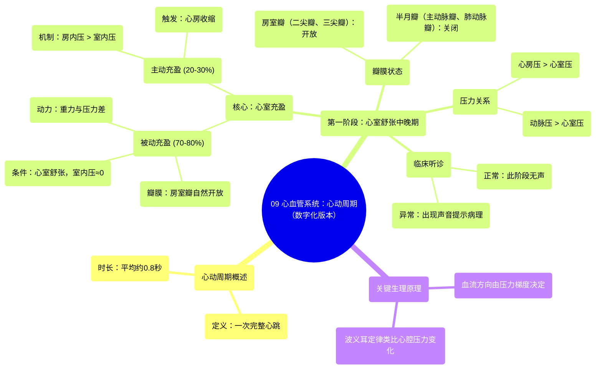

# 09 Cardiovascular Cardiac Cycle Digital Version

  <video controls preload="metadata" playsinline>
    <source src="https://helly.s3.bitiful.net/心血管学科/%E4%B8%93%E8%BE%91%2003%EF%BC%9A%E5%BF%83%E8%A1%80%E7%AE%A1%E7%94%9F%E7%90%86%E5%AD%A6%E6%B7%B1%E5%BA%A6%E7%B2%BE%E8%AE%B2%20%28Cardiovascular%20Physiology%29/09%20Cardiovascular%20Cardiac%20Cycle%20Digital%20Version.mp4" type="video/mp4">
    
您的浏览器不支持播放，请升级。

  </video>

::: tip ⚡️ 核心考点 (30s速读)
*   **核心考点**：心动周期是心脏一次收缩和舒张的全过程，平均约0.8秒。其第一阶段（心室舒张中晚期）的核心是**心室的被动充盈**（占70-80%）和**心房的主动收缩**（占20-30%）。
*   **临床意义**：理解瓣膜的开关时机（房室瓣开、半月瓣关）及压力变化，是诊断心脏杂音（如二尖瓣狭窄、主动脉瓣关闭不全）的基础。此阶段正常应无声音，出现声音即为病理表现。
:::

## 🧠 深度精讲

*   **概念1：心动周期概述**
    心动周期指心脏完成一次泵血活动所经历的机械过程，包括收缩期（心室射血）和舒张期（心室充盈）。视频强调其平均时长为**0.8秒**，体现了心脏高效的工作效率。

*   **概念2：第一阶段 - 心室舒张中晚期**
    这是心动周期的起始阶段，核心是**心室充盈**。
    1.  **被动充盈（占70-80%）**：
        *   **前提**：心室肌舒张，室内压接近零。乳头肌松弛，腱索放松，导致**房室瓣（二尖瓣、三尖瓣）处于自然开放状态**。
        *   **过程**：来自体循环（经上、下腔静脉、冠状窦）和肺循环（经肺静脉）的血液回流至心房后，在重力及压力差作用下，**被动地**流经开放的房室瓣进入心室。此过程**心房并未收缩**。
    2.  **主动充盈（占20-30%）**：
        *   **触发**：心房肌去极化后收缩，房内压升高。
        *   **过程**：心房收缩进一步挤压血液，克服心室舒张末期的微小压力，使房室瓣开得更大，将剩余约20-30%的血液“主动”泵入心室。此即 **“心房收缩期”**。
    3.  **瓣膜状态与压力关系**：
        *   **房室瓣（二尖瓣、三尖瓣）**：开放。因为此时**心房压 > 心室压**。
        *   **半月瓣（主动脉瓣、肺动脉瓣）**：关闭。因为此时**动脉压（主动脉约80 mmHg，肺动脉约7-10 mmHg） > 心室压（约0 mmHg）**。血液无法逆流回心室。
    4.  **听诊意义**：此阶段房室瓣开放和半月瓣关闭均为**无声**的。若在此阶段听到异常声音，提示可能存在瓣膜病变。

*   **概念3：相关物理与生理原理**
    *   **波义耳定律**：用于解释心腔压力与容积的关系。心房收缩时容积减小，导致内部压力（房内压）增大，从而推动血液流动。
    *   **压力梯度决定血流方向**：血液总是从高压区流向低压区，这是瓣膜开闭和血流方向的根本驱动力。

## 📚 双语术语表 (Terminology)
| 英文术语 | 中文翻译 | 定义/解释 |
| :--- | :--- | :--- |
| Cardiac Cycle | 心动周期 | 心脏一次完整的收缩和舒张活动。 |
| Ventricular Diastole | 心室舒张期 | 心室肌肉松弛、心室腔扩大并充盈血液的时期。 |
| Atrial Systole | 心房收缩期 | 心房肌肉收缩，将血液进一步挤入心室的时期。 |
| Mitral (Bicuspid) Valve | 二尖瓣（僧帽瓣） | 位于左心房和左心室之间的房室瓣，有两个瓣叶。 |
| Tricuspid Valve | 三尖瓣 | 位于右心房和右心室之间的房室瓣，有三个瓣叶。 |
| Aortic Semilunar Valve | 主动脉半月瓣 | 位于左心室和主动脉之间的出口瓣膜。 |
| Pulmonary Semilunar Valve | 肺动脉半月瓣 | 位于右心室和肺动脉干之间的出口瓣膜。 |
| Papillary Muscles | 乳头肌 | 心室壁上的锥形肌肉突起，通过腱索连接并牵拉房室瓣，防止其翻入心房。 |
| Chordae Tendineae | 腱索 | 连接乳头肌和房室瓣瓣叶的纤维索，防止瓣膜反翻。 |
| Superior/Inferior Vena Cava | 上/下腔静脉 | 将身体上部/下部的缺氧血输送回右心房的大静脉。 |
| Pulmonary Veins | 肺静脉 | 将富氧血从肺部输送回左心房的静脉。 |
| Coronary Sinus | 冠状窦 | 心脏静脉血汇集的主要管道，开口于右心房。 |
| Boyle‘s Law | 波义耳定律 | 在恒温下，气体的压力与体积成反比。此处类比解释心腔压力与容积的关系。 |

## 🗺️ 知识图谱

