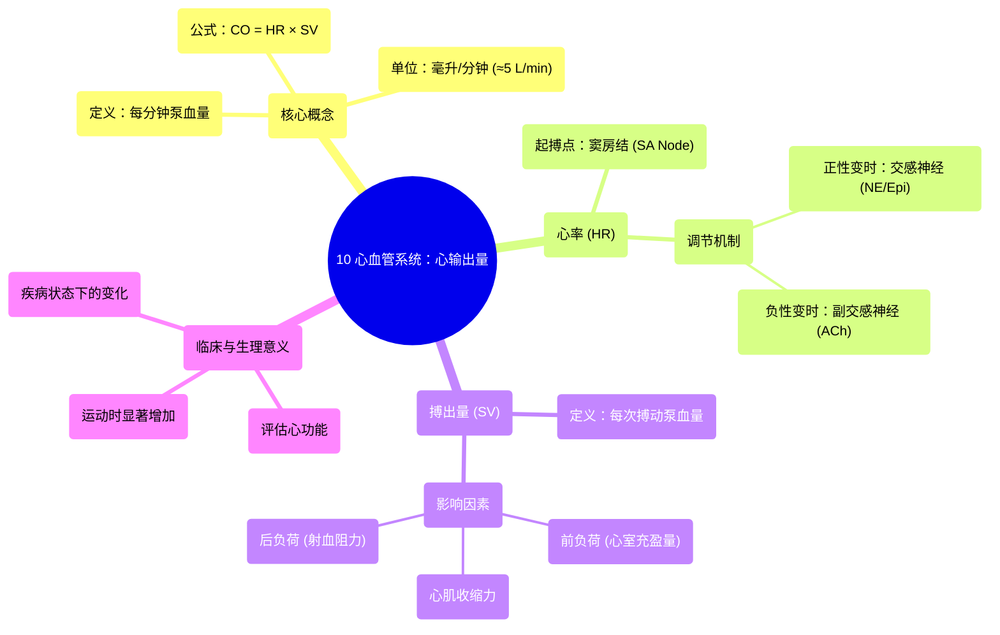

# 10 Cardiovascular Cardiac Output

  <video controls preload="metadata" playsinline>
    <source src="https://helly.s3.bitiful.net/心血管学科/%E4%B8%93%E8%BE%91%2003%EF%BC%9A%E5%BF%83%E8%A1%80%E7%AE%A1%E7%94%9F%E7%90%86%E5%AD%A6%E6%B7%B1%E5%BA%A6%E7%B2%BE%E8%AE%B2%20%28Cardiovascular%20Physiology%29/10%20Cardiovascular%20Cardiac%20Output.mp4" type="video/mp4">
    
您的浏览器不支持播放，请升级。

  </video>

::: tip ⚡️ 核心考点 (30s速读)
*   **核心考点**：心输出量 (CO) = 心率 (HR) × 搏出量 (SV)。它是衡量心脏每分钟泵血总量的核心指标，正常值约5升/分钟。
*   **临床意义**：理解CO是评估心脏泵血功能、诊断心力衰竭、休克及指导治疗（如使用正性肌力药、调整心率）的基础。其变化直接影响全身器官的血液灌注。
:::

## 🧠 深度精讲

*   **心输出量的定义与计算**：
    心输出量是指心脏每分钟泵入体循环或肺循环的血液总量。其计算公式为：**心输出量 (CO) = 心率 (HR) × 搏出量 (SV)**。心率单位是“次/分钟”，搏出量单位是“毫升/次”。两者相乘后，单位简化为“毫升/分钟”，直观反映了心脏每分钟的工作量。

*   **正常值与生理意义**：
    以一个健康成年人为例，静息时平均心率约为70次/分钟，平均搏出量约为70毫升/次。因此，静息心输出量约为 **70 × 70 = 4900毫升/分钟**，通常简化为 **约5升/分钟**。这个数值是维持基础代谢和器官功能所必需的。在运动、应激等状态下，通过增加心率和/或搏出量，心输出量可显著增加（如增至25升/分钟以上），以满足组织增加的氧耗和代谢需求。

*   **心率的调控**：
    心率主要由**窦房结**的内在节律（约60-100次/分钟）决定，但受自主神经系统精细调节。
    *   **正性变时作用**：**交感神经系统**兴奋时，释放去甲肾上腺素和肾上腺素，作用于心脏的β1肾上腺素能受体，使心率**加快**。这类物质称为**正性变时剂**。
    *   **负性变时作用**：**副交感神经系统**（迷走神经）兴奋时，释放乙酰胆碱，作用于M2受体，使心率**减慢**。这类物质称为**负性变时剂**。

*   **搏出量的调控（视频片段提示）**：
    视频片段末尾提到了通过乙酰胆碱降低心率，这引出了对搏出量的讨论。搏出量受三个主要因素影响（视频后续应会展开）：
    1.  **前负荷**：心室舒张末期容积（回心血量）。在一定范围内，前负荷增加（如静脉回流量增加），心肌初长度增加，收缩力增强，搏出量增加（Frank-Starling定律）。
    2.  **后负荷**：心室射血时遇到的阻力（主要是主动脉压）。后负荷增加（如高血压），会减少搏出量。
    3.  **心肌收缩力**：心肌细胞本身收缩的强度和速度。交感神经兴奋、正性肌力药物（如洋地黄）可增强收缩力，增加搏出量。

## 📚 双语术语表 (Terminology)
| 英文术语 | 中文翻译 | 定义/解释 |
| :--- | :--- | :--- |
| Cardiac Output (CO) | 心输出量 | 每分钟由一侧心室泵出的血液总量。CO = HR × SV。 |
| Heart Rate (HR) | 心率 | 心脏每分钟搏动的次数，单位：次/分钟。 |
| Stroke Volume (SV) | 搏出量 | 一次心搏中，一侧心室射出的血液量，单位：毫升/次。 |
| Sinus Rhythm | 窦性心律 | 由窦房结正常起搏形成的心脏节律，心率通常在60-100次/分钟。 |
| SA Node | 窦房结 | 位于右心房上部，是心脏正常的起搏点，产生并传导兴奋。 |
| Sympathetic Nervous System | 交感神经系统 | 自主神经系统的一部分，兴奋时释放去甲肾上腺素等，使心率加快、心肌收缩力增强。 |
| Parasympathetic Nervous System | 副交感神经系统 | 自主神经系统的一部分（主要为迷走神经），兴奋时释放乙酰胆碱，使心率减慢。 |
| Chronotropic Agent | 变时剂 | 能影响心率的物质。正性变时剂加快心率，负性变时剂减慢心率。 |
| Positive Chronotropic Effect | 正性变时作用 | 使心率加快的效应。 |
| Negative Chronotropic Effect | 负性变时作用 | 使心率减慢的效应。 |
| Norepinephrine / Epinephrine | 去甲肾上腺素 / 肾上腺素 | 交感神经系统释放的神经递质/激素，可激活β1受体，产生正性变时和正性肌力作用。 |
| Acetylcholine (ACh) | 乙酰胆碱 | 副交感神经系统（迷走神经）释放的神经递质，可激活M2受体，产生负性变时作用。 |

## 🗺️ 知识图谱

