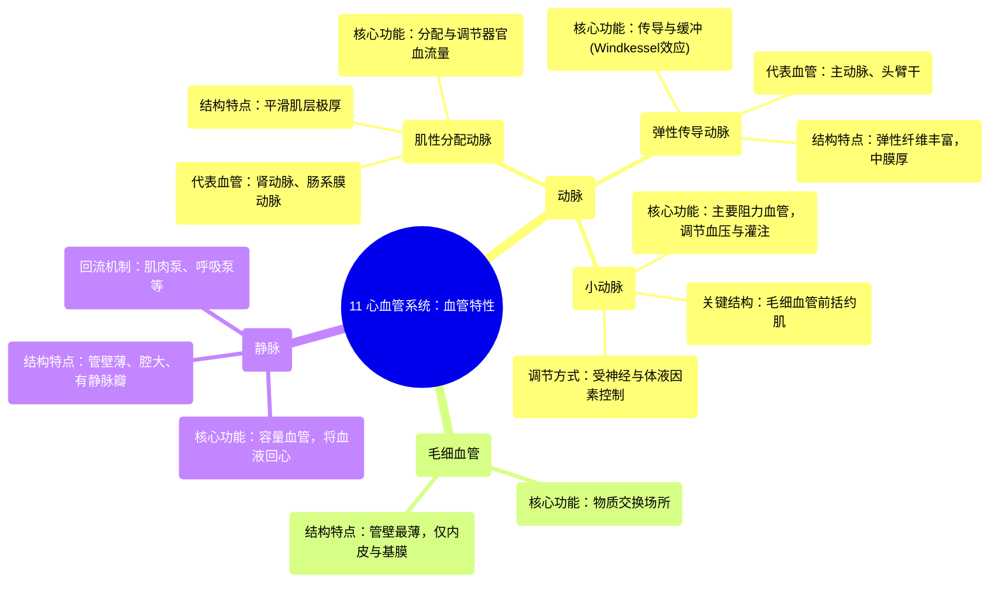

# 11 Cardiovascular Blood Vessel Characteristics

  <video controls preload="metadata" playsinline>
    <source src="https://helly.s3.bitiful.net/心血管学科/%E4%B8%93%E8%BE%91%2003%EF%BC%9A%E5%BF%83%E8%A1%80%E7%AE%A1%E7%94%9F%E7%90%86%E5%AD%A6%E6%B7%B1%E5%BA%A6%E7%B2%BE%E8%AE%B2%20%28Cardiovascular%20Physiology%29/11%20Cardiovascular%20Blood%20Vessel%20Characteristics.mp4" type="video/mp4">
    
您的浏览器不支持播放，请升级。

  </video>

::: tip ⚡️ 核心考点 (30s速读)
*   **核心考点**：血管系统根据其结构、功能和直径分为不同类型，包括弹性动脉、肌性动脉、小动脉、毛细血管和静脉。其中，**小动脉是主要的阻力血管**，通过平滑肌收缩调节血流和血压；**弹性动脉**（如主动脉）通过扩张和回弹维持连续血流。
*   **临床意义**：理解血管特性是理解高血压、动脉粥样硬化等心血管疾病病理生理的基础。例如，小动脉阻力增加是原发性高血压的关键机制；弹性动脉功能减退则影响血压缓冲能力。
:::

## 🧠 深度精讲

*   **弹性传导动脉**
    *   **结构与功能**：这是最大、最靠近心脏的动脉（如主动脉、头臂干）。其管壁富含弹性纤维，**中膜**极厚。主要功能是**传导**从心脏泵出的血液，并利用其弹性特性：在心脏收缩（射血）时被动扩张以容纳血液，在心脏舒张时弹性回缩，将储存的势能转化为动能，从而**维持舒张期血压和血流的连续性**，即“Windkessel效应”。
    *   **特点**：直径大（约1-1.5厘米），承受压力最高。

*   **肌性分配动脉**
    *   **结构与功能**：为弹性动脉的分支（如肾动脉、肠系膜动脉）。其**中膜**由大量**平滑肌**构成，非常厚。主要功能是将血液**分配**到特定的器官或组织区域。通过平滑肌的收缩与舒张，可以主动调节血管直径，从而控制分配到各器官的血流量。
    *   **特点**：直径中等（约6毫米），是调节器官灌注的主要部位。

*   **小动脉**
    *   **结构与功能**：是动脉系统的终末分支，直径很小（约35微米）。其管壁有完整的平滑肌层。它们是**全身血管阻力的最主要来源**，因此被称为**阻力血管**。小动脉平滑肌的紧张度由神经（交感神经）和体液因素精细调节，其收缩与舒张直接决定外周阻力的大小，进而对**动脉血压**进行微调，并控制进入毛细血管床的血流量。
    *   **毛细血管前括约肌**：位于小动脉末端与真毛细血管起始部，是环绕毛细血管入口的平滑肌环。它的舒缩控制着相应毛细血管的开放与关闭，从而调节组织局部的血流分布。

*   **毛细血管**
    *   **结构与功能**：是血管系统中最细（直径约8-10微米）、管壁最薄（仅由单层内皮细胞和基膜构成）的部分，是血液与组织液进行**物质交换**（如氧气、营养物质、代谢废物）的唯一场所。其巨大的总横截面积使得血流速度在此处最慢，有利于充分交换。

*   **静脉**
    *   **结构与功能**：负责将血液从组织引回心脏。与同级动脉相比，静脉管壁薄、弹性小、管腔大、可扩张性强。由于其容量大且易扩张，静脉系统容纳了循环血量的60-70%，因此被称为**容量血管**。静脉血压低，回流依赖于静脉瓣（防止血液倒流）、骨骼肌泵和呼吸泵等机制。视频中提到，静脉将是后续详细讨论的重点。

## 📚 双语术语表 (Terminology)
| 英文术语 | 中文翻译 | 定义/解释 |
| :--- | :--- | :--- |
| Elastic Conducting Arteries | 弹性传导动脉 | 靠近心脏的大动脉，管壁弹性纤维丰富，主要功能是传导血流并缓冲血压波动。 |
| Muscular Distributing Arteries | 肌性分配动脉 | 中膜富含平滑肌的中等动脉，负责将血液分配到各器官，并能调节血流量。 |
| Arterioles | 小动脉 | 微小的动脉分支，是外周阻力的主要来源，通过平滑肌舒缩精细调节血压和毛细血管灌注。 |
| Capillaries | 毛细血管 | 连接小动脉和小静脉的微细血管，管壁极薄，是物质交换的主要场所。 |
| Pre-capillary Sphincters | 毛细血管前括约肌 | 环绕真毛细血管起始部的平滑肌环，控制毛细血管的开放与关闭，调节局部血流。 |
| Tunica Media | 中膜 | 血管壁的中层，由弹性纤维、平滑肌和胶原纤维构成，是血管舒缩活动的关键结构。 |
| Resistance Vessels | 阻力血管 | 主要指小动脉，其收缩和舒张是改变外周阻力和调节血压的主要因素。 |
| Capacitance Vessels | 容量血管 | 主要指静脉，因其管壁薄、容量大、可扩张性强，能储存大量血液。 |

## 🗺️ 知识图谱

