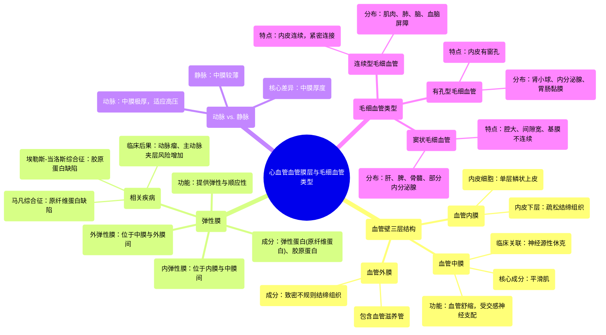

# 12 Cardiovascular Tunic Layers & Types of Capillaries

  <video controls preload="metadata" playsinline>
    <source src="https://helly.s3.bitiful.net/心血管学科/%E4%B8%93%E8%BE%91%2003%EF%BC%9A%E5%BF%83%E8%A1%80%E7%AE%A1%E7%94%9F%E7%90%86%E5%AD%A6%E6%B7%B1%E5%BA%A6%E7%B2%BE%E8%AE%B2%20%28Cardiovascular%20Physiology%29/12%20Cardiovascular%20Tunic%20Layers%20%26%20Types%20of%20Capillaries.mp4" type="video/mp4">
    
您的浏览器不支持播放，请升级。

  </video>

::: tip ⚡️ 核心考点 (30s速读)
*   **核心考点**：血管壁由三层膜（血管内膜、中膜、外膜）构成，其厚度与成分因血管类型（动脉/静脉）而异。毛细血管是物质交换的关键场所，分为连续型、有孔型和窦状毛细血管三种。
*   **临床意义**：血管壁结构异常（如马凡综合征、埃勒斯-当洛斯综合征）可导致内弹性膜薄弱，增加主动脉夹层和动脉瘤风险。中膜受交感神经支配，其功能障碍可导致血管舒缩异常（如神经源性休克）。
:::

## 🧠 深度精讲

*   **血管壁的三层结构**：所有血管（动脉、静脉）的基本结构都包含三层膜状结构，称为“血管膜”。从管腔内侧向外侧依次为：
    1.  **血管内膜**：最内层。由单层鳞状上皮细胞（内皮细胞）及其下方的内皮下层（疏松结缔组织）构成。内皮细胞直接接触血液，功能至关重要。
    2.  **血管中膜**：中间层。主要由平滑肌细胞构成，受交感神经系统支配，通过收缩（血管收缩）或舒张（血管舒张）来调节血管直径和血压。此层在动脉中最厚。
    3.  **血管外膜**：最外层。由致密不规则结缔组织构成，起固定和保护作用。其内含有为血管壁自身供血的小血管，称为“血管滋养管”。

*   **弹性膜**：在中膜的内、外侧各有一层波浪状的弹性膜，分别称为**内弹性膜**和**外弹性膜**。它们主要由弹性蛋白（如原纤维蛋白）和胶原蛋白构成，赋予血管弹性，使其能够扩张（顺应性）并在压力降低后回弹。这两种成分的遗传性缺陷（如马凡综合征、埃勒斯-当洛斯综合征）会削弱血管壁，是动脉瘤和夹层的重要风险因素。

*   **动脉与静脉的结构差异**：视频中对比了动脉和静脉。核心差异在于**中膜的厚度**。动脉承受更高的血压，因此其中膜（平滑肌层）非常厚，以提供强大的收缩力和弹性。静脉血压较低，其中膜相对较薄。

*   **毛细血管的类型**：毛细血管是连接微动脉和微静脉的极细血管，是血液与组织液进行物质交换的主要场所。根据内皮细胞的结构，分为三类：
    1.  **连续型毛细血管**：内皮细胞连续完整，细胞间有紧密连接。是大多数组织（如肌肉、肺、脑）中最常见的类型，物质交换主要通过胞吞胞吐或穿越细胞。
    2.  **有孔型毛细血管**：内皮细胞上有许多小孔（窗孔），通常有隔膜覆盖。允许小分子物质快速通过。见于需要快速滤过或分泌的部位，如肾小球、内分泌腺。
    3.  **窦状毛细血管**：管腔大而不规则，内皮细胞间隙宽，基膜不连续甚至缺失。允许大分子物质（如蛋白质）甚至血细胞通过。见于肝、脾、骨髓等。

## 📚 双语术语表 (Terminology)
| 英文术语 | 中文翻译 | 定义/解释 |
| :--- | :--- | :--- |
| Tunica Intima/Interna | 血管内膜 | 血管壁最内层，由内皮细胞和内皮下层构成。 |
| Endothelial cells | 内皮细胞 | 衬于血管内壁的单层鳞状上皮细胞。 |
| Sub-endothelial layer | 内皮下层 | 血管内膜中位于内皮细胞下方的疏松结缔组织层。 |
| Internal Elastic Lamina | 内弹性膜 | 位于血管内膜和中膜之间的波浪状弹性膜。 |
| Tunica Media | 血管中膜 | 血管壁中层，主要由平滑肌构成，负责血管舒缩。 |
| Sympathetic innervation | 交感神经支配 | 自主神经系统的一部分，支配中膜平滑肌，维持血管张力。 |
| Vasoconstriction / Vasodilation | 血管收缩 / 血管舒张 | 中膜平滑肌收缩使管径变小/舒张使管径变大的过程。 |
| External Elastic Lamina | 外弹性膜 | 位于血管中膜和外膜之间的弹性膜。 |
| Tunica Externa/Adventitia | 血管外膜 | 血管壁最外层，由致密不规则结缔组织构成。 |
| Vasa Vasorum | 血管滋养管 | 分布于大血管外膜，为血管壁自身供血的小血管。 |
| Continuous Capillary | 连续型毛细血管 | 内皮细胞连续完整，物质交换受控最严的毛细血管。 |
| Fenestrated Capillary | 有孔型毛细血管 | 内皮细胞上有窗孔的毛细血管，允许快速滤过。 |
| Sinusoidal Capillary | 窦状毛细血管 | 管腔大、间隙宽、基膜不连续的毛细血管，通透性最高。 |
| Marfan Syndrome | 马凡综合征 | 常染色体显性遗传病，原纤维蛋白缺陷导致结缔组织（包括弹性膜）薄弱。 |
| Ehlers-Danlos Syndrome | 埃勒斯-当洛斯综合征 | 一组遗传性结缔组织疾病，常涉及胶原蛋白合成缺陷。 |

## 🗺️ 知识图谱

