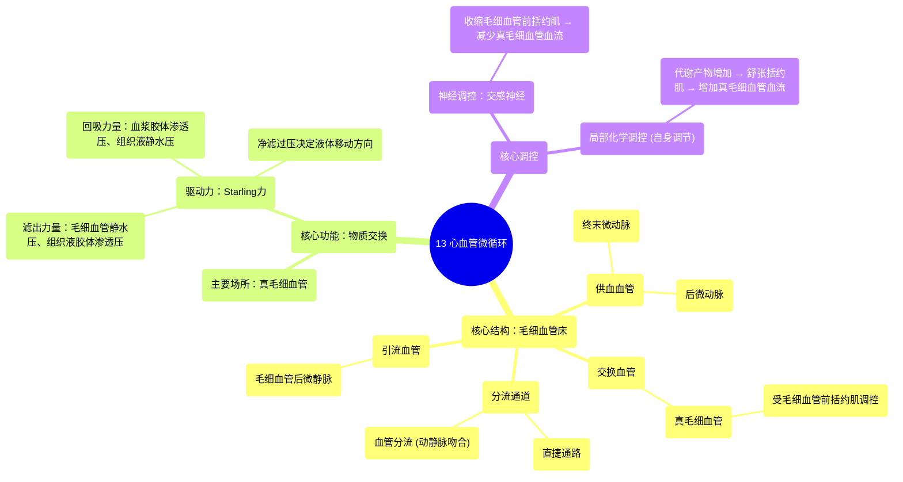

# 13 Cardiovascular Microcirculation

  <video controls preload="metadata" playsinline>
    <source src="https://helly.s3.bitiful.net/心血管学科/%E4%B8%93%E8%BE%91%2003%EF%BC%9A%E5%BF%83%E8%A1%80%E7%AE%A1%E7%94%9F%E7%90%86%E5%AD%A6%E6%B7%B1%E5%BA%A6%E7%B2%BE%E8%AE%B2%20%28Cardiovascular%20Physiology%29/13%20Cardiovascular%20Microcirculation.mp4" type="video/mp4">
    
您的浏览器不支持播放，请升级。

  </video>

::: tip ⚡️ 核心考点 (30s速读)
*   **核心考点**：微循环的核心功能单位是**毛细血管床**，其血流由**毛细血管前括约肌**调控，通过**血管分流**（动静脉吻合）和**真毛细血管**两条路径实现。物质交换主要发生在真毛细血管，由**静水压**和**胶体渗透压**的平衡（**Starling力**）驱动。
*   **临床意义**：理解微循环是理解休克、水肿、炎症等病理生理过程的基础。例如，休克时毛细血管前括约肌收缩，血液经血管分流直接回流，导致组织灌注不足；炎症时局部化学物质使括约肌舒张，增加血流和渗出，形成水肿。
:::

## 🧠 深度精讲

*   **微循环的解剖结构**：微循环是指微动脉与微静脉之间的血液循环，是血液与组织细胞进行物质交换的场所。其核心结构是**毛细血管床**，由以下部分组成：
    *   **终末微动脉**：供应毛细血管床的入口小动脉。
    *   **后微动脉**：终末微动脉的延续，是**血管分流**的起始部分。
    *   **真毛细血管**：从后微动脉分出的、迂回曲折的毛细血管网，是进行气体和物质交换的主要场所。每个毛细血管床约有10-100条真毛细血管。
    *   **直捷通路**：连接后微动脉和毛细血管后微静脉的较直通道，是**血管分流**的组成部分。
    *   **毛细血管前括约肌**：环绕在真毛细血管起始部的平滑肌环，受交感神经和局部化学物质调控，控制流入真毛细血管的血流量。
    *   **毛细血管后微静脉**：收集毛细血管床血液的微静脉。

*   **血管分流与动静脉吻合**：
    *   **血管分流**：指从**后微动脉**到**直捷通路**的这段直接通道。当毛细血管前括约肌收缩时，大部分血液不经真毛细血管，直接通过此通路回流，实现了动静脉间的“短路”。
    *   **动静脉吻合**：**血管分流**是动静脉吻合的一种类型，指动脉血不经过毛细血管床直接流入静脉的结构。它在调节体温（如皮肤血流）和局部血流分配中起重要作用。

*   **毛细血管物质交换的机制**：
    *   物质交换主要发生在**真毛细血管**，其管壁薄、通透性高。
    *   驱动液体在毛细血管壁两侧移动的力量称为**Starling力**，主要包括：
        1.  **毛细血管静水压**：血压产生的、推动液体**滤出**毛细血管的力量。
        2.  **组织液静水压**：组织间隙液体产生的、通常促进液体**回吸**入毛细血管的力量（通常较小或为负值）。
        3.  **血浆胶体渗透压**：主要由血浆蛋白（尤其是白蛋白）产生，吸引液体**回吸**入毛细血管的力量。
        4.  **组织液胶体渗透压**：由组织间隙中的蛋白质产生，吸引液体**滤出**毛细血管的力量。
    *   **净滤过压** = (毛细血管静水压 + 组织液胶体渗透压) - (血浆胶体渗透压 + 组织液静水压)。在毛细血管动脉端，净滤过压为正，液体滤出形成组织液；在静脉端，净滤过压为负，大部分组织液被重吸收回血管，小部分进入淋巴管。

*   **血流调控**：
    *   **交感神经调控**：通过收缩毛细血管前括约肌，减少真毛细血管血流，将血液分流至直捷通路。
    *   **局部代谢产物调控**：组织代谢活跃时（如运动中的骨骼肌），会产生CO₂、H⁺、腺苷、K⁺等物质，这些**局部化学物质**能使毛细血管前括约肌舒张，增加真毛细血管血流，以满足组织增加的代谢需求。这是**自身调节**的重要机制。

## 📚 双语术语表 (Terminology)
| 英文术语 | 中文翻译 | 定义/解释 |
| :--- | :--- | :--- |
| Microcirculation | 微循环 | 微动脉与微静脉之间的血液循环，是物质交换的主要场所。 |
| Capillary Bed | 毛细血管床 | 微循环的功能单位，由真毛细血管、直捷通路、微动脉、微静脉等构成。 |
| Terminal Arteriole | 终末微动脉 | 直接向毛细血管床供血的小动脉。 |
| Metarteriole | 后微动脉 | 终末微动脉的延续，真毛细血管和直捷通路的起始点。 |
| True Capillary | 真毛细血管 | 进行气体和营养物质交换的毛细血管。 |
| Thoroughfare Channel | 直捷通路 | 连接后微动脉和毛细血管后微静脉的较直通道。 |
| Vascular Shunt | 血管分流 | 血液从后微动脉经直捷通路直接回流至静脉的路径，是动静脉吻合的一种。 |
| Arteriovenous Anastomosis (AV shunt) | 动静脉吻合（动静脉短路） | 动脉血不经过毛细血管床直接流入静脉的结构。 |
| Pre-capillary Sphincter | 毛细血管前括约肌 | 环绕真毛细血管起始部的平滑肌环，控制流入真毛细血管的血流量。 |
| Post-capillary Venule | 毛细血管后微静脉 | 收集毛细血管床血液的微静脉。 |
| Hydrostatic Pressure | 静水压 | 液体因重力或压力产生的压强，在毛细血管中指血压。 |
| Colloid Osmotic Pressure (Oncotic Pressure) | 胶体渗透压（胶体压） | 由血浆中大分子蛋白质（如白蛋白）产生的渗透压，吸引水分。 |
| Starling Forces | Starling力（斯塔林力） | 决定毛细血管内外液体交换的四种压力的总和。 |
| Bulk Flow | 总体流动 | 指大量液体及溶解于其中的溶质在压力差驱动下通过毛细血管壁的移动。 |

## 🗺️ 知识图谱

