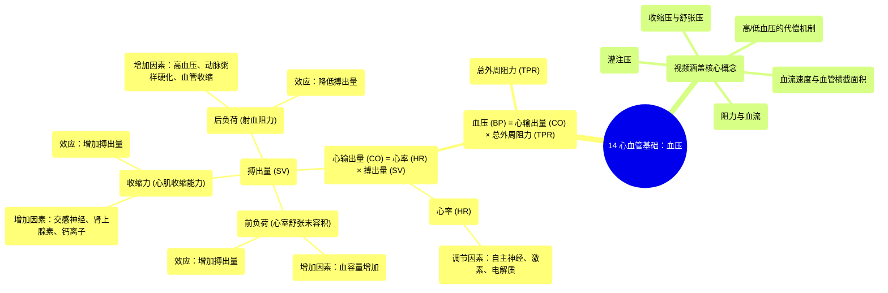

# 14 Cardiovascular Fundamentals of Blood Pressure

  <video controls preload="metadata" playsinline>
    <source src="https://helly.s3.bitiful.net/心血管学科/%E4%B8%93%E8%BE%91%2003%EF%BC%9A%E5%BF%83%E8%A1%80%E7%AE%A1%E7%94%9F%E7%90%86%E5%AD%A6%E6%B7%B1%E5%BA%A6%E7%B2%BE%E8%AE%B2%20%28Cardiovascular%20Physiology%29/14%20Cardiovascular%20Fundamentals%20of%20Blood%20Pressure.mp4" type="video/mp4">
    
您的浏览器不支持播放，请升级。

  </video>

::: tip ⚡️ 核心考点 (30s速读)
*   **核心考点**：血压（BP）由心输出量（CO）和总外周阻力（TPR）共同决定。心输出量等于心率（HR）乘以搏出量（SV），而搏出量受前负荷、收缩力和后负荷三个因素影响。
*   **临床意义**：理解血压的调节机制是分析高血压、低血压及其代偿反应的基础。例如，高血压会增加心脏后负荷，降低搏出量；而血容量增加（如前负荷增加）则会提升血压。
:::

## 🧠 深度精讲

*   **血压的定义与公式**：血压是血液对血管壁产生的侧压力。其核心计算公式为：**血压 (BP) = 心输出量 (CO) × 总外周阻力 (TPR)**。这个公式是理解所有血压变化机制的基石。
*   **心输出量的构成**：心输出量是指每分钟心脏泵出的血液总量，计算公式为：**心输出量 (CO) = 心率 (HR) × 搏出量 (SV)**。
    *   **心率**：受自主神经系统（交感神经兴奋增快，副交感神经兴奋减慢）、激素（如肾上腺素、甲状腺激素）和电解质（如钙、钾、钠）水平的影响。
    *   **搏出量**：指每次心跳心室射出的血量，受三个关键因素调控：
        1.  **前负荷**：指心脏在收缩前（舒张末期）所承受的负荷，主要由心室舒张末期的血容量决定。**血容量增加 → 前负荷增加 → 搏出量增加**。
        2.  **收缩力**：指心肌纤维本身的收缩能力。**交感神经兴奋、肾上腺素、去甲肾上腺素、甲状腺激素、钙离子等可增强收缩力 → 搏出量增加**。
        3.  **后负荷**：指心室收缩射血时需要克服的阻力，主要来自主动脉血压和外周血管阻力。**高血压、动脉粥样硬化、外周血管收缩 → 后负荷增加 → 搏出量减少**。
*   **视频学习目标**：本视频旨在系统讲解收缩压、舒张压、阻力、血流、血流速度、血管横截面积、灌注压等基本概念，并最终理解机体在面临高血压或低血压时，如何通过调节上述因素进行代偿。

## 📚 双语术语表 (Terminology)

| 英文术语 | 中文翻译 | 定义/解释 |
| :--- | :--- | :--- |
| Blood Pressure (BP) | 血压 | 血液在血管内流动时作用于单位面积血管壁的侧压力。 |
| Cardiac Output (CO) | 心输出量 | 每分钟由一侧心室射出的血液总量，等于心率乘以搏出量。 |
| Total Peripheral Resistance (TPR) | 总外周阻力 | 整个体循环系统的血管对血流产生的阻力总和。 |
| Heart Rate (HR) | 心率 | 每分钟心脏跳动的次数。 |
| Stroke Volume (SV) | 搏出量 | 一次心搏中，一侧心室射出的血液量。 |
| Preload | 前负荷 | 心脏在收缩前（舒张末期）所承受的负荷，通常以心室舒张末期容积或压力来表示。 |
| Contractility | 收缩力 | 心肌纤维不依赖于前、后负荷而改变其收缩强度和速度的内在特性。 |
| Afterload | 后负荷 | 心室开始收缩射血时所需要克服的阻力，主要取决于主动脉压和外周血管阻力。 |
| End Diastolic Volume (EDV) | 舒张末期容积 | 心室在舒张末期充盈完成后的血液容积。 |
| Systolic Blood Pressure | 收缩压 | 心脏收缩射血时，动脉血压达到的最高值。 |
| Diastolic Blood Pressure | 舒张压 | 心脏舒张充盈时，动脉血压下降到的最低值。 |
| Flow Rate | 流量 | 单位时间内流经血管某一横截面的血液体积，常用单位如立方厘米/分钟。 |
| Velocity of Blood Flow | 血流速度 | 血液在血管中流动的线速度。 |
| Cross-sectional Area | 横截面积 | 血管腔横截面的面积。 |
| Perfusion Pressure | 灌注压 | 驱动血液流入某个器官或组织的压力差，通常等于该区域入口动脉压与出口静脉压之差。 |

## 🗺️ 知识图谱

