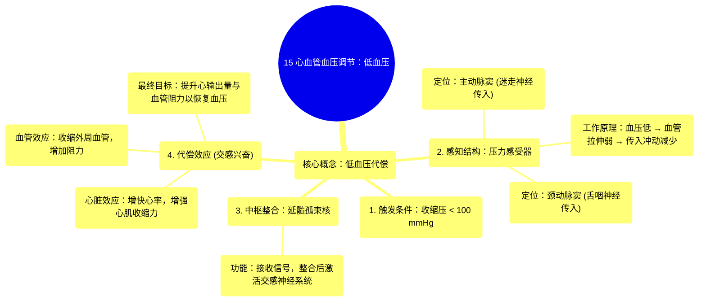

# 15 Cardiovascular Blood Pressure Regulation Hypotension

  <video controls preload="metadata" playsinline>
    <source src="https://helly.s3.bitiful.net/心血管学科/%E4%B8%93%E8%BE%91%2003%EF%BC%9A%E5%BF%83%E8%A1%80%E7%AE%A1%E7%94%9F%E7%90%86%E5%AD%A6%E6%B7%B1%E5%BA%A6%E7%B2%BE%E8%AE%B2%20%28Cardiovascular%20Physiology%29/15%20Cardiovascular%20Blood%20Pressure%20Regulation%20Hypotension.mp4" type="video/mp4">
    
您的浏览器不支持播放，请升级。

  </video>

::: tip ⚡️ 核心考点 (30s速读)
*   **核心考点**：低血压（收缩压 < 100 mmHg）触发压力感受器（主动脉窦、颈动脉窦）反应减弱，通过神经反射（迷走神经、舌咽神经传入，延髓孤束核整合）激活交感神经系统，引发心率加快、心肌收缩力增强、外周血管收缩等代偿反应，以提升血压。
*   **临床意义**：理解此代偿机制是诊断和处理休克、脱水等低血压状态的基础。代偿失败将导致组织灌注不足，引发器官功能障碍。
:::

## 🧠 深度精讲

*   **低血压的定义与触发**：视频将低血压（Hypotension）明确定义为收缩压低于100毫米汞柱（mmHg）。当血压降至该阈值以下时，身体会启动一系列代偿机制以恢复血压，防止组织灌注不足。
*   **压力感受器的角色与定位**：身体通过**压力感受器**（Baroreceptors）感知血压变化。它们主要位于两个关键部位：
    1.  **主动脉窦**：位于主动脉根部，其感觉信号由**迷走神经**（第10对脑神经）的内脏传入纤维传导。
    2.  **颈动脉窦**：位于颈总动脉分叉处，其感觉信号由**舌咽神经**（第9对脑神经）传导。
*   **压力感受器的工作原理**：压力感受器是机械敏感性通道。当血压**升高**时，血管壁被拉伸，激活通道，钠离子内流，产生动作电位，向中枢传递“血压高”的信号。反之，在**低血压**时，血管壁拉伸减弱或消失，通道关闭，动作电位产生减少或停止，这向中枢传递了“血压低”的警报。
*   **中枢整合与传出通路**：来自压力感受器的传入信号最终到达延髓的**孤束核**进行整合。当接收到低血压信号（即传入冲动减少）时，中枢会抑制副交感活动并**强烈激活交感神经系统**。
*   **代偿机制（交感兴奋的效应）**：交感神经兴奋后，通过释放去甲肾上腺素等递质，作用于心脏和血管，产生以下升压效应：
    *   **心脏方面**：增加心率（正性变时作用）和增强心肌收缩力（正性变力作用），从而增加心输出量。
    *   **血管方面**：使大多数外周血管（尤其是皮肤、内脏的动脉）收缩，增加外周血管阻力。
    *   **综合效果**：通过增加心输出量和外周血管阻力，共同将血压提升回正常范围。

## 📚 双语术语表 (Terminology)
| 英文术语 | 中文翻译 | 定义/解释 |
| :--- | :--- | :--- |
| Hypotension | 低血压 | 通常指收缩压低于100毫米汞柱的病理状态。 |
| Baroreceptor | 压力感受器 | 位于主动脉窦和颈动脉窦，能感知血压变化的感觉神经末梢。 |
| Aortic Sinus | 主动脉窦 | 位于主动脉根部，内含压力感受器。 |
| Carotid Sinus | 颈动脉窦 | 位于颈总动脉分叉处，内含压力感受器。 |
| Vagus Nerve (CN X) | 迷走神经（第10对脑神经） | 负责传导主动脉窦压力感受器传入信号。 |
| Glossopharyngeal Nerve (CN IX) | 舌咽神经（第9对脑神经） | 负责传导颈动脉窦压力感受器传入信号。 |
| Nucleus of Tractus Solitarius | 孤束核 | 位于延髓，接收并整合来自压力感受器等内脏传入信号。 |
| Sympathetic Nervous System | 交感神经系统 | 在低血压时被激活，通过增强心功能和收缩血管来升高血压。 |

## 🗺️ 知识图谱

